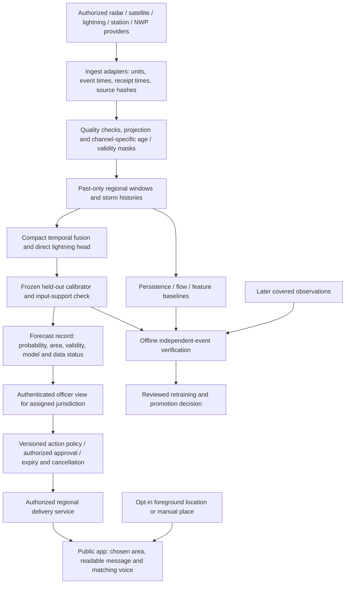

# VAJRA: what to build, why it matters, and how to prove it

Decision date: 30 September 2026. Read this alongside the [detailed architecture](DETAILED_TECHNICAL_ARCHITECTURE.md), [verified model/API/repository review](research/MODEL_AND_REPOSITORY_DECISIONS.md), [Indian evidence register](research/LOCAL_WEATHER_IMPACT_EVIDENCE.md) and [primary paper library](research/PAPER_REFERENCE_LIBRARY.md). Proposed capabilities below are separate from the [implemented system](docs/IMPLEMENTED_SYSTEM.md).

The recommendation is a regional thunderstorm and lightning decision-support system. It should answer: **Is a dangerous storm developing near this place, during which time window, how trustworthy is the result, and what action has an authorized operator approved?** It needs numerical weather models and verified observations. A language model is not a required component.

## The problem in ordinary language

A district forecast helps someone plan a day. A worker outside needs a different answer: whether a nearby storm is becoming dangerous soon enough to reach shelter. Those are different prediction targets. A good daily rainfall forecast does not establish a reliable next-30-minute lightning forecast.

Local weather varies with the storm's position and development, terrain, coastlines and the variable being measured. There is no universal rule that weather changes by a fixed percentage every kilometre. A model's grid spacing also differs from the smallest feature it predicts skilfully. Showing a smooth, zoomed map cannot establish street-level accuracy.

An Indian study tested 3 km WRF daily rainfall forecasts against 812 panchayat gauges in three Bihar districts during the 2020 and 2021 monsoons. That is a useful example of checking the forecast at the places where people use it. It is not a five-minute lightning evaluation. [Original MAUSAM study](https://mausamjournal.imd.gov.in/index.php/MAUSAM/article/view/6037).

Existing Indian warnings already have substantial capability. MoES reports a March–June thunderstorm nowcast probability of detection of 0.92 in 2025, versus 0.83 in 2022. POD measures how many observed events were detected; it does not reveal false alarms, local probability reliability or who received the warning. Our claim should concern a measured improvement on a defined task, not a claim that government forecasting generally fails. [Official March 2026 reply](https://www.moes.gov.in/static/uploads/2026/03/9fbc5fe044e9f667b2569306b65d3181.pdf).

## What would make this project different?

Multisensor AI, storm tracking, multilingual alerts and first-lightning prediction all have prior art. LightningCast and the multisensor work by Leinonen and colleagues are direct references. India's SACHET system already supports targeted multilingual alerts. Our opportunity is to assemble and verify a useful Indian regional service, with evidence another team can inspect. [LightningCast](https://repository.library.noaa.gov/view/noaa/52868), [multisensor research](https://agupubs.onlinelibrary.wiley.com/doi/10.1029/2022GL101626), [official cell-broadcast launch](https://www.pib.gov.in/PressReleasePage.aspx?PRID=2257499&lang=1&reg=3).

| Proposed distinction | What the person or officer gets | Evidence needed before claiming superiority |
|---|---|---|
| First-lightning evaluation | A chance to act before a previously quiet local storm produces its first detected flash | Lead-time distribution and missed initiation events, with a declared quiet-history window and complete sensor coverage |
| A history for each tracked storm | Observed movement, growth, split/merge history and changes in evidence | Track association review and an ablation showing whether history improves forecasts |
| Sensor-quality-aware forecasts | A visible explanation of missing, late or questionable observations; an unavailable state when required support is absent | Identical held-out storms with realistic outages/delays, measuring skill and abstention coverage |
| An evidence record for every forecast | Issue time, valid interval, geographic footprint, input age, model version and approval history | Causal replay that reconstructs what the system knew at the time |
| Probability reliability for the actual region | A 70% forecast that can be checked against outcomes across comparable cases | Calibration on separate events, untouched test results, bin counts and event-level uncertainty |
| Local delivery connected to an action | Clear area, expiry, language, readable/speech fallback and an appropriate preparation instruction | Comprehension tests and warning drills; distinguish sent, delivered, opened, understood and acted upon |

These are hypotheses to demonstrate. They are not world-first algorithm claims or measured benefits of this prototype. The best judge demonstration is a replay of an unseen storm followed by the same replay with a sensor delayed, with the observations, forecast, missing-data state and eventual outcome visible.

One useful product experiment is a preparation deadline. If a supervised drill assumes that a team needs ten minutes to stop work and reach shelter, evaluate whether the first useful warning arrived before that deadline. Compare missed deadlines and unnecessary interruptions under the same policy. The ten minutes is an example operational input, not a universal safety recommendation. This connects prediction quality to a concrete task and is more informative than showing only a colourful risk map.

## Algorithms: what belongs where, and why

A CNN learns spatial patterns. A temporal model learns changes across successive observations. A probability calibration method adjusts confidence. A decision rule converts an agreed probability and operational policy into an action. These are different jobs; a single model name does not cover them all.

| Input or task | Recommended method/tool | Reason and build decision |
|---|---|---|
| Numeric radar volumes | Py-ART or selected wradlib functions | Decode and georeference the actual provider product; inspect clutter, attenuation, calibration and beam geometry. These are preparation tools, not forecasting CNNs. |
| Moving radar echoes | Persistence, local optical flow and semi-Lagrangian extrapolation; pysteps Lucas–Kanade as a comparator | Establish how much predictable movement alone explains. Existing code already has persistence, global translation and Horn–Schunck dense flow. |
| Storm development | LINDA precipitation baseline, then compact ConvLSTM with a learned growth/decay correction | A transported echo can strengthen or disappear. Learn the remaining development from matched past/future observations. Preserve the target's units; rain rate and reflectivity differ. |
| Storm history | pysteps DATing | Associate objects across available past frames and retain splits/merges. Keep the dense map too, because early convection may not pass an object threshold. |
| Satellite channels | Satpy reader/calibration, channel masks, brightness-temperature changes, compact CNN encoder | Clouds provide spatial and development clues. Compare a simple feature model, a U-Net-style spatial model and a temporal model before choosing complexity. |
| Lightning sensors | Provider-specific event parsing, deduplication, density/age features and coverage masks | Events are observations and labels, not ordinary photographs. Distinguish total lightning from cloud-to-ground detections and missing coverage from no flashes. |
| NWP | xarray plus a GRIB reader for available GFS/IFS forecast fields | Supply moisture, instability and wind context. Obtain upper-air levels before claiming vertical shear. Use the cycle actually available at issue time. |
| Combined prediction | Logistic/boosted-tree baseline, then compact sensor encoders plus one temporal fusion model | Begin with an interpretable baseline. Add source age, validity and context; evaluate which sensor contributes skill on the same events. |
| Lightning probability | A separate supervised binary output head | Learn the defined lightning outcome from lightning labels. A predicted rain image or cold cloud is insufficient evidence of a lightning probability. |
| First-lightning timing | Optional discrete-time survival head | Estimates event timing while respecting follow-up coverage. Add after the simpler occurrence classifier has enough initiation examples. |
| Reliability and actions | Separate calibration partition, proper scores and explicit versioned action rules | Check confidence independently; allow officers to inspect why a threshold and action apply. |

Tool links, licences, activity dates and sensor caveats are in the [repository review](research/MODEL_AND_REPOSITORY_DECISIONS.md). [DATing](https://pysteps.readthedocs.io/en/stable/generated/pysteps.tracking.tdating.dating.html) and [LINDA](https://pysteps.readthedocs.io/en/stable/generated/pysteps.nowcasts.linda.forecast.html) are established baselines, not our inventions.

**ConvLSTM is worth testing now.** The repository contains a compact trainable ConvLSTM CLI. Its present smoke data prove software operation only. The next substantive experiment needs paired radar/satellite inputs and covered lightning labels. Choose ConvLSTM or ConvGRU through comparison; stacking both adds no inherent benefit. Start with source-specific preparation and one compact temporal fusion path.

**Earthformer is a later challenger.** Its larger spatial/temporal attention may help long-range relationships, but it needs enough representative events and measured compute. Add it if errors remain that a compact temporal model cannot resolve. A win requires better held-out skill at acceptable latency, memory and calibration, rather than a more impressive architecture diagram. [Official implementation](https://github.com/amazon-science/earth-forecasting-transformer).

**Diffusion is conditional on the output we need.** It can generate alternative precipitation evolutions. Multiple plausible rainfall fields are useful for uncertainty research, but visually sharp images do not establish lightning skill. Train and score a direct lightning predictor first. Sample count and denoising steps also affect runtime. [PreDiff paper](https://papers.neurips.cc/paper_files/paper/2023/hash/f82ba6a6b981fbbecf5f2ee5de7db39c-Abstract-Conference.html).

**A graph neural network is optional.** It could model relations among tracked storms or irregular stations. DATing lineage records do not themselves require a GNN. First test whether neighbouring-storm and station features improve the simpler model. Track errors can otherwise propagate into a more complex graph.

For the proposed first-event model, divide the next 30 minutes into six five-minute intervals. Let `q[k]` be the probability of the first event in interval `k`, conditional on no earlier event. Then the cumulative probability through interval `K` is `1 - product(1 - q[k])`. Use observed intervals only and handle censoring explicitly. Do not treat six independent interval probabilities as a valid cumulative forecast. A first detection also depends on the network's detection capability. [Discrete-time survival reference in the paper library](research/PAPER_REFERENCE_LIBRARY.md#r10-a-scalable-discrete-time-survival-model-for-neural-networks).

The proposed next-30-minute target differs from the existing simulator, whose labels cover a 15-minute window ending at the selected lead. Keep these target identifiers separate. No current score should be relabelled as a cumulative 30-minute result.

## WeatherNext 3, TimesFM 3.0 and Jev

WeatherNext 3 combines large-scale atmospheric analysis/forecast context with satellite observations. Its mesh transformer generates a distribution of future weather, represented by an ensemble. This is numerical forecasting, not a conversational language model. Google's specifications give variable-dependent resolutions: approximately 5 km temperature/dewpoint, 10 km surface fields including precipitation, and 25 km upper-air fields. It does not supply a verified local lightning head for our target. [Technical paper](https://arxiv.org/abs/2609.03582), [official specifications](https://developers.google.com/weathernext/guides/models).

It is a possible environmental input or comparison forecast. The public source repository does not include WeatherNext 3 weights. Access to forecast outputs has account/terms requirements. Delivery time also matters: for example, the nominal 00 UTC run targets 07:45 UTC delivery in Cloud Storage. Satellite inputs can be newer than that nominal initialization, so retain input, publication, receipt and valid times separately. Replay only a product actually available before our forecast was issued. [Open-source status](https://developers.google.com/weathernext/guides/osmodel), [access](https://developers.google.com/weathernext/guides/access-forecast), [delivery schedule](https://developers.google.com/weathernext/guides/dissemination).

TimesFM 3.0 forecasts numerical time series, including multivariate series. A sensible research use would be a storm's area or cloud-temperature history, compared against a small recurrent or autoregressive model. It is not a drop-in radar image model. Its source code and model weights have different licences: the published 3.0 weight licence restricts use to non-commercial, non-production purposes. Earlier weights through 2.5 have Apache-2.0 terms. A free public alert service would still be production use. [Official repository](https://github.com/google-research/timesfm), [3.0 weight licence](https://huggingface.co/google/timesfm-3.0-pytorch/blob/main/LICENSE).

**Do not add an LLM or Jev to the required forecast or alert path.** Complex numerical evidence can be processed by the trained fusion model and explicit decision policy. Jev's documented offering is a hosted text/JSON decision API, not an open local weather-image model; a public SDK does not imply public model weights. Optional later uses include drafting a report from verified structured fields, with numerical checks. Fixed reviewed translations and action templates are more predictable for the required warning flow. [Jev documentation](https://docs.typesafe.ai/models).

## Regional architecture and data flow

This diagram describes the intended operational system. Authentication, live lightning inference, approved public dispatch and automatic regional matching are not present in the current prototype. The [implemented flow](docs/IMPLEMENTED_SYSTEM.md) identifies the working subset.

The public app should request location only when the person chooses it. Use the selected point and its uncertainty to resolve the appropriate coverage area. Show forecast grid/footprint and validity; a phone fix accurate to 20 metres does not create a 20-metre weather forecast. If the point is outside supported coverage, show that explicitly. Manual selection must remain possible. For polygon alerts, match the warning geometry and account for location uncertainty at boundaries.

A regional risk probability also needs a defined target. Averaging pixel probabilities gives a different quantity from the chance of any event in a district. Taking the maximum is not a calibrated district probability either. Train the relevant area target or compute event occurrence per ensemble member over the area and calibrate that result, preserving spatial dependence.

The operator should see all authorized areas within their jurisdiction, feed health, forecast history and an audit trail. Role-based access belongs on the server. The present public/operator tab switch is only navigation. A future national administrator and a district officer should not automatically have identical permissions.

Keep computation on a regional backend for consistent model versions and fresh feeds. Cache readable guidance, chosen areas and explicitly timestamped past messages on devices. Fresh warnings need a delivery connection. Speech can run on-device when a suitable installed voice works offline; verify this on actual phones. Government-authorized cell broadcast or other delivery channels would require a partnership, not simply an app permission.

The existing prototype stack remains Python/FastAPI, NumPy/PyTorch, React/Vite/Three.js, and Expo/React Native with installed-voice speech. A bounded pilot can add an object store for immutable raw files and a spatial database for region/alert geometry. Choose a job queue only when actual ingestion and processing concurrency requires one; a national streaming platform is not a prerequisite for one-region evaluation.

## Data we can use, and what is still missing

The repository contains real source files and manifests from IMD WIS2, NASA POWER, NOAA GFS and US ABI/GLM/radar samples. These examples have different dates and locations. They exercise downloads and readers; they do not constitute matched Indian storm training data. [Exact starter inventory](data/government/README.md).

| Need | Source and access route | Next practical step |
|---|---|---|
| Indian numeric station observations | [IMD WIS2 collections](https://wis2box.imd.gov.in/oapi/collections?f=json), anonymous access verified | Check reporting cadence, station metadata, QC and retained history |
| Indian radar and warnings | [IMD API portal](https://api.imd.gov.in/public/index.php) | Obtain authorized product access; confirm raw numeric format and archives. An API index or website image is not a training-data contract |
| INSAT channels | [MOSDAC download API](https://www.mosdac.gov.in/downloadapi-manual) | Register/obtain approved dataset access; verify product reader, channels, dates and rights |
| Indian lightning events | [IITM thunderstorm programme](https://www.tropmet.res.in/28-Thunderstorm%20Dynamics-project) and authorized providers | Secure events plus network coverage/uptime, uncertainty and detection type. A public alert app does not establish access to its raw labels |
| Large open paired research benchmark | [SEVIR registry](https://registry.opendata.aws/sevir/) and [creator tutorial](https://github.com/MIT-AI-Accelerator/eie-sevir/blob/master/examples/SEVIR_Tutorial.ipynb) | Build a bounded, reproducible US benchmark. Respect event selection, storm overlap and VIL units. Transfer to India remains a separate test |
| Atmospheric context | [GFS](https://registry.opendata.aws/noaa-gfs-bdp-pds/), [ECMWF Open Data](https://www.ecmwf.int/en/forecasts/datasets/open-data), conditional WeatherNext | Preserve actual operational availability and accumulation intervals; reanalysis alone cannot establish a real-time result |

The [verified API table](research/MODEL_AND_REPOSITORY_DECISIONS.md#4-data-and-apis-what-is-obtainable-now) records anonymous success, credential requirements and unresolved endpoint schemas. It also distinguishes NOAA's current Level II archive from our Level III sample. Do not substitute unrelated US events for Indian validation.

## How we will verify improvement

1. Freeze the hazard, event type, radius or polygon, lead, interval, grid and coverage rules before training. Maintain normal-weather cases as well as storms. Event-enriched datasets need representative evaluation before population probabilities can be claimed.
2. Keep each physical storm and its overlapping windows in one partition. Hold out chronological periods and, separately, districts or radar domains where sample size permits. Split train, model-selection validation, calibration and final test events independently.
3. Fit statistics on usable training measurements. At every issue time, mask values not yet received. Keep future observations isolated as labels and include complete future coverage requirements.
4. Compare climatology, persistence and relevant motion/LightningCast-style baselines on the same test cases. Ablate radar, satellite, lightning history, NWP context, tracking and age masks one at a time.
5. Measure Brier score, log loss, reliability bins with counts, and precision-recall average precision for lightning. Report POD, false-alarm ratio and CSI at a prespecified threshold. Accuracy alone can hide failure on rare events.
6. For rain fields, add unit-appropriate intensity and spatial scores, such as FSS across stated neighbourhood sizes. For first lightning, show misses, warning lead-time distribution and false-alert minutes. Do not replace these with image sharpness or a single pooled score.
7. Resample whole independent events for uncertainty, not correlated pixels. Show event counts and unavailable intervals for insufficient samples. Inspect performance by season, region, daytime/nighttime and input-quality state without pretending tiny subgroups are conclusive.
8. Measure end-to-end latency, including feed delay, download, decoding and delivery. Run delayed/stale/missing-sensor cases and distinguish forecast unavailability from a low-risk forecast.
9. Evaluate warning comprehension and actions separately from model skill. Prospective shadow operation and reviewed drills precede claims about operational benefit.

Calibration asks whether repeated 70% predictions occur about 70% of the time for comparable cases. It cannot teach an uninformative model where storms form. The implemented optional calibration workflow and exact metrics are in [the calibration guide](docs/CALIBRATION_AND_VERIFICATION.md). A successful synthetic run is a pipeline check, even if its Brier score improves.

For an action threshold, define the user's cost of acting and avoidable loss with the domain partner. Under the simple cost-loss assumptions, acting when probability exceeds `cost / avoidable_loss` is an interpretable starting rule. Those assumptions and consequences differ by action. It is not a universal lightning safety threshold or an invitation to let a text model invent operational policy.

## More data and controlled retraining

More relevant, correctly timed, labelled observations can improve a model. Duplicate storm frames, biased event selection, sensor changes and wrong labels can worsen it. Do not teach the system that its own predictions are ground truth.

Collect immutable observations and later outcomes, monitor missingness and regional score changes, then retrain offline on a versioned corpus. Evaluate each challenger against the incumbent on a locked comparison set, reserve fresh future events to avoid repeated test-set tuning, recalibrate on separate events and review before promotion. Keep the prior model for rollback. Online ingestion and scheduled reviewed retraining provide a useful learning loop without uncontrolled live weight changes.

## Evidence, impact and feasibility

The [new evidence register](research/LOCAL_WEATHER_IMPACT_EVIDENCE.md) contains 14 primary-source groups with samples, dates, denominators and limitations, plus a [CSV](research/LOCAL_WEATHER_IMPACT_EVIDENCE.csv). The earlier [surveys and news](research/SURVEYS_AND_NEWS_2026.md) and [paper library](research/PAPER_REFERENCE_LIBRARY.md) supply additional context; mirrored reports are not counted as independent studies.

Historical NCRB figures reproduced by MoSPI record 2,887 lightning deaths in 2022. This establishes reported harm, not how many a new app could prevent. The NSO 2025 telecom survey reports a smartphone in 82.1% of rural households, while individual mobile ownership among rural people aged 15+ differs sharply: 80.7% of men and 48.4% of women. Shared household access is not guaranteed warning access. [MoSPI mortality table](https://www.mospi.gov.in/sites/default/files/reports_and_publication/statistical_publication/EnviStats/Complete_ES1_2024.pdf), [official telecom survey](https://static.pib.gov.in/WriteReadData/specificdocs/documents/2025/may/doc2025529560001.pdf).

Mission Mausam's original approval was ₹2,000 crore for two years. That is a programme approval, not proof of expenditure or money lost through forecast error. A dated official crop report records 14.24 lakh hectares affected in FY2024–25 as of 27 January 2025. A later official table has an internal arithmetic discrepancy, which the evidence register flags. Affected area, insurance claims and total economic loss are different measures. [Cabinet approval](https://www.pib.gov.in/Pressreleaseshare.aspx?PRID=2053898&lang=2&reg=48), [dated crop report](https://www.pib.gov.in/Pressreleaseshare.aspx?PRID=2100762&lang=2&reg=48).

There is no defensible present estimate of lives or rupees saved annually by VAJRA. Measure added warning lead time, unnecessary interruptions, comprehension and documented decisions first. Agricultural advisories about sowing several weeks ahead need a different product and evaluation from short-lead lightning shelter decisions.

Technical feasibility is strongest for a bounded regional pilot with a compact model and existing observations. The largest dependency is matched Indian observation and label access. Institutional operators, campuses, field-work organizations and local disaster-management partners are candidate pilot users, not validated paying customers. Assess integration/support costs and partner demand before proposing subscription revenue. Do not assume government procurement or data rights.

For sustainability, cache and reuse decoded observations, fetch needed variables and regions, profile compact models on the actual machine, and measure compute/network costs. Larger ensembles or diffusion need a demonstrated benefit. Keep user location collection minimal, preserve source licences, budget translation review and maintain a versioned rollback path. The [business/risk evidence](research/VIABILITY_AND_SUSTAINABILITY_EVIDENCE.md) expands these assumptions.

## What this iteration delivers and what follows

This iteration adds the model/API/repository review, the evidence register, this decision document, opt-in foreground location for the public native app, and optional held-out probability calibration with reproducible evaluation. Location focuses the map and displays uncertainty; it does not connect live regional warnings. [Location implementation and limits](docs/LOCATION_DELIVERY_NOTES.md).

The next model milestone is a reproducible paired lightning experiment with declared target/coverage and strong baselines. Then add motion-aware growth and tracking only where ablations show value, obtain matched Indian data, and run independent regional validation. WeatherNext, Earthformer, diffusion, GNNs and TimesFM remain explicit experiments with conditions for adoption. No LLM is needed to complete this sequence.
