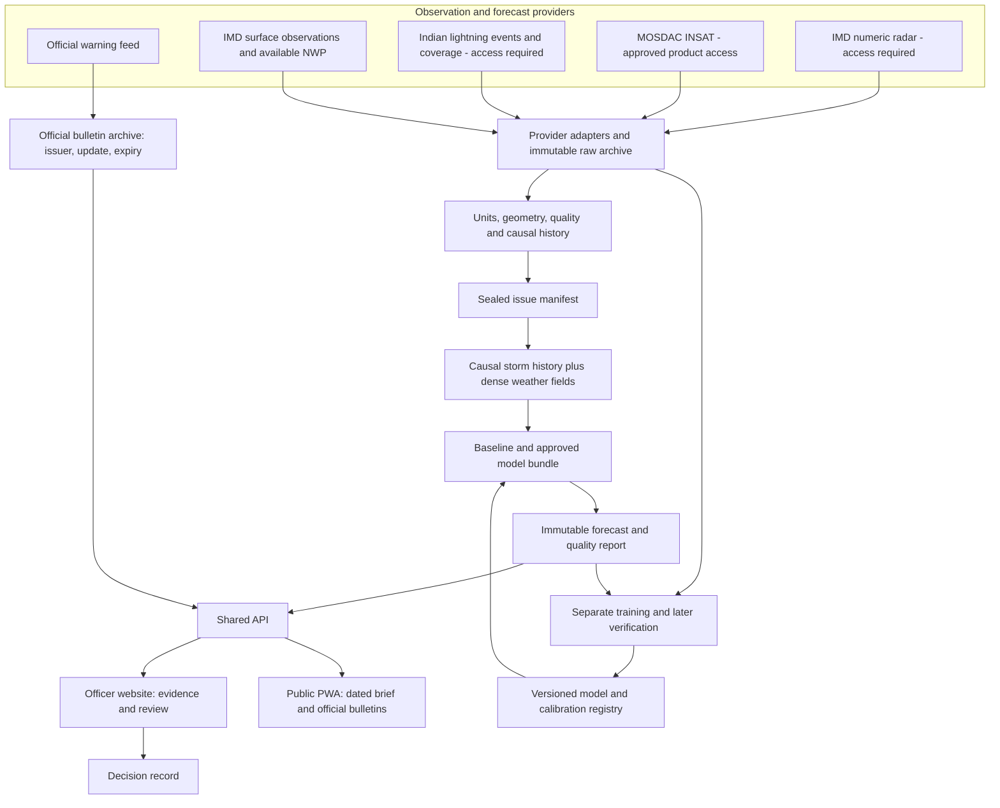
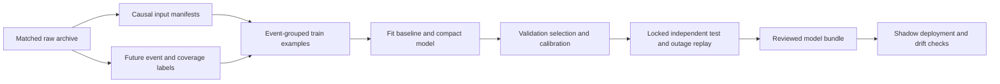

# VAJRA detailed technical architecture

Design date: 30 September 2026. Scope: one regional research and shadow-operation pilot for SIH26072. Read this with the [proposal and evidence](SIH26072_PROPOSAL_AND_EVIDENCE.md), [government data inventory](data/government/README.md) and [validation record](VALIDATION.md).

**Recommendation:** keep a single Python application with a scheduled regional worker, a shared forecast archive, and one responsive website/PWA. Train a compact temporal model only after obtaining matched observations and trustworthy lightning labels. Each issued forecast must carry the exact evidence and model used to produce it.

The new architecture below is a design. The existing application is a working simulation and historical radar replay. Downloading government data does not train or validate an Indian nowcasting model.

## 1. The problem in simple language

A person working outside needs to know whether lightning may affect their location soon enough to prepare. A district officer needs to judge many locations, inspect the evidence, and coordinate a response. A radar image shows part of what is happening; someone still has to interpret movement, growth, uncertainty and missing observations.

VAJRA is intended to connect these steps: observe the weather, estimate the next short interval, explain the evidence, and support a recorded decision. It must also say when its evidence is inadequate. Official products already exist, including IMD warnings and Damini. Our proposal needs to demonstrate additional local decision value alongside those services. [IMD](https://mausam.imd.gov.in/), [IITM Thunderstorm Dynamics](https://www.tropmet.res.in/28-Thunderstorm%20Dynamics-project).

The primary users are officers and institutional safety teams. The public receives a simpler view with the issuer, affected area, time, expiry and action. Both views use the same backend and forecast version. Public warning publication requires an authorised issuer and an agreed operational process.

## 2. What exists and what this design adds

| Capability | Present implementation | Detailed design |
|---|---|---|
| Forecast inputs | Generated radar, satellite, lightning and NWP; separate French radar replay | Licensed provider adapters, actual timestamps, units and QC |
| Prediction | Global image translation and six small synthetic logistic heads | Motion/development baselines plus a compact temporal lightning model |
| Storm identity | Components labelled again for each request | Persistent causal tracks and observed split/merge lineage |
| Real data | French radar replay plus the newly collected government starter pack | Matched multi-season Indian training and test archive |
| Trigger | Browser requests compute a run | Scheduler computes each regional issue once |
| Records | Local SQLite JSON rows and simulation receipts | Immutable forecasts, authenticated review, indexed spatial records |
| Website/app | Responsive React PWA; cached guide and saved historical preview | Officer roles and public official-bulletin consumption |
| Validation | Synthetic tests and one small real radar case | Independent real-event tests, calibration and shadow operation |

Current request flow is `service.run → simulated_run/observed_run → predict/replay → persist`. The observed branch verifies pinned Météo-France files, uses two radar frames for motion and compares future echoes. It has no lightning observations. The simulation branch uses three generated frames. Current component IDs are not lifetime storm tracks. See [grounding trace](research/design/detailed-grounding.md).

## 3. Architecture overview



The inference worker may read eligible observations and approved models. It cannot query future labels. Training uses the same input-selection rules, then attaches future outcomes in a separate process. The public client cannot write forecasts, publish official warnings or download restricted raw files.

A single application package keeps scientific decisions in a few substantial modules. Two long-lived processes, API and worker, isolate slow downloads and inference from web requests. PostgreSQL and object storage support the proposed shared pilot. Today's localhost application can continue using SQLite until this migration is implemented.

## 4. Caller usage and module boundaries

These signatures illustrate the proposed interfaces. They are not currently available imports.

```python
raw = observation_archive.ingest(provider.fetch(product_request))

issue = forecasting.issue(
    region="bihar-pilot-v1",
    origin="2026-10-01T08:00:00Z",  # illustrative future issue
    bundle="lightning-30m-8km-v1",
    mode="shadow",
)
forecast = forecasts.get(issue.forecast_id)

decision = review.record(
    forecast_id=forecast.id,
    site_id="registered-site-42",
    actor=authenticated_officer,
    policy_version="site-procedure-v1",
)
```

| Module owner | Public responsibility | Internal details hidden from callers |
|---|---|---|
| `observations` | Ingest a product; select an eligible history | Provider transport, credentials, format readers, units, QC, geometry, archive receipts |
| `forecasting` | Issue one regional forecast | Input freezing, model compatibility, tracks, baselines, inference, calibration, output masks |
| `verification` | Build labelled examples; evaluate saved forecasts | Future observations, coverage rules, splits, metrics, bootstrap and subgroup analysis |
| `review` | Record an authenticated decision; read official bulletins | Site policy, roles, issuer identity, update/cancel/expiry and audit |
| API and scheduler | Translate HTTP or a schedule into domain calls | Request validation, job leases, rate limits and transport serialization |

Provider JSON, GRIB handles and HTTP objects stay inside adapters. Domain records carry typed values and immutable references. Large scientific arrays live outside SQL rows.

The [design comparison](research/design/DETAILED_SYNTHESIS.md) explains the selected structure and the stream-based alternative.

## 5. Data contracts and storage

### Observation and forecast contracts

| Record | Required fields and invariant |
|---|---|
| `RawArtifact` | SHA-256, bytes, provider, product/version, source URL, retrieval time, format, terms reference; immutable content |
| `ObservationReceipt` | Raw hash, acquisition start/end, provider publication time if known, local receipt and ready times, original time scale; unknown stays null |
| `GridSpec` | CRS definition, extent, pixel centres, row direction, spacing, shape and nodata convention |
| `ObservationField` | Artifact reference, variable, units, grid, value array reference, valid mask, quality flags and observed interval |
| `NwpField` | Model/cycle, lead or accumulation interval, valid time, availability evidence, variable/level and units |
| `IssueManifest` | Region, forecast origin, input cutoff, exact input hashes, alignment version, bundle, replay mode and excluded-source reasons |
| `ModelBundle` | Weights, preprocessing and channel schema, target contract, training split, calibration, supported source patterns and test report |
| `ForecastRecord` | Manifest ID, creation/publication time, valid window, probability array, output mask, model/calibration versions, quality status and supersession link |
| `DecisionRecord` | Forecast ID, site, actor, policy, action, creation time and explicit dispatch state |

Do not use one `timestamp` for all these meanings. Store UTC-aware instants internally and render IST in the user interface with the timezone label. A source with an unresolved timezone cannot join a precise multimodal timeline. The existing French sample therefore remains an independently labelled replay.

```python
@dataclass(frozen=True)
class TargetContract:
    id: str
    event_definition: str
    radius_m: int
    lead_start_seconds: int
    lead_end_seconds: int
    coverage_policy_version: str

@dataclass(frozen=True)
class IssueManifest:
    id: str
    region_id: str
    forecast_origin_utc: datetime
    cutoff_utc: datetime
    input_hashes: tuple[str, ...]
    bundle_id: str
    mode: Literal["live", "shadow", "idealised_replay", "latency_scenario"]

def select_history(issue: IssueManifest, policy: AlignmentPolicy) -> HistoryTensor: ...
def predict(history: HistoryTensor, bundle: ModelBundle) -> ForecastFields: ...
def label_window(target: TargetContract, coverage: Coverage, events: EventSet) -> LabelField: ...
```

The final implementation must validate timezone awareness, units, array shape and compatibility at boundaries. Type hints alone do not enforce them. The label function belongs to training/verification, outside the inference path.

### Storage layout

```text
raw/<provider>/<product>/<sha256>       immutable provider bytes
receipts/<receipt-id>.json             URL and actual acquisition metadata
prepared/<schema>/<grid>/<hash>.zarr    decoded arrays, masks and QC
issues/<manifest-id>.json              exact causal input selection
forecasts/<forecast-id>/               probability fields and metadata
labels/<target-version>/<hash>/        separate training/evaluation access
models/<bundle-id>/                    weights, calibration and model card
```

SQL tables cover artifacts, receipts, jobs, issue manifests, forecast indexes, official bulletins, sites, decisions and delivery attempts. Index receipts by product, observation time and footprint; forecasts by region, target, origin and status; jobs by status and lease expiry. Use PostGIS for site/area queries. Keep arrays in chunked files or objects.

Content hashes deduplicate identical bytes. Each retrieval still has its own receipt because source URL and arrival time may differ. A model bundle binds normalization and calibration to weights; swapping a weight file alone cannot produce an approved deployment.

Preserve the raw receipt even when parsing fails. Freeze the eligible observation snapshot before deriving motion/tracks; then seal a final forecast manifest containing the snapshot and exact derived-artifact hashes. A stable request ID can exist while computation is pending; keep its later immutable manifest digest separate. This makes retries and source revisions traceable without a distributed broker.

## 6. Detailed acquisition and preparation

| Source | Preparation | Use and limits |
|---|---|---|
| IMD radar | Decode numeric scans; inspect calibration, clutter, attenuation, beam geometry and QC; grid consistently | Echo intensity/movement/development; no severe-wind or lightning truth by itself |
| INSAT | Decode calibrated thermal channels and quality; preserve scan start/end; geolocate and document parallax treatment | Cloud evolution and precursor information; channel/product differences matter |
| Lightning network | Keep original events; validate time/location/type; apply provider-specific flash/stroke grouping and coverage | Past lightning input and separately future occurrence labels |
| IMD SYNOP/AWS | Decode actual units, sensor height and observation interval; preserve coded/missing values | Station context and independent checks; sparse reports do not fill a dense radar grid |
| Available NWP | Keep run cycle, forecast lead, level, valid interval and availability | Large-scale instability, moisture and wind context |
| NASA POWER | Preserve MERRA-2/POWER provenance and hourly/day averaging | Retrospective environmental exploration; not a rapid operational sensor |
| Official warnings | Parse identifier, sender, issue/expiry, area and update/cancel references | Officer context and public authorised information; not observed-event ground truth |

For overlapping radar reflectivity, combine valid estimates in linear reflectivity, `Z = 10^(dBZ/10)`, using documented quality weights, then convert back. Do not average dBZ as if it were linear energy. Retain a coverage mask and contributing instrument IDs. This operation already exists for the simulator; real radar QC does not.

Grid temperature and wind with a declared interpolation method and a missingness limit. Aggregate lightning events by time/area without interpolating flashes into unobserved space. Retain quality codes separately. Reprojection does not create finer physical measurement resolution.

Adapter acceptance requires a real-file test for units, time parsing, coordinates, missing sentinels and duplicate handling. Do not turn an HTTP error page into a dataset because its filename ends with `.nc`.

## 7. Time alignment and the forecast issue

Start with six history slots at ten-minute spacing: `t-50, t-40, t-30, t-20, t-10, t`. The interval and tile sizes are proposed experiment settings, not claims about provider cadence.

For each slot, choose observations whose acquisition ends by that slot and whose actual local ready time precedes the issue cutoff. Carry the actual observation age and mask. A repeated older satellite scan remains the same older scan; do not describe it as six independent images. An image observed at 08:05 and received at 08:11 cannot enter an 08:10 issue.

NWP differs from observations. A forecast for 09:00 may enter an 08:00 issue if its run and file were already available by 08:00. Requiring NWP valid time to precede issue time would incorrectly reject useful forecasts. Reanalysis that incorporates later information belongs to a labelled retrospective experiment. [NOAA GFS](https://www.ncei.noaa.gov/products/weather-climate-models/global-forecast), [ERA5 metadata](https://cds.climate.copernicus.eu/datasets/reanalysis-era5-single-levels?tab=overview).

Define forecast origin, cutoff and actual publication time separately. Targets are anchored to the stated forecast origin. If computation finishes two minutes later, the UI shows the reduced remaining window; it cannot reset the prediction clock. If observations lack historical availability, use `idealised_replay` with explicit delay assumptions, rather than claiming an operational backtest.

The published probability still refers to the original full target interval. A 30-minute probability does not become a 28-minute remaining-window probability merely because delivery took two minutes. Show both the original interval and remaining time.

An operational update using newly arrived data receives a new actual cutoff and origin, with a correspondingly updated target interval. It may supersede an earlier forecast but cannot claim to have been available at the earlier origin. A rerun preserving an old cutoff remains a labelled replay and must use only that cutoff's eligible evidence.

```mermaid
sequenceDiagram
  participant P as Provider
  participant W as Regional worker
  participant A as Archive and SQL
  participant M as Approved model
  participant U as Shared API and clients
  P->>W: File or observation message
  W->>A: Raw bytes, checksum, receipt and QC
  W->>A: Claim issue job and freeze eligible inputs
  A-->>W: Immutable issue manifest
  W->>M: Causal history, masks and ages
  M-->>W: Forecast fields and valid-output mask
  W->>A: Commit forecast plus publication event
  A-->>U: Completed forecast identifier
  U->>A: Fetch same immutable forecast
  Note over P,A: Late data creates a new revision; previous evidence stays unchanged
```

## 8. Prediction pipeline and algorithms

### Precise first target

Proposed target `lightning-occurrence-30m-8km-v1` means at least one qualifying detected lightning event within 8 km of a grid point during `(t, t+30 minutes]`. The provider's definition of a flash or stroke must be fixed in this contract. For a first Indian pilot, do not combine radio-network strokes and GLM optical flashes into one supposedly identical label.

A negative label requires valid detection coverage across the relevant space and interval. Missing coverage is excluded or censored under the chosen method. It is never automatically “no lightning.” This first occurrence task includes already active storms. A later first-lightning experiment needs a separate quiet-history definition and verified prior coverage.

For the initial ordinary binary-loss experiment, require the chosen complete-coverage rule for both positive and negative examples. Retain observed positives during partial coverage as evidence, but do not silently add all of them while excluding partial-coverage negatives; that would bias the training frequency. Censoring or weighting requires a separately specified experiment. Complete network coverage still does not imply perfect detection of every physical flash.

The existing simulator uses fixed 15-minute windows ending at the selected horizon. That target cannot silently inherit the new target's name or metrics. Independent cumulative 15/30/60-minute heads can violate monotonicity; test a coherent conditional-hazard construction only after the single-target experiment is reliable. [Survival-method reference](https://peerj.com/articles/6257.pdf).

### Algorithm selection

| Stage | First choice | Why and verification |
|---|---|---|
| Motion baseline | Pysteps optical flow and advection; retain current global translation as a simple comparator | Measure displacement skill and boundaries; movement alone misses growth/decay |
| Development baseline | LINDA where the data meet its rain-rate requirements | Compare against an existing development model, not just persistence; do not apply rain-rate assumptions directly to flashes |
| Storm history | Causal DATing-style detection, optical-flow association and overlap | Store observed area/intensity/growth/age and association confidence; audit splits/merges |
| Learned predictor | Small per-source encoders, temporal ConvLSTM or compact temporal encoder-decoder, dense lightning head | Test multisource benefit with manageable compute; preserve full-domain initiation detection |
| Missing sources | Explicit value masks, ages and quality inputs; realistic source-dropout training | Test actual outage patterns and weather-dependent gaps; unknown sources cannot imply quiet weather |
| Calibration | Validation-only temperature scaling or another predeclared calibrator | Evaluate reliability and Brier score by source pattern, lead, season and region |
| Later research | First-event survival, graph track interactions or selective diffusion refinement | Add only after an ablation shows a useful gain at an acceptable latency/cost |

Tracking runs on the prefix available at each issue. Some DATing outputs describe relationships involving a subsequent timestep; importing them from a completed event leaks the future. Dense fields remain necessary because a new storm may have no existing track. Track lineage describes algorithmic associations, which can be uncertain. [DATing documentation](https://pysteps.readthedocs.io/en/stable/generated/pysteps.tracking.tdating.dating.html), [LINDA paper](https://doi.org/10.1175/JTECH-D-21-0013.1).

For an initial tensor experiment, use a 128×128 scored interior at 2 km spacing and a 32-cell halo on each side, giving 192×192 inputs. The interior covers nominally 256×256 km; each halo is 64 km wide. Choose the projected CRS and grid origin for the pilot. The halo supplies context, but does not guarantee coverage for every fast storm, especially at 60 minutes. Mask or expand insufficient-context borders after measurement.

Run tracking across the region with one writer per tracking epoch. A split creates children referencing an earlier parent; a merge creates a successor referencing its parents. The edge becomes known only when the confirming scan is eligible. Bind the track view, tracker version and context hashes to the final forecast manifest. Display tiles must not reset a crossing storm's identity or age.

Store a versioned channel schema. Candidate channels include radar reflectivity, available thermal brightness temperatures, past flash density and NWP environment. Radar echo-top or wind-shear fields require suitable volume/vertical data; the collected surface GFS subset cannot derive vertical shear. GOES channel 13 is a reference sample, not a drop-in INSAT channel adapter.

### What could distinguish this implementation

Our proposed contribution is the combined Indian evaluation and decision workflow: causal storm history, explicit source age and coverage, forecasting under real feed failures, and an auditable location-specific review. Each element already has related work. Radar-assisted LightningCast has already studied first-flash events and missing radar, so those claims alone are not novel. [NOAA 2026 paper](https://repository.library.noaa.gov/view/noaa/75509).

Demonstrate the contribution with ablations: dense baseline; baseline plus storm history; plus age/quality; then the same models under recorded or declared outages. Measure skill, useful lead time, false-alert duration, abstention and reviewer comprehension. A more complicated diagram is not evidence of a better system.

## 9. Training, verification and model promotion



Group train/validation/test by storm episode and date, with no overlapping histories or target windows across partitions. Reserve later seasons and held-out geography when data permit. Normalization and sampling policies are fitted on training data; calibration uses a separate validation allocation; the final test stays locked.

Include quiet periods at a documented sampling rate. Class balancing can change predicted prevalence, so calibration must use representative validation data or declared sampling corrections. Report sample counts, station/network coverage and excluded periods. One pixel or one flash is not an independent storm.

Verify binary lightning with Brier score, reliability, CSI, POD, FAR and operational threshold tradeoffs. Use event-level bootstrap confidence intervals instead of treating nearby pixels as independent. Report first-event lead time only for a separately defined initiation cohort. For gridded precipitation/echo, add suitable neighbourhood verification such as FSS; keep hazard targets and units separate. [Proper scoring rules](https://doi.org/10.1198/016214506000001437), [FSS](https://doi.org/10.1175/2007MWR2123.1).

Lightning must have lightning baselines: training-only seasonal/location climatology, a declared recent-lightning persistence rule, satellite-only prediction and suitable radar-plus-satellite prediction. Compare on the same observable cohort. Beating precipitation advection or LINDA does not establish better lightning forecasts.

Promotion gates include correct units/time/geometry, coverage-aware labels, better held-out utility than declared baselines, assessed reliability, supported outage behavior and measured end-to-end latency. Numerical business thresholds must be set with pilot users before opening the test. Do not invent a universal “95% accuracy” target for a rare event.

Rollback changes the active bundle pointer to an already evaluated bundle. It never overwrites old forecasts. Re-evaluate calibration after sensor/product changes. Track data drift and delayed verification separately; labels may arrive much later than forecasts.

## 10. API, officer flow and public app

Preserve current `/api/runs` and simulation receipts for research. Add versioned operational endpoints only when their backend exists.

| Proposed endpoint | Purpose |
|---|---|
| `GET /api/v1/regions/{id}/forecasts/latest` | Latest completed forecast with origin, publication time, expiry and target |
| `GET /api/v1/forecasts/{id}` | Immutable forecast, source-quality report and bundle identity |
| `GET /api/v1/forecasts/{id}/tiles/...` | Probability/quality map layers without raw restricted observations |
| `GET /api/v1/sites/{id}/brief` | Site risk, freshness, official bulletins and action-policy context |
| `POST /api/v1/reviews` | Authenticated review with idempotency key and explicit dispatch state |
| `GET /api/v1/official-bulletins` | Source-attributed official updates, cancellations and expiry |
| `GET /api/v1/system-status` | Source age, stalled jobs and service status appropriate to the role |

The officer opens a region, selects a site, sees the target time window and probability, inspects evidence and missing feeds, then records a review. The public sees a brief written in everyday language, the official issuer where applicable, affected area and clear expiry. Use colour plus text/icons, accessible contrast and large touch targets. Avoid presenting an exact strike location or a deterministic arrival time from an area probability.

Preparation time belongs to site policy. Subtracting preparation time from a forecast window provides a scheduling cue, not a predicted strike ETA. A probability below a chosen threshold does not prove safety. Record the threshold/policy and its version with the review.

The initial site lookup returns the nearest valid grid centre, its distance from the requested site, and that centre's target definition. Do not call this an exactly located calibrated probability. Taking a maximum over neighbouring probabilities changes the forecast definition and requires separate evaluation.

Jev remains optional for permitted operator text, such as classifying a note for review. It is outside the weather model and cannot issue public warnings. A local/manual path remains usable if that service is unavailable. [Existing assessment](research/JEV_ASSESSMENT.md).

Official CAP consumers preserve sender, identifier, references and cancellation semantics. Fetching an official bulletin does not grant publication authority. [SACHET agency integration guide](https://sachet.ndma.gov.in/docs/Integration_Guide_For_Agencies.pdf).

## 11. Online, offline and deployment

Use online observation ingestion and regional inference, with an offline-capable client for saved guidance. Without fresh feeds, a phone cannot know current weather merely because the app opens.

The current PWA caches its static shell and an explicitly saved historical simulation sample. A future public app may retain an official bulletin with its timestamp and expiry, but must show offline status and that cancellation updates may be unavailable. Expired information is visually distinct from a current brief. Cached data never refresh their own issue time.

An institution could later run inference on a local server with direct sensor feeds while its internet link is down. That is a separate edge deployment requiring reliable local observations, model updates and support. It is not achieved by installing a PWA.

| Pilot component | Selection | Reason |
|---|---|---|
| Web/mobile | Existing React + Vite PWA | One responsive client, shared forecast identity |
| API | Existing FastAPI/Pydantic | Typed request boundary and Python science integration |
| Worker | Python scheduled process and PostgreSQL job leases | Retry and recovery without an initial distributed stream cluster |
| Arrays/readers | NumPy, Xarray; provider-appropriate NetCDF/HDF/GRIB readers | Preserve scientific coordinates, units and attributes |
| Baselines/tracking | Pysteps; radar QC via appropriate Py-ART/wradlib readers | Established comparisons and product-aware processing |
| ML | PyTorch compact temporal network | Reproducible experimental training and deployment |
| Records | PostgreSQL/PostGIS | Concurrent review, transactions and spatial queries |
| Raw/derived files | Institution-managed filesystem or S3-compatible storage | Immutable bulk arrays and retained provenance |
| Identity | Institutional OIDC or equivalent maintained identity service | Officer roles and accountable review |
| Deployment | Linux containers, separate API and worker | Stable scientific dependencies and resource isolation |

No library version is prescribed without a compatibility test. The current Windows collection used NOAA's official wgrib2 binary after the Python ecCodes wrapper lacked its native library. Production readers should be pinned and tested on the actual pilot operating system.

## 12. Efficiency, reliability and cost

Compute a regional issue once and reuse it for every client. Cache immutable forecast tiles by forecast ID; the “latest” pointer has a short expiry. Avoid per-user model execution and repeated full global downloads. The collected GFS example downloads exact byte ranges for seven variables and decodes a small Indian bounding box.

For sizing only, six frames of 12 float32 channels on 192×192 cells occupy **10,616,832 bytes, or 10.125 MiB**, before masks, age arrays, activations and training gradients. This is arithmetic, not a measured GPU requirement. Model memory and p95 latency must be profiled at batch size, precision, halo and channel settings actually used.

A ten-minute cycle is 144 issues/day/region. Storage is `raw bytes/day × retention + prepared arrays + forecasts + replicas/backups`. Adjacent histories should reuse archived frames rather than duplicate complete input windows. Retain enough raw data for scientific audit and provider obligations, then apply documented lifecycle policies.

Set a provisional engineering target of completing one issue comfortably within the issue interval. Measure download wait, decode, alignment, inference, packaging and publication separately. Report both issue latency and age of the oldest influential observation. Sub-second network inference does not compensate for a late satellite product.

Use at-least-once jobs with a unique issue key, a lease, bounded retries and a failed-job record. Write files to temporary paths and rename atomically after validation. Commit forecast metadata and its publication-outbox event in one transaction. Consumers deduplicate by forecast ID. Do not claim exactly-once delivery to external systems.

Issue a monotonically increasing fencing token when a worker acquires a job. The completion transaction must match the current token; an old worker finishing after its lease expired cannot publish over a replacement worker. Keep long inference outside the SQL transaction. Give research backfills a separate quota so they cannot occupy all live issue capacity.

Recover an interrupted download without publishing a partial file. Recover a crashed worker through lease expiry. Preserve a completed forecast if publication retries. Late data creates a superseding revision with its own ID. A provider outage should produce an explicit degraded/unavailable state, governed by the model's tested source patterns. Probability, data quality and calibration status remain separate fields.

## 13. Security, access and operating responsibility

Provider credentials remain on the server, outside source control. Restrict download adapters to approved provider URLs and file-size/format limits. Isolate parsers handling external scientific files. Use transport security, role checks and audit logs before multi-user deployment.

A public user can read appropriate published information. An officer can inspect and record site decisions within their organisation. A model operator can promote an evaluated bundle. An authorised warning issuer is a distinct role with an agreed publication process. The present demo has none of these authenticated role controls.

Keep official messages intact with attribution and references. Keep experimental guidance clearly identified. Limit location storage to what the use case requires; public users can select a location without creating a persistent personal movement history. Do not redistribute provider files when product terms do not allow it.

## 14. Data readiness and implementation order

The [government starter-pack inventory](data/government/README.md) is the authoritative account of files actually collected. It includes raw data, units/time evidence and checksums. The samples cover different dates and regions and do not form one joined training example. In particular, US GOES/GLM samples cannot be paired with Indian SYNOP/GFS solely because all files are now present.

| Step | Concrete deliverable | Gate |
|---|---|---|
| 1, delivered in this task | Detailed design and downloaded government starter pack | Checksums, decoded fields, time/geometry and provenance inspection |
| 2 | One provider adapter and a causal regional replay | Known acquisition/availability handling and no future leakage |
| 3 | Indian matched archive and coverage-aware target builder | Radar, INSAT and lightning access; sufficient coincident events and quiet periods |
| 4 | Baselines, compact model and frozen evaluation | Real held-out skill, calibration, outage tests and runtime measurements |
| 5 | Authenticated officer shadow pilot | Users understand evidence, expiry and uncertainty; service ownership assigned |
| 6 | Approved public integration | Authority, distribution terms, update/cancel handling and operating support |

The data access requests must specify region/dates, numeric products, cadence, archive completeness, event definition, sensor coverage, latency metadata, research use, derived-output rights and live-feed terms. See [India collection notes](research/GOVERNMENT_INDIA_COLLECTION.md) and [full data-source atlas](research/DATA_SOURCES.md).

Business viability depends on adoption, operating ownership and measurable decision value. The scientific model alone is not a business. Keep basic public information accessible and validate institutional demand for integration, site procedures, training and support. Avoid unnecessary continuous retraining and heavy models until simpler methods fail the agreed test. The [proposal](SIH26072_PROPOSAL_AND_EVIDENCE.md) contains the fuller business, risk, impact and sustainability analysis; [surveys/news](research/SURVEYS_AND_NEWS_2026.md) and the [paper library](research/PAPER_REFERENCE_LIBRARY.md) provide evidence and prior art.
