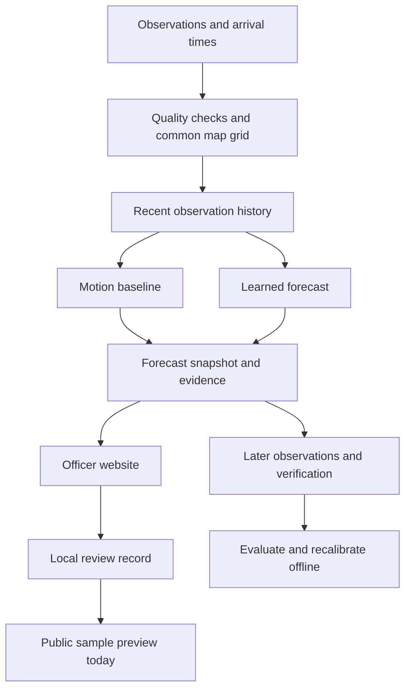

# VAJRA: the product, algorithms and execution flow

Status checked on 30 September 2026. This is the plain-language companion to the [research blueprint](SIH26072_RESEARCH_AND_BLUEPRINT.md). The two new friend notes were reviewed as proposals. Their statements are not proof of implemented functionality or measured accuracy.

## 1. The problem in everyday language

Imagine managing an outdoor school event. A weather forecast says thunderstorms are possible today. You still need to decide whether to stop the event now, move everyone inside, or keep watching.

The useful questions are local and immediate: is a storm developing near us, could lightning occur in the next few minutes, how reliable is that estimate, and how long will it take us to prepare? A storm can develop or change between observations. A missing radar scan makes the decision harder.

VAJRA is a proposed tool for that decision. It combines observations, estimates a precisely defined short-term event, shows what evidence is missing, and helps an officer record a review. The eventual public interface would communicate approved instructions clearly.

This is a real forecasting and decision problem. It is also a field with existing services. IMD, Damini and SACHET already address parts of it. We should demonstrate a specific improvement instead of claiming that we invented lightning warnings. Verified impact figures and official sources are in [Problem and evidence](research/PROBLEM_EVIDENCE.md). The actual [SIH listing](https://www.sih.gov.in/sih2026PS) is the requirements reference; elaborate features in the supplied analyses are interpretations.

## 2. What has actually been completed

| Part | Working now | Limit |
|---|---|---|
| Research | Problem evidence, existing systems, dataset atlas, model comparisons, blueprint and primary references | No stakeholder field interviews or newly conducted survey |
| Training | Six small models trained locally on generated storms; separate training, validation and test events | These are simulator results, not measured Indian forecasting skill |
| Real data | A downloaded, checksum-verified historical MétéoNet radar sample | Southeast France, one case, no paired lightning labels |
| Forecast workbench | Select event, issue time, target, lead time, map layer and source outage | No live Indian radar, satellite, lightning or NWP feed |
| Verification | Persistence and motion comparisons; CSI, POD, FAR, Brier, reliability and neighbourhood scores | Software correctness does not prove operational accuracy |
| Decision records | Save a local simulation receipt with inputs, target, versions and evidence; export JSON | No external dissemination or officer authentication |
| Website and mobile view | Overview, officer workbench, public preview and plain-language pipeline guide | Public view is a sample experience, not a warning service |
| Offline web app | Build-versioned app-shell cache and explicitly saved simulation brief | New weather needs fresh observations and a reachable backend |

The current map marks detected components and projects them using one estimated motion. It does **not** maintain storm identities through time, represent observed split/merge lineage, or run a graph neural network. Those are next-stage research tasks.

## 3. Which prediction are we using right now?

### Simulator mode

The active model is **logistic regression**, a small model that turns a set of measurements into an event probability. There are six separate output models: lightning and a radar-based storm proxy, each at 15, 30 and 60 minutes.

The input uses the last three available frames and 15 features, including current and moved radar intensity, radar change, cold-cloud information, cooling, recent and moved lightning activity, synthetic atmospheric context and source-availability flags. A temperature value chosen on validation events adjusts the model output. That adjustment is not a guarantee of calibration in India or under every outage.

In simplified form, the output is `sigmoid(weighted features / temperature)`. The code is in [forecast.py](nowcast/forecast.py) and [training.py](nowcast/training.py). The model file is [model.json](data/model.json).

Two inexpensive reference methods run alongside it:

1. Persistence keeps the last observed field in place.
2. The motion baseline estimates a single movement from recent frames and translates the field forward.

The motion estimate uses normalized cross-correlation with a small displacement search and half-pixel refinement. This is a global translation estimate, not a dense optical-flow network. Bilinear translation leaves unknown boundary areas as unknown instead of wrapping the picture around.

**The lightning time window matters.** Its target is at least one generated flash within 8 km during the 15 minutes ending at the chosen lead. At +30 minutes it covers minutes 15–30; at +60 it covers minutes 45–60. The latter probability can therefore be lower. The current model does not estimate the cumulative probability of lightning occurring at any time in the next hour.

The storm target is reflectivity at least 35 dBZ at the lead time. Reflectivity is a radar measurement. That threshold is a proxy for convection, not proof of a severe thunderstorm, damaging wind or lightning.

### Real radar mode

The active prediction is **motion extrapolation**, compared with persistence. It uses two real radar frames from 19 December 2018 to predict echo at least 20 dBZ at +5, +10, +15 and +20 minutes. Future frames are held aside for scoring.

This mode does not use the simulator-trained lightning model. A real rainfall-radar example with no lightning labels cannot establish lightning skill. [MétéoNet radar documentation](https://meteofrance.github.io/meteonet/english/data/rain-radar/).

## 4. How the parts connect

In the current application, React renders the website, FastAPI receives requests, NumPy runs the small forecasting methods, and SQLite stores runs and receipts. Both views read the same forecast result rather than calculating different weather independently.

For a live system, ingestion should run on a scheduled backend. It would compute a regional forecast once for a particular input manifest, issue time and model version, then publish that immutable snapshot to many viewers. The current research API computes on request and records a reproducible identifier; it is not yet that scheduled production service.

The future public path adds authenticated officer review and a permitted bulletin channel. CAP describes a message format; it does not grant permission to publish through SACHET. No such integration exists in this prototype. [CAP 1.2 specification](https://docs.oasis-open.org/emergency/cap/v1.2/CAP-v1.2-os.html).

## 5. Who is this for?

**Both officers and the public, with officers as the primary first user.** They need different amounts of information.

| User | Their question | Interface |
|---|---|---|
| Meteorological forecaster | What supports this forecast, and where is it weak? | Map, storm history, sensor age, probability, alternative methods and verification |
| District or local officer | Which places need review, and how much preparation time is available? | Location list, relevant time window, approved procedure and decision record |
| School, construction or outdoor-event coordinator | Is there an approved instruction affecting our location? | A clear brief, valid times, source and action relevant to the site |
| General public | What should I do here, and is this information current? | Location, official message, action, issue/expiry time and update status |

The public should not have to understand dBZ, temperature scaling or diffusion. Officers should be able to inspect the evidence behind a message. These are views in the prototype, not implemented access-control roles.

A responsive **Progressive Web App**, or PWA, is the practical first website-plus-app delivery. It shares code and API contracts, works on desktop and phone, and can be installed in supported browsers. A separately packaged Android/iOS app can follow if device testing establishes a need for native capabilities. App-store releases, background delivery and push are not completed by adding a manifest. Installation behavior varies by browser and platform. [MDN installation guide](https://developer.mozilla.org/en-US/docs/Web/Progressive_web_apps/Guides/Making_PWAs_installable).

## 6. The research architecture I recommend

Start with the first friend's proposal, but build it in measurable stages.

| Stage | Method to use | Why it belongs here | Status |
|---|---|---|---|
| Radar decoding and QC | Py-ART or wradlib, appropriate to the actual supplied format | Convert raw radar geometry and reject known bad measurements | Planned; current real sample is already gridded |
| Multi-radar fusion | Align scan times/heights and compare documented quality-weighted linear-reflectivity blending with simple composites | Overlapping radars have different viewing quality | Synthetic linear blending exists; real quality model planned |
| Sensor alignment | Metric grid, observation/arrival timestamps, validity masks and age channels | Prevent future-data leakage and distinguish missing from quiet | Basic masking exists; full live alignment planned |
| Local motion | Compare Lucas–Kanade optical flow in pysteps against current global translation | Different storms can move differently | Planned comparison |
| Storm tracking | DATing, with observed lineage and growth features | Preserve a cell's history through movement, splits and mergers | Planned |
| Field prediction | Compact ConvLSTM or temporal encoder-decoder, with motion plus a learned growth/decay correction | Motion is useful; storm development also matters | Planned after matched observations |
| Lightning occurrence | A separately trained binary event head with defined radius/window/coverage | Radar echo and lightning are different targets | Synthetic logistic version exists |
| First-lightning timing | Discrete-time survival head for an explicitly defined initiation cohort | Produce coherent cumulative timing probabilities | Later experiment; requires valid quiet history and labels |
| Probability reliability | Held-out temperature or isotonic calibration, chosen by validation support | A raw score needs comparison with observed event frequency | Simulator temperature scaling exists |
| Site lookup | Spatial index and polygon/location joins | Convert map output into the relevant local result | Fixed demo sites now; real GIS joins later |
| Warning review | Versioned deterministic policy, officer review and audit | Keep authority, probability and communication traceable | Local receipt now; operational workflow later |

Do not run ordinary neural layers directly on NaNs. Preserve validity separately and use a finite fill plus mask/age channels. Do not reduce forecast probability merely because a source disappeared; missing evidence can accompany dangerous weather. Data confidence and event probability need separate displays.

For the learned field branch, the idea is to move the existing storm and learn what grows or fades. This has prior art, including [NowcastNet](https://www.nature.com/articles/s41586-023-06184-4). A compact temporal model is a useful comparator, not an inferior method by definition. [Multisensor thunderstorm nowcasting, Leinonen et al.](https://agupubs.onlinelibrary.wiley.com/doi/10.1029/2022GL101626).

### Storm history and the background map must work together

A storm object contains a location, extent, radar trend, satellite cooling trend and recent lightning activity. Tracking connects its successive observations. Nearby objects can be linked through a sparse graph. Start by storing these relationships and feeding simple history features to a classifier. Add a graph neural network only if an experiment shows that learned interactions help.

Keep a field model watching the full region. Before a new storm is detected there may be no object to track. A graph alone can miss the very initiation we want to predict.

DATing already supports split/merge information. A subtle implementation risk is that some annotations describe the next timestep. Tracking must use only the prefix of observations available at issue time; otherwise future mergers can leak into earlier predictions. [DATing documentation](https://pysteps.readthedocs.io/en/stable/generated/pysteps.tracking.tdating.dating.html).

### First lightning and survival modelling

A timing model can estimate the chance of a first event in each small interval, conditional on no earlier event. Combining those conditional chances gives a cumulative probability. For the same event and issue time, the chance within 60 minutes cannot be below the chance within 30 minutes.

This is established survival analysis, not a new mathematical invention. It needs censored examples when recordings stop or lightning coverage becomes unknown. A record with no detections during a sensor outage is not a negative example. An already electrifying storm belongs in a next-flash task, not the first-flash initiation cohort. [Discrete-time survival method](https://arxiv.org/abs/1805.00917).

## 7. Newer techniques worth investigating

| Technique | What it may add | Decision for this project |
|---|---|---|
| Mask and elapsed-time learning, inspired by GRU-D | Explicitly model missingness and how old each observation is | Worth a small ablation; adapt the idea to gridded weather rather than claiming the medical-model result transfers |
| Object history plus a dense field branch | Combine storm development with monitoring of undetected activity | Recommended experimental direction; first use simple object features |
| PreDiff / Earthformer diffusion | Generate several plausible precipitation futures | Later benchmark when data, training compute and latency budget are known |
| STLDM | Deterministic forecasting followed by latent diffusion enhancement | Newer published comparator, not our novel architecture |
| Adaptive spatial refinement | Spend extra work on changing areas while maintaining full-region surveillance | Profile first and compare against fixed tiles |
| Adaptive conformal methods | Study interval/set coverage under changing conditions | Defer; dependencies, delayed labels and region shifts need a careful protocol |

Sources: [GRU-D](https://arxiv.org/abs/1606.01865), [PreDiff](https://proceedings.neurips.cc/paper_files/paper/2023/hash/f82ba6a6b981fbbecf5f2ee5de7db39c-Abstract-Conference.html), [STLDM, published December 2025](https://arxiv.org/abs/2512.21118), [adaptive conformal inference](https://proceedings.neurips.cc/paper/2021/hash/0d441de75945e5acbc865406fc9a2559-Abstract.html).

Diffusion produces possible futures. Eight of ten samples exceeding a threshold gives a model ensemble fraction. It does not automatically establish a calibrated 80% lightning probability. Sharp pictures are not enough; a sharp storm in the wrong place can still be a poor forecast.

The second note also groups GraphCast with diffusion, but GraphCast is a graph neural network for global weather forecasting. Its claims about guaranteed physics, exact local arrival times and seamless national dispatch need to be removed or tested. Its Ghaziabad event is an invented demonstration, not an observed success. The [full review](research/FRIEND_NOTES_REVIEW.md) records the corrections with primary sources.

## 8. What can make our submission stand out?

The strongest proposed contribution is **a measured improvement in useful warning time under imperfect observations**. It combines weather performance and the operator's actual task.

Four experiments would support that contribution:

1. **Sensor quality and age.** Replay the same event with complete inputs, one missing radar and delayed satellite data. Measure the change in skill and reliability. Show the coverage gap instead of silently filling it with a confident answer.
2. **Storm development history.** Compare the same predictor with and without tracked growth, cooling and lineage features. Measure first-lightning lead time, misses and false alarms.
3. **Preparation time.** Show how a 5-minute task and a 20-minute task receive different review deadlines for the same forecast window. The current arithmetic prototype already demonstrates this. Real policy needs operator validation.
4. **Useful computation.** Compare fixed-resolution processing with coarse monitoring plus selected fine tiles at matched quality. Count input reading, preprocessing and tile overlap, not just neural inference.

A possible additional experiment is to refine a tile when the forecast is changing, the available evidence is uncertain, or a preparation deadline is close. This is a proposed scheduling heuristic. It must retain maximum revisit times for quiet areas and be tested for missed initiation. We have not established that it is a first-ever algorithm.

For a judge, the demonstration should answer: what did you know, what did you predict, what actually happened, what changed when a sensor failed, and what evidence supports your claim? That is stronger than listing more model names.

## 9. Can we use Jev? Should it be offline?

The Jev in the first note is **TypeSafe AI's Jev**. Its documented API accepts supplied state and narrow questions. Choice selects an option, Score evaluates ordered categories, and Noul returns a yes/no probability. Those are language-based decisions, not radar or lightning inference. [Jev primitives](https://docs.typesafe.ai/introduction).

The documented inference service is online at TypeSafe. Open-source Python and JavaScript clients do not contain Jev's model weights. I did not verify an official offline runtime or downloadable Jev model. [API reference](https://docs.typesafe.ai/api), [official Python client](https://github.com/typesafe-ai/typesafe-sdk-python).

Use ordinary code for timestamps, sensor-age rules, distances, probabilities, preparation deadlines and expiry. If an officer writes an ambiguous maintenance note, Jev could optionally suggest which review team should inspect it. It must not change the weather probability or turn missing data into an all-clear.

The optional call should be asynchronous, limited to permitted note content, and have a local fallback. When offline or timed out, the note goes to manual review. Jev is not connected now. Full deployment, data-handling, cost and limitation findings are in [Jev assessment](research/JEV_ASSESSMENT.md).

## 10. What works online and offline?

| Function | Offline behavior | What online adds |
|---|---|---|
| Website introduction and guide | Cached app shell opens after a successful first visit and cache installation | New version and external reference downloads |
| Saved sample public brief | Explicitly labelled historical simulation remains readable on this browser | A user can create another sample using the backend |
| Current local forecasting code | Runs without internet if Python, files and weights are local and the browser can reach the server | No extra predictive skill simply from connectivity |
| Phone with no backend connection | Cannot run the Python forecasting engine | Retrieves new forecast snapshots when connectivity returns |
| Live Indian forecast system | Cannot ingest unavailable remote measurements; must label age and coverage | Fresh feeds support a new issue |
| Jev | Local deterministic/manual path | Optional hosted classification |
| Approved public warnings | Saved warning must retain its issue/expiry and stale status | Fetch updated, replaced or cancelled official bulletins |

The PWA caches static application files, never `/api/` forecast responses. The separately saved sample contains its historical issue time. No browser cache can make old weather current. Production offline bulletin delivery needs expiry, cancellation and update rules that are not implemented here. [MDN offline operation](https://developer.mozilla.org/en-US/docs/Web/Progressive_web_apps/Guides/Offline_and_background_operation).

## 11. Efficiency and accuracy, with actual limits

The recorded local benchmark is in [benchmark.json](artifacts/benchmark.json), with context in [VALIDATION.md](VALIDATION.md).

| Measurement | Recorded result | Interpretation |
|---|---|---|
| Simulator runs | About 139–280 ms per selected forecast in the prior benchmark | Small 48×48 domain and simple CPU model |
| Real radar replay | About 2.90–6.23 seconds while browser verification was also running | Larger approximately 172×262 grid; includes forecast and scoring |
| Isolated real +15-minute replay | About 1.74 seconds cold, 1.40 seconds warm | Individual observations, not a p95 service guarantee |
| Synthetic model fitting and calibration | About 38 seconds | Tiny generated training setup, not a deep weather model training budget |

At +5 minutes in the one French case, motion CSI was about 0.711 and persistence about 0.638. At +20 minutes the values were about 0.508 and 0.488. These support the motion baseline on this replay only.

There are real weaknesses in our own experiment. At +60 minutes the synthetic storm-proxy fusion CSI is zero while motion is about 0.098. With lightning removed, the +15-minute storm-proxy fusion CSI is about 0.196 versus motion at about 0.491. A larger-sounding model or polished UI must not conceal these results.

For a live regional service, profile source delay, decoding, alignment, model inference, calibration, persistence, payload size and rendering separately. Report hardware, domain, resolution, p50/p95 latency, memory and cold/warm state. No production latency or national-scale throughput has been established.

Useful implementation choices are bounded observation ring buffers, chunked arrays for the archive, sparse nearby-object edges, and one regional forecast shared across viewers. H3 can help geographic joins; it need not replace the atmospheric model grid. Keep raster data, storm histories and decision records separate. Add distributed infrastructure only when the measured workload requires it.

## 12. Data and build sequence

The next scientific dependency is matched data, not another API wrapper.

1. **Choose a region through data coverage.** Obtain overlapping radar, satellite and lightning periods with clear reuse terms. Ghaziabad is an illustrative option, not yet a verified multi-radar study domain. Bihar in the prototype is a geographic backdrop for simulated fields.
2. **Prove a causal replay.** Retain observation and actual arrival time, product units, quality and missing coverage. Do not use later satellite images to interpolate what an earlier forecast supposedly knew. NWP must be the forecast cycle available then; retrospective ERA5 is a separately labelled experiment.
3. **Train on a paired public dataset first if needed.** SEVIR is useful for learning multimodal data handling and lightning tasks, but its US domain and radar VIL differ from Indian radar reflectivity. MétéoNet alone cannot train our multimodal lightning target. [SEVIR official repository](https://github.com/MIT-AI-Accelerator/SEVIR).
4. **Establish local motion and a compact temporal model.** Split whole events/dates, tune on validation only, test independently. Show quiet conditions, initiation, mature storms, decay and outages.
5. **Add tracked history and a separate initiation task.** Retain only improvements supported by ablation. Introduce a GNN or diffusion benchmark after the simpler model is useful.
6. **Pilot the officer task.** Measure time to identify the relevant area, interpret unavailable data and record a decision. Ask real operators about responsibilities and preparation procedures; we have not conducted those interviews yet.
7. **Connect public delivery after validation and authorised integration.** Add identity, review status, publication, replacement/cancellation, expiry, languages and delivery monitoring. Test the mobile app on actual devices and poor networks.

The [training-data atlas](research/DATA_SOURCES.md) lists MOSDAC, IMD, IITM lightning, NWP/reanalysis and international alternatives, including access steps and limitations. Dataset names are not proof of a ready-to-download matched Indian training set.

## 13. UI changes in this iteration

The website now starts with an explanation and two user paths. The officer workbench retains its working controls and explicitly names the active algorithm. The guide connects each pipeline stage with its implemented and planned parts. The public preview uses location and time before technical detail.

Navigation uses linkable URLs and browser history. Mobile navigation collapses, controls have a 44-pixel minimum height, supporting text is more readable, and keyboard focus is visible. No external font service is required. The app has a manifest and versioned offline shell; saved simulation previews can be cleared on the device.

The public preview does not publish anything. It either shows a labelled empty layout or an explicitly saved historical simulation. The current site has no authentication, push, live public warning feed, native package or app-store release. The next scientific milestone is a paired real-data lightning model that beats declared baselines and remains useful under source failures.
