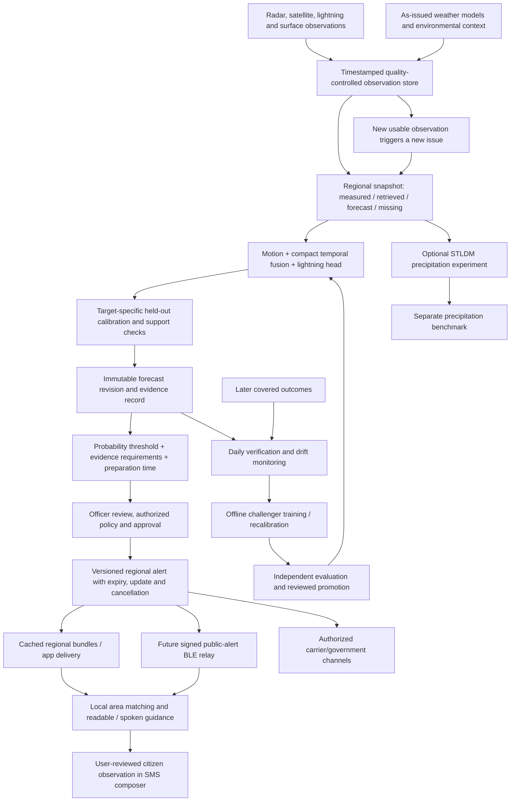

# Regional decisions, continuous forecasts and resilient communication

Updated 30 September 2026. This extends the [algorithm guide](ALGORITHM_DIFFERENTIATION_AND_VALIDATION.md) using both supplied notes and newly checked primary sources. Detailed supporting research covers [weather drivers and sensor gaps](research/WEATHER_DRIVERS_AND_SENSOR_GAPS.md), [STLDM and controlled learning](research/STLDM_STREAMING_AND_LEARNING.md), and [offline delivery and regional targeting](research/OFFLINE_DELIVERY_AND_REGIONAL_TARGETING.md).

**Use good published methods.** We can reuse STLDM, optical flow, DATing, calibration and CAP under their applicable terms. Their publication is a reason to understand and benchmark them, not a reason to exclude them. Our contribution should be a working, well-tested regional decision system and demonstrated improvements on the chosen task.

The product is decision support. Its numerical forecast is one input to an officer's decision. The officer needs to know which area may be affected, during which interval, what evidence is available, which policy checks passed and how much preparation time remains. An LLM or Jev is not required to answer those structured questions.

## How the proposed system connects

This is the operational design. The current prototype has research forecasts, policy receipts, a standalone bounded update queue and the separately documented native reporting/reference-model additions. It does not have an authorized live Indian warning feed, production authentication, public dispatch or a tested Bluetooth network. See [the implementation design](docs/CONTINUOUS_FORECAST_DESIGN.md) and [validation](VALIDATION.md) for the exact working subset.

## What we keep from the supplied notes

| Idea | Decision and integration |
|---|---|
| Quality-aware multisensor fusion | Keep. Preserve age, coverage, quality and measurement type. Test source combinations and outages independently. |
| Motion plus growth/decay | Keep. Movement cannot explain every newly forming storm; compare against LINDA/STEPS and a compact temporal model. Current LINDA accepts rain rate or linear-scale reflectivity, with unit-aware settings. [Official API](https://pysteps.readthedocs.io/en/stable/generated/pysteps.nowcasts.linda.forecast.html) |
| Storm objects, tracks and interactions | Keep. Use past-only associations, lineage and surrounding environmental context. A later observed split cannot become an earlier predictor. |
| STLDM-generated futures | Add as an optional precipitation research path. Preserve the released checkpoint's actual input/target contract and compare against baselines. |
| Earthformer plus diffusion | Evaluate as a distinct architecture experiment. Native STLDM already has its own conditioning network; adding Earthformer changes the architecture and needs retraining. PreDiff is relevant prior work. |
| Ensemble uncertainty | Keep the ensemble, then verify its distribution. Eight threshold exceedances in ten members describe that ensemble's frequency, not an automatically calibrated lightning probability. |
| Operator explanations | Use recorded observation changes and explicit policy reasons. Attention weights alone are not a verified causal explanation. Distinguish measured evidence from model attribution. |
| CAP and geographic warnings | Keep the standard and lifecycle design. CAP formatting does not grant authority to publish through SACHET. Official integration requires access and an agreed workflow. |
| FSS, CSI, POD and FAR | Keep, with units, thresholds, spatial scales and sample counts. Add proper probability scores/calibration and event uncertainty. No one score establishes superiority for every purpose. |

The fictional Ghaziabad timeline in the notes remains an illustration. Its exact timing errors, wind speeds and delivery success are not results. The [earlier note review](research/FRIEND_NOTES_REVIEW.md) records the claim-level corrections.

## STLDM's role

The released HKO checkpoint takes five single-channel 128×128 frames and predicts twenty frames. It combines a deterministic conditioning forecast with latent diffusion refinement. It is not a pretrained multimodal Indian lightning model. Its source and public checkpoint have MIT notices, with pinned versions and actual inference instructions recorded in the [STLDM guide](docs/STLDM_GUIDE.md). [Author repository](https://github.com/sqfoo/stldm_official), [paper](https://arxiv.org/abs/2512.21118).

The optional CLI uses an isolated author checkout and checkpoint cache. It must record input encoding, source/checkpoint hashes, seed, sampling steps, output shape and measured runtime. Supplied normalized example imagery has no verified local availability timestamps or coverage mask. A successful run therefore demonstrates compatibility, not Indian accuracy. It must not invent a dBZ conversion or identify normalized output values as probabilities.

For useful adoption, assemble a matched multi-event precipitation benchmark, compare persistence/flow/LINDA/STEPS/compact models and STLDM on the same issues, and measure the full compute budget. Evaluate precipitation fields separately from lightning labels. A learned lightning head using generative storm features is a possible later experiment, with its own target and calibration. No published method guarantees improvement merely by being included.

The official reference run now succeeds locally: 113.39 seconds of CPU model computation, while other verification work was running. On this one example, normalized MSE was 0.008187 for STLDM and 0.007929 for persistence, so persistence was better. This result supports keeping STLDM as a measured experiment; it supplies no lightning accuracy evidence. The [execution summary](artifacts/stldm-reference-summary.json) and guide retain the source, checkpoint, input and output identities.

## Predicting where ground sensors are sparse

We can forecast a place without a radar directly above it. Nearby radar may cover it, satellites observe a wider area, and NWP supplies an estimated atmospheric state. Upstream storms and the surrounding environment also contain information. But these inputs remain different kinds of evidence.

Every field should retain a provenance class: **direct observation**, **retrieved/interpolated estimate**, **model forecast**, or **missing**. Do not fill a radar gap with predicted reflectivity and then count it as a new radar observation. Do not train on generated lightning as if it were detected lightning.

Use explicit operating modes: full supported inputs; a separately trained/tested satellite-plus-environment mode; a coarser context-only view; or unavailable local lightning prediction. A missing radar does not mechanically lower the true hazard. It changes what we can establish and how the model must be evaluated. Validate outages and hold out whole sensor domains/regions; sparse target coverage remains unknown rather than negative.

Satellite availability also has an access constraint. MOSDAC documents three-day Level-1 latency for general users and separate near-real-time eligibility. General users' Level-2 onward access has a different policy. Confirm the exact product/account/latency before promising a live INSAT image stream. [MOSDAC FAQ](https://www.mosdac.gov.in/faq-page).

## Which physical factors deserve attention?

The detailed [predictor atlas](research/WEATHER_DRIVERS_AND_SENSOR_GAPS.md) maps individual variables to mechanisms, data routes, time/spatial support and limitations. The practical order is:

| Factor group | What it tells us | Priority for short-lead lightning |
|---|---|---|
| Cloud growth, cooling, height, texture and expansion | Whether convection is developing or changing | Core satellite evidence; account for moving clouds, cirrus, scan cadence and parallax |
| Radar structure, echo height, mixed-phase volume and motion | Where precipitating convection is and how it develops | Core where numeric radar is available; polarimetric features are additional tested candidates |
| Recent lightning and changes in activity | Current electrification and its evolution | Core when event type and detection coverage are known; initiation needs a separate quiet-history cohort |
| Moisture, temperature/pressure profiles, CAPE/CIN and freezing level | Whether the environment supports deep convection and electrification | Core context; high temperature or CAPE alone does not prove a storm will form |
| Wind by altitude, shear, convergence and moisture transport | Steering, organization and lifting | Core; surface wind is not cloud motion or the complete wind profile |
| Cold pools, outflow boundaries and their intersections | How one storm may trigger or alter another elsewhere | Important surrounding-domain features; their influence differs from simply moving the parent cloud |
| Terrain, coastlines, sea breezes, solar time and season | Local lifting and background conditions | Region-specific support; evaluate across terrain/season/day-night regimes |
| Soil moisture, land cover and surface fluxes | Slower changes to the boundary-layer environment | Later additions after demonstrating incremental benefit |
| Sea-surface temperature | Ocean moisture/heat context, especially for coastal weather | Useful environmental context; not a direct next-30-minute lightning sensor |
| Sea level, tide, surge and waves | Coastal flooding, access and marine impacts | A separate hazard layer that can change the recommended action |
| Lunar position | Astronomical tides and a small measured atmospheric-tide signal | Not a core local lightning feature; use authoritative tide products for coastal risks |

An upstream storm can affect another place by moving there, producing an outflow boundary that triggers a new cell, or participating in a larger changing weather system. The model therefore needs a surrounding area, not only the user's map pixel. Choose a halo using transport, lead time, target radius and model receptive field, then test border errors. Do not assert that attention automatically learns these mechanisms. [NWS outflow case](https://www.weather.gov/ohx/outflowboundary), [WMO nowcasting guidance](https://public.wmo.int/media/magazine-article/nowcasting-guidelines-summary).

The lunar rainfall study concerns a tiny aggregate tropical signal. It does not demonstrate useful Indian local lightning prediction. Test additional variables only with prespecified held-out comparisons so that a large feature search does not manufacture apparent improvement. [Original lunar study](https://agupubs.onlinelibrary.wiley.com/doi/10.1002/2015GL067342).

## Officer thresholds and the trust question

Separate hazard probability from evidence support and validated model performance. A forecast of 80% lightning probability and two missing sensors should not become `80% × 50% trust = 40% lightning probability`. That would quietly turn ignorance into a lower hazard estimate.

The intended officer policy has distinct checks:

1. The forecast has the correct hazard, area and time window, with valid source/model versions.
2. Its input regime and region fall within the model's demonstrated support; age, coverage and QC requirements hold.
3. The calibrated probability exceeds the chosen action threshold for that action and population.
4. The officer or an authorized automation policy approves the message, jurisdiction and validity; a current approved warning can be updated or cancelled through its lifecycle.

If support is poor, route the result to evidence review and retain authoritative warnings. Failure of our model gate must not suppress an independently issued official alert. Thresholds can differ by operational action, but their selection and changes need an audit trail and false-alarm/miss evaluation. They are not universal numbers copied from a paper.

The implemented website adds minimum recent spatial-source count and maximum age controls to the existing demo probability threshold. Saved receipts show which sources qualified, failed checks, preparation deadline and deterministic reasons. These are **research support checks**, not a calibrated confidence score. Synthetic outputs cannot authorize public dispatch. Production policy additionally needs validated regional input regimes, authorized identities and delivery integration.

## Do we actually need Jev for decisions?

No. Threshold comparisons, timestamps, geographic membership, expiry, duplicates, eligibility and preparation deadlines belong in tested code. Structured evidence can be explained with reviewed templates. Jev's own documentation recommends code for arithmetic and date comparisons and says it is not trained for text generation. [Vendor limitations](https://docs.typesafe.ai/model-jaggedness/jev-1.13).

A reasonable optional hypothesis is: **Jev routes ambiguous free-text citizen/operator notes to the right review team more accurately, or with less officer effort, than a structured form and simple local classifier.** Allowed suggestions might be sensor fault, observation review, delivery issue or unresolved. They do not change probabilities, thresholds or warning status.

Test the hypothesis on human-labelled, held-out notes, with multilingual errors, vague locations, contradictory information and adversarial text. Compare rules, a small local classifier and Jev using the same cases. Measure routing precision/recall, unresolved rate, officer correction/time, deadline failures and actual cost. Redact personal details, use a fixed version/rubric, enforce an overall timeout and keep the ordinary review queue available. A shadow trial has no dispatch permission. If it adds no measurable value, omit it. No Jev request or credential is needed for the current system. [Existing Jev assessment](research/JEV_ASSESSMENT.md).

## More precise alerts without tracking everyone centrally

A broad NCR message is not automatically wrong. It may describe a broad risk, an administrative area, uncertainty or a public test. We did not inspect the user's particular message. A government announcement explicitly described a Delhi/NCR-wide test, which should not be mistaken for a verified local weather forecast. [DoT announcement](https://www.pib.gov.in/PressReleasePage.aspx?PRID=2257102&lang=1&reg=3).

Compute a regional forecast once and reuse it for everyone in that area. Store authorized alert polygons and versions centrally. Use a coarse spatial index, such as H3, to distribute candidate regional bundles; keep the precise fix on the device and perform final polygon matching there. Publish matching explanations and an uncertain-boundary state when the accuracy circle intersects the edge. A manual place remains a supported alternative.

Use conservative polygon-to-cell coverage: default H3 centre-based membership can miss intersecting edge cells. Account for neighbors, movement and uncertainty, then apply an exact final geometry check. Cache bundles by region/version, update subscriptions only after meaningful movement, and expire tokens. The officer normally needs aggregate coverage and delivery health, not a live map of people's movements. Coarse location still reveals information and needs retention controls. [H3 region API](https://h3geo.org/docs/api/regions/), [PostGIS boundary-inclusive matching](https://postgis.net/docs/ST_Covers.html).

This approach reduces repeated computation and precise-location storage. It does not improve the model's spatial skill by itself. A 20-metre GPS fix can still lie within a several-kilometre forecast footprint. Background receipt and dynamic subscriptions require their own platform implementation; the current foreground location button does not implement them.

## Bluetooth, SMS and internet outages

Bluetooth relay is worth prototyping as an additional public-alert delivery route. Participating nearby phones can carry a signed alert onward, including when mobile service is absent. A fresh alert must first enter the mesh through an authorized connected gateway, or through a device that already carries it. A disconnected group with no new source cannot discover a newly issued warning.

Bitchat's nearby mesh and geographic channels are different: the latter use internet Nostr relays. Its iOS and Android repositories also have different/conflicting licence notices. Study the protocol and make a deliberate reuse decision; a generic BLE implementation will not automatically interoperate with Bitchat. [Official project](https://github.com/permissionlesstech/bitchat), [transport/licence audit](research/OFFLINE_DELIVERY_AND_REGIONAL_TARGETING.md).

Relayed public alerts need authenticated origin, issue/expiry, geographic scope, version and update/cancellation references. Deduplicate packets, bound storage and hops, prioritize cancellation, and do not let an older alert revive after cancellation. A gateway signature proves the gateway's statement, not necessarily the original agency's signature. A phone may miss an offline cancellation, so expiry and last-sync age remain visible. Keep private citizen reports outside the public relay channel.

SMS can work without mobile data, but it needs an available carrier messaging path. It is not a solution to complete cellular outage. The current native addition opens the user's messaging composer with an explicitly unverified citizen report, an editable manually entered locality and a note. It does not select a recipient, attach precise GPS automatically, send in the background or claim delivery. A future operator-to-public bulk SMS gateway requires a receiving/sending service and a separate operational setup. [Expo SDK57 SMS source](https://github.com/expo/expo/blob/sdk-57/packages/expo-sms/src/SMS.ts).

Physical phones are required to establish BLE radio/lifecycle behavior and actual SMS transport. Browser tests and native bundle exports establish software behavior only. The immediate delivery is the SMS composer and detailed relay design; there is no working BLE warning network claimed here.

## Continuous correction, daily learning and bounded memory

At 12:00, issue a forecast from everything usable then. When a new scan arrives at 12:05, issue a new forecast version. Preserve both: replacing the old record with the updated answer would hide its actual error. The twenty internal denoising steps of a diffusion model are not twenty arrivals of new weather evidence.

After the outcome window ends and the observation provider establishes coverage/completeness, score the earlier forecast. Delayed or revised labels have their own version. Do not immediately train from an apparent miss if the lightning network was down or the label has not arrived.

The daily job can collect labels, calculate scores, inspect drift and prepare a candidate. Deploy a new model only after comparing it with the current model on suitable independent events. Use a bounded historical replay set to retain rare events, older seasons and sensor regimes. Reusing the same final test set every day would turn it into a tuning set. Never treat the model's own forecast as observed truth. [Continual-learning and drift references](research/STLDM_STREAMING_AND_LEARNING.md#daily-learning-with-delayed-labels).

For efficiency, load weights once per inference worker, share regional results across users, cache decoded observations, bound past-frame buffers, coalesce pending updates and cap active work. The new `LatestForecastQueue` implements the metadata part: one pending revision per configured region, bounded running jobs, duplicate/conflict handling, expiry and rejection of superseded completion. It does not load frames or run a provider feed. Persistent storage and atomic publication must surround it before production use. [Design and boundaries](docs/CONTINUOUS_FORECAST_DESIGN.md).

No LLM does not mean negligible compute. Diffusion can still consume substantial memory and inference time. Run it in a separate bounded experiment queue so it cannot delay the required compact model. Measure decode, queue, inference, serialization and delivery separately. Regional batch size and worker count should follow measured memory and latency, not the number of app users.

## Evidence required for a stronger accuracy and trust claim

Use independent storms, regions and seasons; hold out calibration separately; evaluate actual input-availability histories. Compare full and reduced-sensor modes, unseen regions, missed first events, false-alert duration, useful preparation time, Brier/log loss/reliability, precipitation spatial scores and end-to-end delay. Report coverage and sample counts beside scores. Run prospective shadow forecasts before operational promotion.

For delivery, test polygons at boundaries, stale GPS, moving subscriptions, duplicate/out-of-order updates, offline expiry/cancellation, BLE background restrictions and SMS cancellation/unknown results. For the officer, test whether the explanation makes the correct action easier to choose. Model skill, trustworthy provenance, successful message delivery and protective action require separate evidence.

The research supports this design; it does not establish a national accuracy percentage, lives saved or guaranteed uninterrupted warning delivery. Exact implementation and measured checks are maintained in [VALIDATION.md](VALIDATION.md).
