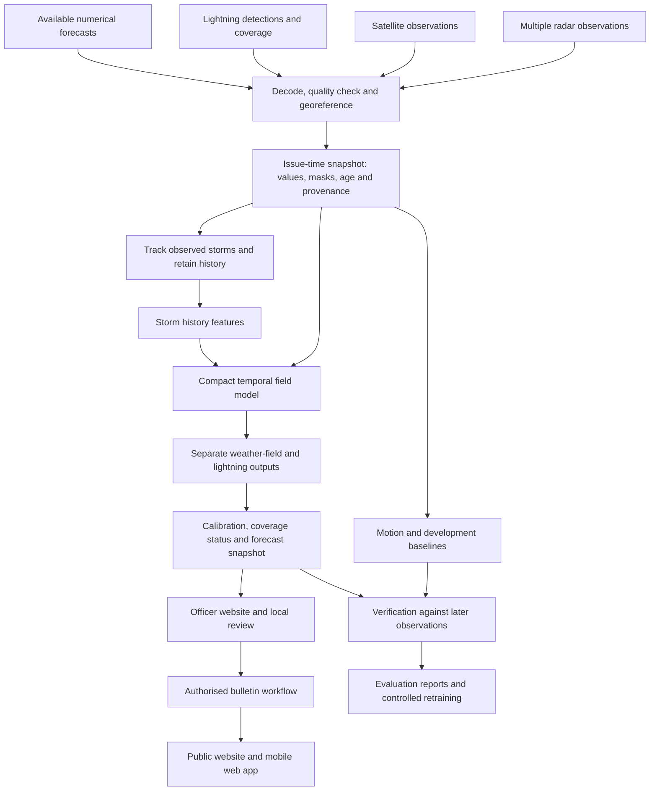

# VAJRA: storm nowcasting and local preparedness

**SIH26072 proposal and evidence brief · 30 September 2026**

VAJRA combines weather observations to estimate short-term thunderstorm and lightning risk, explains the quality of the available evidence, and helps an officer decide when local preparation is needed.

This proposal follows the selected approach: storm development history, sensor quality and freshness, a compact forecasting model, and a shared officer website and public mobile experience. It is the current proposal baseline; experimental radii and grid choices in older notes are alternatives, not additional requirements. It separates the working prototype from the system we propose to validate. Published studies and surveys are external evidence; we have not conducted a field survey or demonstrated lives saved.

## 1. The problem

### The decision people face

An outdoor-work supervisor receives a warning that thunderstorms are possible. The practical decision is more specific: which site needs attention, how soon might the hazard arrive, how current is the information, and can people complete the required preparation in time?

A forecaster must interpret radar, satellite, lightning detections and atmospheric model output that arrive at different times. Storms can move, develop, split, merge or weaken. A missing observation can look misleadingly like an absence of danger unless coverage is recorded explicitly.

The problem has two connected parts:

1. **Forecasting:** estimate a defined local event over a short future interval using incomplete, changing observations.
2. **Preparation:** communicate the evidence, timing and relevant instruction so the responsible person can act and record the outcome.

An alert being sent does not establish that it was received, understood or followed. Improving the second part does not by itself satisfy the forecasting requirement.

### Evidence that the problem matters

| Evidence | What it supports | What it does not establish |
|---|---|---|
| MoSPI's reproduction of NCRB data records **2,887 lightning deaths out of 8,060 deaths due to forces of nature in 2022**, or 35.82%. | Lightning is a serious documented hazard. | These are 2022 figures, not the latest annual total. They do not measure preventability by our product. |
| An IMD intermediate-user survey collected **515 responses in January–February 2021**. About half identified poor communication of uncertainty as a barrier. | Users need intelligible uncertainty and response information. | It is not a representative survey of all Indian citizens or farmers. |
| IMD documents a GIS decision-support system combining radar, satellite, model and exposure information. | Our system must complement substantial existing services. | It would be false to claim India lacks multisensor warning systems. |

Sources: [MoSPI EnviStats 2024, Statement 4.08, printed p. 200](https://www.mospi.gov.in/sites/default/files/reports_and_publication/statistical_publication/EnviStats/Complete_ES1_2024.pdf), [IMD survey monograph, January 2022](https://www.researchgate.net/publication/359699450_Expectation_and_Utilization_Behaviour_of_the_IntermediateUsers_of_Weather_and_Climate_Services_in_India), [MoES parliamentary answer, 11 February 2026](https://www.pib.gov.in/PressReleasePage.aspx?PRID=2226187&lang=2&reg=48).

The MoSPI statistic was directly inspected during the preceding project research. A new attempt to retrieve the 2025 component PDF timed out; it is not used as a newly verified replacement. Conflicting secondary reports of newer NCRB totals are excluded from the headline.

### Defined problem statement

**How can an officer obtain a useful, verifiable local thunderstorm and lightning forecast, understand when missing observations weaken its evidence, and relate the forecast window to the time needed for preparation?**

The [official SIH statement](https://www.sih.gov.in/sih2026PS) asks for AI/ML nowcasting using multiple radars, satellite, lightning and model data. The architecture, pilot area and operational workflow below are our design choices. The official statement does not grant access to those datasets.

## 2. The proposed solution

VAJRA is a forecasting and decision-support service with two interfaces.

| User | Main need | Proposed experience |
|---|---|---|
| Forecaster | Assess a prediction and its supporting observations | Weather map, source quality, storm history, model comparisons and verification |
| District or institutional officer | Prioritise locations and preparation | Site list, relevant time window, procedure, review state and decision record |
| Worksite or school coordinator | Understand an approved instruction | Site-specific brief, issue and expiry times, acknowledgement and escalation |
| Public | Understand current official information | Simple mobile view with location, source, valid time and approved action |

The forecast engine runs centrally or on an institutional server. The website and mobile web app consume the same forecast snapshot. The public service would display authorised information with its issuer and expiry. Experimental model guidance remains identifiable.

### Scope of the first real-data pilot

Choose one region with matched observations and a willing operational partner. Evaluate 15-, 30- and 60-minute products before extending the horizon. Choose grid spacing through actual data resolution and measured compute cost; a fine display grid is not proof of equally fine forecast accuracy.

The current simulator estimates a flash within 8 km during a fixed 15-minute window ending at each lead time. Keep that definition visible during the demonstration. The proposed first real-data experiment predicts at least one qualifying detected flash within **8 km during the next 30 minutes**. This is a cumulative 30-minute target, with new labels. The radius is an initial research setting, not an approved warning boundary; confirm it and the provider's flash definition before freezing the experiment.

A later first-lightning model estimates event timing for a separately defined initiation cohort. Unknown future lightning coverage is excluded or censored, not labelled as no lightning. Cumulative timing probabilities and the current fixed-window probabilities are different products and must not share an ambiguous label.

### Working today versus proposed

The working prototype contains simulator-trained logistic models, a real French radar replay, source-failure controls, forecast verification, saved simulation decisions, an officer website and a public layout preview. Its web-app shell and an explicitly saved historical sample can be opened offline after caching.

Persistent storm lineage, a trained spatial neural model, Indian forecast validation, authenticated operational review and public warning publication are proposed work. Jev is optional research for interpreting operator notes; it is not a weather model or a dependency of the core pipeline.

## 3. Differentiation and the limits of uniqueness

Our proposed contribution is **measured usefulness under realistic observation gaps, linked to local preparation decisions**. Each feature must justify its cost through an experiment or an operator task.

| Proposed feature | Why it helps | Evidence required |
|---|---|---|
| Sensor age, coverage and quality carried into the forecast | Distinguishes missing measurements from genuinely quiet weather | Matched-event tests with delayed, missing and degraded inputs |
| Storm development history with observed split/merge lineage | Adds information about growth beyond present location and movement | Compare the same predictor with and without history features |
| Separate first-lightning evaluation | Tests usefulness before recent lightning becomes an easy predictor | Initiation misses, lead-time distribution and false-alert duration |
| Preparation-aware review | Different sites need different amounts of time to respond | Validated preparation times and supervised scenario tests |
| Reproducible forecast and decision record | Lets reviewers inspect what was known and why a decision was recorded | Identical issue-time replay, versioned inputs and recorded policy |
| Coarse monitoring with selected fine-resolution processing | May save computation while maintaining coverage | Equal-hardware comparison at matched skill, including missed initiation |

These components have prior art. Pysteps DATing supports storm tracking; LINDA models advection and growth/decay; LightningCast and its radar extension address lightning forecasting. IMD, Damini and SACHET already provide substantial forecasting or dissemination capabilities. The [LINDA paper](https://doi.org/10.1175/JTECH-D-21-0013.1), [DATing documentation](https://pysteps.readthedocs.io/en/stable/generated/pysteps.tracking.tdating.dating.html) and [radar-LightningCast record](https://repository.library.noaa.gov/view/noaa/75509) belong in the comparison.

India's official Cell Broadcast System was launched on **2 May 2026**, integrated with CAP SACHET. Multilingual, geographically targeted phone alerts are therefore established services, not our invention. [DoT launch announcement](https://www.pib.gov.in/PressReleasePage.aspx?PRID=2257499&lang=1&reg=3).

The defensible pitch is: **VAJRA tests whether storm history and explicit observation quality can improve useful local lightning guidance, while preserving the evidence behind each review.** We do not claim a world first or superior accuracy before independent evaluation.

## 4. Technical architecture

Start with a modular backend and one shared API. Separate ingestion, forecasting, review and evaluation in code before introducing separate services. Distributed infrastructure is justified only by a measured workload or operational requirement.



### Forecasting components

1. **Observation adapters.** Preserve provider, observation time, receipt time, product, units, projection and quality metadata. Numerical model initialisation, availability and forecast-valid time are separate fields.
2. **Common observation history.** Build a projected grid from data actually available at issue time. Store values, validity masks and age separately. Ordinary neural layers receive finite values plus masks rather than raw NaNs.
3. **Radar composite.** Align time and height and compare documented quality-weighted blending in linear reflectivity with simpler composites. Retain contributing-radar identifiers. Do not average different radar radial velocities as ordinary horizontal wind.
4. **Motion and storm history.** Compare local optical flow with the current global movement baseline. Use DATing or validated overlap tracking to preserve observed storm identities, growth, splits and mergers.
5. **Compact learned model.** Use small input encoders and a ConvLSTM or temporal encoder-decoder. Start with concatenated features and history summaries. Predict growth/decay alongside motion, and train a separate lightning head on actual lightning labels.
6. **Reliability layer.** Calibrate using held-out data and evaluate by source-availability condition. Show event probability, data quality and validation status separately. Missing observations need not reduce the estimated hazard.
7. **Decision layer.** Apply a versioned policy and relevant preparation time. Store the officer's decision and supporting snapshot. A preparation deadline is not a guaranteed strike arrival time.

Maintain a field model watching the whole region: a tracker cannot follow a storm that has not yet become a detected object. Add graph learning only after simpler tracked features prove useful. Defer Earthformer/diffusion until representative training data and benchmark results justify the additional computation.

An initial compute experiment can use six input times at ten-minute spacing, a 128 by 128 projected tile at 2 km spacing, and a ten-minute issue cycle. These are proposed benchmark settings, conditional on product availability. Satellite images retain their real age rather than being interpolated using future frames. Halo cells around the scored interior preserve context. Record the chosen channel count, halo size and model width before comparing runs; do not infer a production GPU budget from this configuration alone.

DATing can annotate relationships involving the next timestep. Tracking on an entire completed storm and attaching those annotations to earlier training samples can leak future information. Run it on the causal observation prefix or timestamp when each relationship became known.

## 5. Data flow

The operational flow and the training flow share data contracts but use future observations differently.

| Step | Input | Output and rule |
|---|---|---|
| Acquire | Licensed files or feed messages | Immutable raw object, receipt time and checksum |
| Validate | Product metadata and measurement arrays | Verified units, geometry, timing and quality flags |
| Align | Valid observations available by issue time | Recent gridded history with masks and age |
| Track | Causal sequence of detected objects | Observed storm IDs, lineage and development features |
| Predict | Frozen model and available history | Defined hazard probabilities and weather-field prediction |
| Package | Prediction, quality and versions | Immutable forecast ID, issue/validity, target, provenance and status |
| Review | Forecast and site context | Reviewed local decision or advisory draft |
| Communicate | Authorised bulletin | Issuer, affected area, action, issue/expiry and update/cancellation relationship |
| Verify | Later observations with coverage | Skill, calibration, false-alert duration and initiation lead time |

For example, an image observed at 14:05 but received at 14:11 is unavailable to a 14:10 forecast. An archive that contains that image does not establish earlier operational availability. If historic receipt times are missing, label the replay idealised and test declared delay scenarios separately.

Keep future truth in the evaluation path. Group train, validation, calibration and test data by event/date, with enough separation to avoid shared input or target intervals. Sample quiet periods as well as storms so that calibration reflects the intended operating environment.

The public view never runs its own independent forecasting model. For deployment, compute each regional issue once and distribute the same snapshot. Offline clients display explicitly dated cached information; they cannot infer that an old quiet forecast means present safety.

## 6. Technology stack

| Layer | Current implementation | Next-stage selection and reason |
|---|---|---|
| Website and mobile UI | React, Vite, Tailwind CSS, Lucide icons | Keep the responsive PWA to share officer/public interface code |
| Maps | Canvas field and coordinate overlays | Add MapLibre or Leaflet only when real geographic layers and their licences are available |
| API | Python, FastAPI, Uvicorn | Keep one typed request/response boundary and add identity and role controls for deployment |
| Current prediction | NumPy logistic models and image translation | PyTorch for the temporal model; preserve small statistical and motion baselines |
| Radar preparation | Provider's gridded sample | Py-ART or wradlib according to raw formats and quality requirements |
| Satellite preparation | Generated simulator field | Satpy and appropriate product readers; validate channels and units |
| Tracking and baselines | Connected components and global motion | Pysteps optical flow, DATing and LINDA comparison |
| Scientific arrays | Local files and NumPy arrays | Xarray with NetCDF/Zarr for a larger matched archive |
| Forecast and review records | SQLite | PostgreSQL/PostGIS when concurrent users and spatial queries require it |
| Raw archive | Local files with hashes | Institution-managed object storage with immutable manifests |
| Background processing | On-demand research runs | Scheduled ingestion/inference worker; add a queue only if needed |
| Verification | Python tests and Playwright | Event-based scientific evaluation, failure replay and actual-device testing |
| Deployment | Local Python service | Containerised institutional or cloud deployment after data-access and service requirements are known |

Do not put raw radar arrays through Jev. Its documented hosted API may be tested for interpreting permitted operator notes. The forecasting and review path must remain usable without it. See the [Jev assessment](research/JEV_ASSESSMENT.md).

## 7. Feasibility and viability

Feasibility asks whether we can build and validate the system. Viability asks whether an organisation can adopt, fund and maintain it.

### Technical and data feasibility

| Area | Assessment | Next evidence needed |
|---|---|---|
| UI, API, replay and local records | Demonstrated at prototype scale | Multi-user security, monitored deployment and operational user testing |
| Low-cost baseline computation | Demonstrated on small local examples | End-to-end p50/p95 latency and memory for the actual pilot domain |
| Multimodal training workflow | Plausible with public paired data | A reproducible subset, frozen splits and coverage-aware labels |
| Indian lightning skill | Unproven | Matched radar, INSAT, lightning and available NWP archives plus independent test events |
| Storm-history benefit | Testable hypothesis | Tracking accuracy and feature ablation on real events |
| National-scale service | Outside the current evidence | Regional pilots, service operations, data rights, scaling and disaster recovery |

[SEVIR](https://registry.opendata.aws/sevir/) provides aligned US radar, satellite and lightning observations and is suitable for pipeline development. Its radar VIL is not dBZ; its satellites and lightning observations differ from Indian products. It does not by itself establish India transfer. The bundled MétéoNet radar sample is useful for a real echo replay but lacks the required paired lightning target.

Indian deployment needs explicit access and reuse arrangements for the actual products. MOSDAC historical access, near-real-time access, raw redistribution and value-added commercial use have distinct conditions. An open viewer or downloadable image is not automatically a training archive or a redistribution licence. See [MOSDAC data-use guidelines](https://www.mosdac.gov.in/look/DOCS/mosdac-data-guidelines_english.pdf) and the [data atlas](research/DATA_SOURCES.md).

### Pilot stages and acceptance gates

| Stage | Deliverable | Gate to proceed |
|---|---|---|
| Data and partner agreement | Selected region, permitted observations, target and responsibilities | Matched periods and usable label coverage exist |
| Causal baseline | Reproducible replay with honest observation availability | Units, timestamps, targets and split checks pass |
| Model experiment | Compact temporal model and storm-history comparison | Useful improvement on held-out events at a declared false-alarm burden |
| Shadow operation | Officer sees experimental guidance alongside official information | Acceptable source delay, forecast behavior and review comprehension |
| Controlled deployment | Authenticated review and approved public integration | Operational ownership, update/expiry handling and support arrangements tested |

Set numerical acceptance thresholds with the meteorological and operating partners before the final test. Include initiation lead time, missed events, false-alert minutes, Brier score, calibration, coverage and latency. A high overall accuracy on mostly quiet pixels is not an adequate gate.

The current local benchmark and **17 science/API tests plus four browser tests** demonstrate implementation behavior. They do not establish real-world forecast skill. Some synthetic experiments lose to the motion baseline; retain these failures in the evidence. [Validation record](VALIDATION.md).

## 8. Business and adoption model

### Who benefits and who might pay

The proposed model keeps basic public information accessible while charging institutions for deployment, integration, site workflows, training and support. This is a hypothesis to validate, not evidence of customers or committed revenue.

| Potential buyer | Service they might value | Reason to validate demand |
|---|---|---|
| State/district disaster-management bodies | Review workflow, local evidence, drills and audit | Public procurement and existing systems may already cover the need |
| Construction, utilities, mines and outdoor operations | Multi-site preparation procedures and decision records | Must demonstrate reduced decision burden and acceptable false-alert cost |
| Institutional campuses and event operators | Location brief and staff response coordination | Budgets, responsibilities and practical shelter access vary |
| Research or weather-service organisations | Replay, model evaluation and observation-quality tools | Integration effort and data restrictions may dominate value |

Possible commercial arrangements are a paid pilot, institution/site subscription, managed deployment or annual support contract. No price is asserted as market-validated. Do not build the business around reselling free official alerts or monetising personal location data.

SACHET already offers agency integration documentation, and government cell broadcast is operational infrastructure. Reading official bulletins does not give VAJRA permission to originate public warnings or use government dissemination channels. [SACHET agency integration guide](https://sachet.ndma.gov.in/docs/Integration_Guide_For_Agencies.pdf).

### Costs and unit economics

Budget for data access, meteorological expertise, engineering, model training, routine inference, storage, communication channels, monitoring, user training and support. Human review and maintenance can cost more than the neural inference itself. Include outages, retraining and customer integration in the cost model.

Use actual pilot measurements in these calculations:

```text
Contribution per paying organisation
    = recurring revenue - variable data, compute, delivery and support cost

Break-even organisation count
    = fixed recurring cost / positive contribution per organisation

Cost per useful reviewed decision
    = total service cost / decisions meeting the agreed usefulness definition
```

Obtain quotes and buyer feedback before inserting rupee values. Total national weather expenditure is not VAJRA's addressable market. The government's Mission Mausam investment establishes an active policy area and strong incumbents, not a guaranteed procurement opportunity. [MoES reply, 13 August 2026](https://www.pib.gov.in/PressReleasePage.aspx?PRID=2298819&lang=1&reg=3).

### Evidence of viability to collect

Interview actual budget owners and users separately. Observe their current process. Establish who can act, who bears a false-alarm cost, and who maintains the system. Then run a paid or explicitly sponsored pilot with acceptance measures, a support owner and a renewal decision. We have no willingness-to-pay survey, contract or revenue result yet.

## 9. Risks and controls

These are qualitative project assessments, not calculated probabilities.

| Risk | Consequence | Control or test | Residual limitation |
|---|---|---|---|
| Missing or delayed observations | Forecast appears more certain than its evidence | Coverage/age channels, dropout replay, stale status and abstention rules | Dangerous weather can remain unobserved |
| Incorrect lightning labels | Model learns sensor outages or product differences | Provider-specific event definitions and coverage-aware labels | Detection efficiency may vary by place and time |
| Future information in training | Inflated scores that collapse in operation | Receipt-time filtering, event splits and causal tracking | Old archives may lack actual receipt times |
| Storm initiation or domain shift | New Indian events differ from training | Separate initiation tests, region/season holdouts and shadow operation | Rare extremes provide limited samples |
| Excessive false alarms | Users lose trust or incur shutdown costs | Measure false-alert duration and calibration at operational thresholds | A missed-event/false-alarm trade-off remains |
| Model result mistaken for official instruction | Conflicting or inappropriate action | Clear issuer, experimental status, review and authorised publication | A clear interface cannot replace governance |
| Public device offline or information expired | Old brief appears current | Visible issue/expiry, cancellation handling and explicit offline state | New hazards cannot be received without connectivity |
| No suitable shelter or response authority | Good information does not result in protection | Site assessment, practical procedures, drills and escalation | Software cannot provide physical infrastructure |
| Data rights, API changes or provider outage | Service cannot legally or technically continue | Written product-specific terms, versioned adapters and fallback plan | Essential feeds may still require ongoing agreements |
| Security or tampered messages | False instructions or exposed records | Authentication, role controls, transport security, audit and incident response | Current localhost demo is not production hardened |
| Adoption and funding | Pilot ends without operational ownership | Named service owner, trained users and maintenance budget | No customer demand has yet been established |
| Excessive compute complexity | Slow updates or unaffordable operation | Profile compact models first; evaluate selective refinement | Finer models still require actual benchmarking |

Avoid treating a fallback as an all-clear. Preserve official warning identity when our experimental guidance disagrees. Public-distribution policy, contractual responsibilities and applicable data handling requirements need the deployment partner's review.

## 10. Impact and benefits

The intended benefit is more useful preparation with less ambiguity about the evidence. The following are outcomes to measure, not benefits already achieved.

| Beneficiary | Intended benefit | Measurement |
|---|---|---|
| Forecasters | Faster inspection of storm development and source problems | Time to identify a relevant event; error rate interpreting missing data |
| Officers | More consistent, reviewable decisions | Decision time, unresolved cases and completeness of the decision record |
| Outdoor teams | More time for a defined protective procedure | Fraction completing the procedure before the relevant event window |
| Public | Understandable, current information | Message comprehension and correct recognition of expired/offline information |
| Operating institutions | Fewer avoidable disruptions while maintaining protection | False-alert minutes, missed hazardous events and documented operating costs |
| Research partners | Reproducible model evaluation | Replayed issues, valid coverage, frozen comparisons and audited failure cases |

Measure sent, received, understood and acted-on messages separately. Compare groups and sites, not only an aggregate average. A successful drill can support usability and readiness claims; it cannot prove reduced deaths.

General early-warning economic research provides a reason to investigate the service. It is not evidence for a project-specific return on investment. Do not convert a global disaster-loss estimate into expected VAJRA savings. The [viability evidence note](research/VIABILITY_AND_SUSTAINABILITY_EVIDENCE.md) records the relevant primary findings and their scope.

## 11. Sustainability

### Financial and operational continuity

Use institutional contracts or public sponsorship to cover recurring maintenance. Name the organisation responsible for data agreements, service monitoring, seasonal validation and incident handling. Keep documented interfaces and exportable records so the system remains maintainable when the student team changes.

### Technical and environmental efficiency

Reuse existing observation networks. Run inference once per region and issue, then share the snapshot. Keep bounded recent-history buffers and chunked archives. Start with compact models and evaluate larger ones against their incremental forecast benefit. Test coarse monitoring with selective fine tiles only after profiling demonstrates a bottleneck.

Measure energy or GPU-hours per experiment, energy per regional issue, stored bytes per day and network bytes per user. State whether energy is directly measured or estimated. Do not claim a carbon reduction without a declared baseline and hardware/grid assumptions.

### Social continuity and inclusion

Keep public essentials accessible and test local-language understanding. Support low-bandwidth views and explicit stale/offline states. Work with existing official channels and local coordinators so the system does not depend on every person installing our app. Plan for people without phones, suitable shelter or authority to stop work.

The project is consistent with the intent of SDG 11.5, SDG 13.1 and SDG 13.3. That is an alignment claim, not a certified contribution or a measured improvement in an SDG indicator. [UN Goal 11](https://sdgs.un.org/goals/goal11), [UN Goal 13](https://sdgs.un.org/goals/goal13).

## 12. Surveys, research papers and newspaper references

### Published surveys

| Study | Sample and date | Use in this proposal | Limitation |
|---|---|---|---|
| IMD, *Expectation and Utilization Behaviour of the Intermediate Users of Weather and Climate Services in India*, January 2022 | 515 intermediate users; fieldwork January–February 2021 | Supports explicit uncertainty, impact and action information | Online intermediary sample; older services and selection bias |
| NCAER, *Estimating the Economic Benefits of Investment in Monsoon Mission and High Performance Computing Facilities*, July 2020 | 6,098 face-to-face beneficiaries, including 3,965 farmers | Informs questions about service use, changed practices and institutional value | Existing beneficiaries were selected; self-reported outcomes do not establish causal benefits for our app |
| Keul, Sharma and Nunes, ECSS 2013 lightning-knowledge pilot | Nagaland quota sample of 100 in 2012 | Supports locally testing understanding instead of assuming it | Small, old, education-skewed conference study; not a national estimate |

Primary materials: [IMD monograph](https://www.researchgate.net/publication/359699450_Expectation_and_Utilization_Behaviour_of_the_IntermediateUsers_of_Weather_and_Climate_Services_in_India), [NCAER report hosted by IMD](https://rsmcnewdelhi.imd.gov.in/uploads/survey/NCAER2020.pdf), [ECSS original conference PDF](https://www.essl.org/ECSS/2013/programme/abstracts/88.pdf). Detailed findings, page references and recent news are in [Surveys and news](research/SURVEYS_AND_NEWS_2026.md).

These surveys are not new research conducted by our team. For the pilot, use neutral questions about the last actual warning, its source, receipt time, interpretation, action, barriers, shelter access and preparation time. Ask officers about actual decisions and institutions about existing expenditure and procurement. Do not treat enthusiasm for an AI demonstration as willingness to pay.

### Technical reading priorities

1. Read LightningCast and its radar extension for direct lightning targets, first-flash behavior and real limitations.
2. Read the multisensor thunderstorm work by Leinonen and colleagues for shared temporal models with separate hazards.
3. Read LINDA, pysteps and DATing before claiming novelty for storm tracking or learned development beyond motion.
4. Use SEVIR for understanding matched public data and domain-transfer limitations.
5. Read NowcastNet, Earthformer, PreDiff and STLDM as alternative architectures and later benchmarks.

The [paper reference library](research/PAPER_REFERENCE_LIBRARY.md) gives exact titles, dates, publication status, links and relevance for twelve selected papers. Useful starting references include:

| Paper | Why we need it |
|---|---|
| Cintineo et al., **The Impact of Radar Reflectivity Data in a Satellite-Based Lightning Nowcasting Model**, 2026 | Closest recent comparator for radar/satellite lightning forecasts, first-flash evaluation and missing radar coverage. [NOAA record](https://repository.library.noaa.gov/view/noaa/75509) |
| Foo et al., **STLDM: Spatio-Temporal Latent Diffusion Model for Precipitation Nowcasting**, 2025 | Recent published field-generation architecture to benchmark later. [Author manuscript](https://arxiv.org/abs/2512.21118) |
| Leinonen et al., **Thunderstorm Nowcasting With Deep Learning: A Multi-Hazard Data Fusion Model**, 2023 | Existing multisensor temporal model with separate hazard targets. [Publisher](https://agupubs.onlinelibrary.wiley.com/doi/10.1029/2022GL101626) |
| Pulkkinen et al., **Lagrangian Integro-Difference Equation Model for Precipitation Nowcasting**, 2021 | Strong movement-plus-development baseline. [DOI](https://doi.org/10.1175/JTECH-D-21-0013.1) |

The library distinguishes precipitation research from lightning research and recent papers from foundational work.

### News and event reports

Newspaper reports establish incident context and public experience, not model accuracy. Pair any selected incident with an official report when possible, preserve the article's date, and label a changing death toll as the count reported at that time. Do not merge lightning deaths with deaths caused by collapsing structures, wind, hail or flooding.

The [IMD report on the 13 May 2026 Uttar Pradesh event](https://mausam.imd.gov.in/Forecast/marquee_data/Thunderstorm%20Report%20for%20the%20weather%20events%20of%2013.05.2026.pdf) is a candidate historical-event reference. Its images and narrative are not a licensed machine-readable training set. Selected newspaper references are:

| Report | Appropriate use |
|---|---|
| Hemant Kumar Rout, *The New Indian Express*, **26 May 2025**, [Lightning deaths rise as early warning apps fail to serve: Study](https://www.newindianexpress.com/states/odisha/2025/May/26/lightning-deaths-rise-as-early-warning-apps-fail-to-serve-study) | Regional reporting about outreach concerns. The underlying university study was not recovered, so its headline is not adopted as verified proof of app failure. |
| TNN, *The Times of India*, **15 May 2026**, [117 killed as storms lash UP with cyclone-like 130kmph winds](https://timesofindia.indiatimes.com/city/lucknow/devastating-storm-across-up-claims-117-lives-damages-homes-livestock-across-up/articleshow/131102356.cms) | Dated reporting on the 13 May event. The headline is a provisional all-storm count, not a lightning-only total. |
| Express Web Desk, *The Indian Express*, **30 May 2026**, [Delhi-NCR residents receive Extremely Severe Alert on phones](https://indianexpress.com/article/india/delhi-ncr-extremely-severe-alert-phones-sachet-launch-10715893/) | Illustrates public experience of existing warning delivery. The article's claim that it was the first such alert was not independently established. |

The companion survey/news file records authors, timestamps, official cross-checks and limitations.

## 13. Recommended submission position

Lead with the local preparation problem, then show the forecasting experiment. Demonstrate one held-out event, what was available at issue time, the forecast, the eventual observation and the recorded review. Repeat it with a sensor removed. Report both improved and degraded results.

Use the working prototype to prove execution and traceability. Use the architecture and evidence library to explain the next research step. The decisive milestones are matched real observations, improvement over strong baselines, and an operational partner who can validate whether the guidance helps people prepare.

Supporting files:

- [Plain-language product and algorithm flow](PRODUCT_FLOW_AND_ALGORITHMS.md)
- [Original research blueprint](SIH26072_RESEARCH_AND_BLUEPRINT.md)
- [Data access and training-data atlas](research/DATA_SOURCES.md)
- [Review of the friend notes](research/FRIEND_NOTES_REVIEW.md)
- [Survey and newspaper evidence](research/SURVEYS_AND_NEWS_2026.md)
- [Research-paper library](research/PAPER_REFERENCE_LIBRARY.md)
- [Business and sustainability evidence](research/VIABILITY_AND_SUSTAINABILITY_EVIDENCE.md)
- [Measured software and forecast validation](VALIDATION.md)
