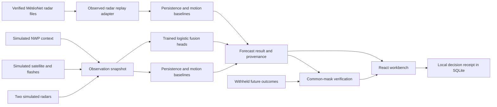
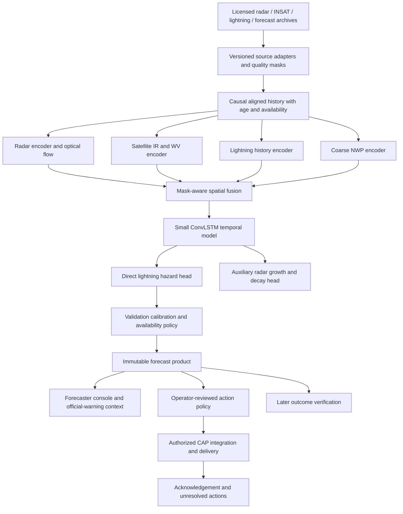

# SIH26072 research and implementation blueprint

Research date: 29 September 2026. Project name: **VAJRA**. Purpose: help the team understand the problem, choose a defensible solution, demonstrate working software, and plan the evidence needed for an Indian pilot.

**Recommendation:** build a verifiable nowcasting workbench for a small pilot region. It should combine observation sources, forecast explicitly defined hazards, reveal when its evidence is incomplete, and help an operator decide when to act. Its distinction should be measured forecasting and operational reliability. A new map, a Transformer, multilingual messages, or four-source fusion does not by itself establish novelty.

This repository includes a running implementation, model-training code and artifacts, observed radar replay, and verification. It does **not** contain a validated operational Indian lightning model. The difference matters when describing the work to judges.

The detailed evidence is divided into [problem and impact](research/PROBLEM_EVIDENCE.md), [data sources and access](research/DATA_SOURCES.md), and [models and evaluation](research/MODEL_RESEARCH.md). [VALIDATION.md](VALIDATION.md) records actual implementation results. [README.md](README.md) explains how to run the software.

## 1. What the official problem asks

The official SIH portal entry `ViewProblemStatement26072` identifies AI/ML nowcasting of thunderstorms and lightning using multiple radars, satellite, lightning and model data. The organization is the Ministry of Earth Sciences, the department is IMD, and the category is Software under Disaster Management. The description repeats the title; the dataset/contact fields were blank when retrieved. [Official SIH portal](https://www.sih.gov.in/sih2026PS).

The official entry does not prescribe a particular neural architecture, numerical accuracy, region, interface or entitlement to data. A 5-minute update cycle, 2 km pilot grid, 15–60-minute initial horizons and an operator dashboard are proposed design choices. The supplied Markdown and DOCX explain sensible interpretations, but their example percentages, thresholds, rankings and deadlines are not experiment results or additional official requirements.

| What the supplied documents get right | What needs tightening |
|---|---|
| The task is spatiotemporal forecasting | Rainfall, reflectivity, observed thunder and lightning need distinct targets |
| Multiple sensors offer complementary information | A useful contribution requires measured improvement over existing fusion products |
| Baselines and event-based splits matter | Also preserve receipt times, label coverage and a gap around split boundaries |
| Missing-source behavior is essential | Missing lightning data cannot become a negative lightning label |
| Confidence and explanation belong in the interface | Data completeness, probability and calibration are separate quantities |
| Localized decisions matter | A moving cell's centroid is not a guaranteed lightning strike ETA |

Both supplied files were read. The DOCX text extraction is retained in [research/input](research/input/problem-analysis-docx.txt). Its embedded team guidance was treated as content to assess, not as an instruction overriding the user's request.

## 2. Experience the problem before designing the model

Imagine a supervisor at three outdoor worksites. A warning covers the district. One site can move everyone indoors in five minutes; another needs twenty minutes, and a third may not have a suitable shelter. The supervisor needs a current, understandable forecast, the time needed to respond, and a way to see whether an instruction was acknowledged.

Now take the forecaster's seat. One radar is late, another sees the storm from a different angle, a cloud is growing before rain appears, and a lightning network has a coverage gap. A model can still output a plausible number. The harder question is whether that number has enough evidence to support a decision.

These are design scenarios, not interviews conducted for this project. They suggest two distinct users:

| User | Immediate job | Useful output | Failure to avoid |
|---|---|---|---|
| IMD or research forecaster | Detect initiation, movement and intensification | Source layers, probabilistic grids, baseline comparison, replay | Overconfident output built from stale or unavailable observations |
| District operator or site supervisor | Make a timely, practical protective decision | Location-specific window, action time, acknowledged review record | A broad notification that arrives too late or cannot be acted on |

An early-warning chain has several links: observations, prediction, official/operator decision, communication, comprehension and action. A sent message does not establish that someone understood it or reached shelter. Measure these links separately.

## 3. Hard facts that are suitable for a presentation

| Fact | Exact scope | Implication |
|---|---|---|
| 2,887 lightning deaths in 2022, out of 8,060 deaths attributed to forces of nature, about 35.82% | NCRB series reproduced in MoSPI's 2024 publication, Statement 4.08. The event year is 2022, not 2024. | A substantial documented harm justifies focused work. This is not a current annual estimate. [MoSPI primary table](https://www.mospi.gov.in/sites/default/files/reports_and_publication/statistical_publication/EnviStats/Complete_ES1_2024.pdf) |
| 1,211 nowcast stations as of December 2025 | Ministry parliamentary answer published 11 February 2026 | Work with existing services and their considerable capability. A station count is not a radar count. [PIB/MoES](https://www.pib.gov.in/PressReleasePage.aspx?PRID=2226187) |
| A 2021 IMD intermediary survey received 515 responses; among 511 answering a multi-select needs question, 63.4% selected lightning and 67.1% thunderstorms | Online intermediary survey, not a representative farmer or household survey | Uncertainty communication and user workflows deserve field testing. [Primary author-hosted monograph](https://www.researchgate.net/publication/359699450_Expectation_and_Utilization_Behaviour_of_the_IntermediateUsers_of_Weather_and_Climate_Services_in_India) |
| A 2026 IMD report documents localized warnings and a severe Uttar Pradesh storm episode on 13 May | One documented event; hazard mix included damaging wind, hail, lightning and rain | A useful candidate for a future real Indian case study after numeric observations are secured. Do not classify all casualties as lightning deaths. [IMD event report](https://mausam.imd.gov.in/Forecast/marquee_data/Thunderstorm%20Report%20for%20the%20weather%20events%20of%2013.05.2026.pdf) |

The evidence note contains additional qualified figures, including IMD's combined thunderstorm/lightning reporting and global early-warning economics. They are not merged with NCRB's lightning-only series. Conflicting newer fatality totals were not promoted into headline facts. The project has not measured lives saved, financial savings or user adoption.

## 4. Existing work changes the novelty claim

| Existing work | What already exists | What this team must demonstrate beyond a similar description |
|---|---|---|
| IMD GIS decision support | Radar, satellite, NWP, observations, exposure and hazard integration | Reproducible incremental skill and explicit failure behavior on an agreed pilot dataset. [Official description](https://www.pib.gov.in/PressReleasePage.aspx?PRID=2226187) |
| IITM Damini | Location-based lightning warnings and safety information | A complementary forecaster/review workflow, benchmarked rather than asserted. [IITM project](https://www.tropmet.res.in/28-Thunderstorm%20Dynamics-project) |
| NDMA SACHET | Geotargeted multilingual warning dissemination | An authorized integration with traceable issue/expiry semantics when the system is ready. [SACHET](https://sachet.ndma.gov.in/) |
| ISRO lightning nowcasting research | The 2025–26 report describes deep-learning probabilistic lightning nowcasts with 30–120-minute lead times | Demonstrated reliability, transfer and practical decision support. Satellite-plus-lightning AI is already prior art. [ISRO annual report](https://www.isro.gov.in/media_isro/pdf/AnnualReport/Annual_Report_2025_26_Eng_29042026_Rev.pdf) |
| NOAA ProbSevere / LightningCast | Storm objects, multiple observations and learned lightning probability; radar extensions also exist | A justified Indian adaptation and measured performance during relevant failures. [MRMS](https://www.nssl.noaa.gov/projects/mrms/), [LightningCast radar-extension record](https://repository.library.noaa.gov/view/noaa/75509) |
| Pysteps, DGMR, NowcastNet, Earthformer | Established motion, recurrent, attention and generative precipitation approaches | Hazard-specific evaluation. A rain/VIL benchmark is not lightning validation. [Pysteps](https://gmd.copernicus.org/articles/12/4185/2019/), [DGMR](https://www.nature.com/articles/s41586-021-03854-z), [NowcastNet](https://www.nature.com/articles/s41586-023-06184-4), [Earthformer](https://arxiv.org/abs/2207.05833) |

Public documentation does not expose every internal capability of these systems. The table is not proof that an incumbent lacks a feature. Do not claim world-first fusion, perfect prediction, zero false alarms or guaranteed strike locations.

## 5. The distinctive proposal

The proposed contribution is an **auditable forecast-to-decision workflow under incomplete observations**. Each claim has a concrete demonstration and a validation requirement.

| Feature | Why choose it | What makes the execution credible | Current status |
|---|---|---|---|
| Forecast evidence record | Operators and reviewers need to reconstruct a result | Store source state, issue/valid times, target, code/model hash, seed or data manifest and outcomes | Implemented for simulation and observed replay |
| Missing/stale source experiments | Networks fail; a clean-data score hides this weakness | Remove observations, recompute, reveal degradation and withhold unsupported output | Implemented; synthetic reliability only |
| Learned forecast versus persistence and motion | Complexity needs to earn its place | Compute identical-target scores on common valid pixels; retain cases where the baseline wins | Implemented |
| A separate lightning target | Rain or cold cloud is not an electrical discharge | Future observed-event window and radius with explicit coverage | Synthetic target implemented; Indian label acquisition pending |
| Decision deadline | Action takes time | Use the start of the forecast window minus preparation time, explain the approximation | Implemented as a simulation review aid |
| First-flash/convective initiation score | Earlier warning is more useful than detecting existing flashes | Separate initiation cohort, prior-clear interval, independent labels and missed events | Research design; not yet a measured result |
| Stable storm lineage | Merges and splits make single tracks misleading | Parent/child association, uncertain-motion state and object-level verification | Initial object motion display only; lineage remains future work |
| Acknowledgement and unresolved-action queue | Delivery is only one step of response | Operator-approved drill, delivery/acknowledgement timestamps and idempotent escalation | Proposed pilot feature; no messages sent |
| Source-specific calibration | A fallback can be less reliable even if it emits probabilities | Validate/calibrate outage cohorts and withhold unsupported combinations | Full-source synthetic temperature fit; outage calibration pending |
| Official-warning coexistence | Users need to know the issuer and authority | Preserve official warning text/expiry alongside experimental products | Documented; authenticated IMD integration pending |

For judges, the strongest demonstration is a result that remains inspectable when challenged. Turn off a sensor. Show the score change. Show a failed forecast. Export the exact evidence. That is a credible execution distinction even without claiming a new neural architecture.

## 6. What the working implementation does

The code has two clearly labelled modes.

**Synthetic Bihar study area.** A reproducible generator creates moving, growing and decaying Gaussian storm structures on a 48 × 48 grid with 4 km spacing. It produces two noisy radar instruments, infrared-like temperatures, simulated flash counts and a coarse environmental field. The radar instruments overlap and are blended in linear reflectivity units. The simulation is not an observed Bihar event and its timestamps are illustrative.

A NumPy logistic model has distinct storm-proxy and lightning heads for +15, +30 and +60 minutes. It uses motion-advected fields, radar change, cloud cooling, recent flashes, source-presence indicators and environmental context. The model is trained on 24 generated events, its temperature is selected using six other events, and six further events are held out for testing. This exercises real fitting, calibration selection and inference code. It does not establish an atmospheric relationship or real-world skill.

**Observed French radar replay.** The application reads an actual Météo-France sample, verifies the file hashes, decodes reflectivity, preserves missing pixels, and selects six consecutive five-minute frames. The first two observations support persistence and global motion extrapolation at +5, +10, +15 and +20 minutes. Future frames are used only for verification. There are no lightning observations in this sample, so the UI does not offer lightning prediction or apply the simulator-trained model to France.

The browser supports event/lead/target selection, forecast/outcome layers, source removal and delay, computed scores, reliability bins, a local site review, JSON export, and saved receipts. Its coordinate raster works without an external map-tile server. It is not a surveyed administrative-boundary map.

## 7. Basic architecture



The future outcome branch has no path into the forecast engine. A test changes all future arrays and confirms the current forecast remains identical.

| Module | Responsibility |
|---|---|
| `nowcast/observations.py` | Synthetic observation fields, multi-radar blending, missing/stale snapshots and receipt-time selection helper |
| `nowcast/numerics.py` | Translation without edge wrap, correlation-based global motion, neighborhoods and connected objects |
| `nowcast/forecast.py` | Feature extraction, learned heads, baselines, abstention and target definitions |
| `nowcast/training.py` | Event-separated fitting, temperature selection and reproducible evaluation artifact |
| `nowcast/real_data.py` | Hash-checked MétéoNet decoding and gap-safe short replay |
| `nowcast/verification.py` | Contingency counts, Brier score, reliability bins and neighborhood FSS |
| `nowcast/service.py` | Validated HTTP inputs, orchestration and immutable SQLite run/receipt records |
| `src/main.jsx` | Forecast controls, coordinate raster, evidence, verification and decision workflow |

The two candidate designs and selection are retained in [research/design](research/design/SYNTHESIS.md). The local modular service won because restricted Indian data and compute were not established. The spatial model remains the next scientific stage, not a component silently assumed to exist.

## 8. Target definitions and probability semantics

Let `t` be issue time, `h` be lead time and `x` be a grid cell.

The implemented simulated convective proxy is `y_storm(x,t,h) = 1` when simulated reflectivity at `t+h` is at least 35 dBZ. This is a reflectivity-derived proxy. Neither high reflectivity nor a cold cloud alone confirms observed thunder or lightning.

The implemented simulated lightning target is `y_lightning(x,t,h) = 1` if at least one generated flash occurs within an 8 km disk during `(t+h-15 minutes, t+h]`. The left boundary is excluded. At +30 minutes this refers to the interval from +15 to +30 minutes. It does not mean lightning at any point between issue time and +30 minutes.

These fixed windows are not cumulative, so the +60-minute probability need not exceed the +30-minute probability. For a future cumulative product, train explicit cumulative labels or a conditional first-event hazard model and preserve its semantics through the API. See [the model research](research/MODEL_RESEARCH.md).

The observed radar target is `echo >=20 dBZ` at the valid timestamp. Its baseline outputs are deterministic binary predictions. A 1 on that map is not a calibrated 100% lightning probability.

For real lightning training, the label must additionally state the network, total versus cloud-to-ground classification, flash versus stroke definition, radius, timing precision and label-coverage mask. GLM total optical lightning and ground-network CG strokes cannot be interchanged without a justified conversion and validation. [NOAA lightning research](https://www.nssl.noaa.gov/research/lightning/).

## 9. Observation alignment that prevents false skill

For each input retain source ID, product version, observation start/end, acquisition/receipt time, units, projection, valid-pixel mask, quality flags, content hash and permission status. For NWP also retain initialization, forecast-valid time and release/receipt time.

An observation is eligible only if it was both observed and available by the forecast issue time. A model initialized at 06:00 may not have been published at 06:00. A satellite frame centered around 10:00 may contain scan lines acquired later. Evaluate with recorded availability when possible; otherwise disclose an idealized replay and simulate delays separately.

Spatial alignment should use a projected pilot grid and preserve the physical meaning of each source. Convert reflectivity `dBZ` to linear `Z` before weighted averaging. Keep contributing radar and quality information. Do not average radial velocities from different viewing directions as if they were horizontal wind components. Satellite projection/parallax and daylight-only channels require separate treatment.

The running prototype implements the unit-correct radar blend, explicit missing/stale masks, causal three-frame snapshots and a timestamp-selection helper. It does not implement a complete operational radar-volume QC/reprojection pipeline or live satellite ingestion. Those are integration work items.

## 10. Data sources and the order to acquire them

The [data atlas](research/DATA_SOURCES.md) records direct access checks, formats, licensing, sample sizes, pitfalls and exact links. The practical source map is:

| Source | Intended use | Access state and important limitation |
|---|---|---|
| IMD DWR | Indian radar training and multi-radar verification | Archive/request workflow exists; permission and usable numeric files not obtained. [Radar service](https://mausam.imd.gov.in/responsive/radar.php?lang=en), [data portal](https://radarapi.imd.gov.in/dsp/frontend/contact) |
| INSAT through MOSDAC | Cloud evolution, IR/WV and environmental products | Approved credentials needed for downloads; NRT rights must be confirmed separately. [Download manual](https://www.mosdac.gov.in/downloadapi-manual), [policy](https://www.mosdac.gov.in/look/DOCS/mosdac-data-guidelines_english.pdf) |
| IITM / MoES lightning archive | Indian direct lightning labels | Catalog found; current event downloads, coverage and reuse terms unresolved. [MoES catalog record](https://incois.gov.in/essdp/ViewMetadata?fileid=05f2bab9-054f-45cf-b77d-1eaf089252ff) |
| IMD official nowcast API | Authoritative context and comparison | Unauthenticated district request returned 401. A forecast warning is not truth data. [API documentation](https://api.imd.gov.in/public/api_reference.html) |
| SEVIR | US paired satellite, VIL and GLM research | Anonymous catalog/object access verified; full training data not downloaded. [Registry](https://registry.opendata.aws/sevir/), [creator utilities](https://github.com/MIT-AI-Accelerator/eie-sevir) |
| MétéoNet | Immediate real radar ingestion/replay; larger European benchmarks later | Sample downloaded and verified; Etalab licence retained. [Provider repository](https://github.com/meteofrance/meteonet) |
| NOAA MRMS | Multi-radar gridded reflectivity/QPE experiments | Anonymous archive; numeric GRIB products and version changes need decoding. [Registry](https://registry.opendata.aws/noaa-mrms-pds/) |
| NEXRAD Level II | Radar-volume processing development | Use current `unidata-nexrad-level2` archive, not obsolete bucket examples. [Current registry](https://registry.opendata.aws/noaa-nexrad/) |
| GOES ABI / GLM | US cloud precursors and direct total-lightning labels | Public netCDF; no India coverage. GOES-19 is relevant to current GOES-East access. [Registry](https://registry.opendata.aws/noaa-goes/) |
| GFS | Issue-time forecast environmental context | Archive cycle and actual availability must be retained. [NOAA NOMADS](https://nomads.ncep.noaa.gov/) |
| ERA5 | Retrospective context, climatology, exploratory research | Account/terms required; later reanalysis is not a live input available at historical issue time. [CDS dataset](https://cds.climate.copernicus.eu/datasets/reanalysis-era5-single-levels?tab=overview) |
| GPM IMERG | Rainfall context or independent precipitation evaluation | Rainfall, not lightning; latency/product version matters. [NASA IMERG](https://gpm.nasa.gov/data/imerg) |
| ISS-LIS / TRMM-LIS | Sampled optical lightning validation and climatology | Orbital overpasses do not give continuous India labels; observation-time masks required. [NASA Earthdata](https://search.earthdata.nasa.gov/search?fsm0=Atmospheric+Electricity&fst0=Atmosphere) |
| Weather4cast | Satellite-to-radar method comparison | Competition-specific terms restrict reuse; do not assume permission for SIH training. [2025 terms](https://weather4cast.net/neurips2025/terms-and-conditions/) |

The six-frame bundled radar sequence is only 20 minutes beyond its two input observations. Its sparse archive sample cannot honestly provide a +60-minute real replay. The reflectivity sample is 4,693,593 bytes, with SHA256 and transformation details in [the manifest](data/external/meteonet_manifest.json). It contains no labels for Indian thunderstorms or lightning.

Recommended acquisition order: establish one real open-data baseline now; select a manageable SEVIR subset next; secure matched Indian radar, INSAT, lightning and issue-time NWP records; then train and validate the Indian model. Data access determines the pilot region. Bihar is a study-area placeholder, not a secured partnership.

## 11. Training plan for a useful Indian system

Start with a data inventory. Count complete matched windows, usable lightning coverage, storm days, no-event days, seasonal coverage, sensor changes and real latency. Inspect enough examples to find mismatched units and missing scans before fitting a model.

Use a sequence of experiments:

1. Regional/seasonal climatology, recent-lightning occurrence and radar persistence.
2. Pysteps optical-flow transport and a probabilistic precipitation benchmark for the corresponding radar target.
3. A transparent logistic or boosted-tree direct-lightning model with environmental and cloud-evolution features.
4. A small single-source spatial sequence model.
5. Multi-source spatial fusion, adding one source at a time.
6. Explicit missing-source training and validation under realistic outages.

The fusion hypothesis is that satellite evolution and environment add initiation/growth information beyond radar/lightning transport. Demonstrate that with ablations. If the extra source or network does not improve held-out performance, keep the simpler model.

Group by storm episode/day and include a temporal gap at least as large as lookback plus forecast horizon at split boundaries. Related crops and overlapping issue windows must remain in the same group. Fit scalers on training only. Choose models, calibration and thresholds on appropriate validation partitions. Freeze the final test set and add an independent geography/season transfer test. [Scientific ML leakage analysis](https://pmc.ncbi.nlm.nih.gov/articles/PMC10499856/).

Do not use an event-enriched benchmark's raw prevalence to calibrate an always-on warning product. Retain ordinary non-storm periods. Class weighting and event oversampling affect probabilities; recalibration on representative validation data is necessary.

## 12. Proposed spatial model and deployment architecture

This is the next-stage design, not the current trained network.



An initial proposed tile has six history frames, a 128 × 128 grid at 2 km spacing and a surrounding halo. With 24 float32 channels the raw six-frame tensor is 9 MiB; this arithmetic excludes masks, outputs, activations and optimizer memory. A 1 km display must not be presented as evidence of 1 km forecast accuracy.

ConvLSTM is a reasonable baseline because it represents spatial sequences at a manageable implementation cost. Attention and generative models remain candidates, but earn adoption through quality/latency experiments. Physics-guided transport is established prior art, not a new invention. [Original ConvLSTM paper](https://papers.nips.cc/paper/2015/hash/07563a3fe3bbe7e3ba84431ad9d055af-Abstract.html), [Earthformer implementation](https://github.com/amazon-science/earth-forecasting-transformer).

Keep one service and local/object storage during the first pilot. Introduce PostgreSQL/PostGIS when real spatial queries and multi-user operations require it. Add a queue when ingest/reprocessing volume requires durable scheduling. Separate GPU inference only when measured workload justifies it. Kafka, Kubernetes and nationwide tiling are not prerequisites for proving one region's forecast skill.

## 13. Verification and acceptance criteria

For hits `H`, misses `M` and false alarms `F`:

```text
POD = H / (H + M)
FAR = F / (H + F)
CSI = H / (H + M + F)
Brier score = mean((probability - observed_binary_outcome)^2)
```

FAR here is false alarm **ratio**, not false positive rate. An undefined denominator is reported as unavailable. Common valid coverage is required for paired comparisons. Report coverage alongside scores so abstaining on hard cases cannot create an apparently better model.

| Question | Metric/evidence | Acceptance rule |
|---|---|---|
| Does it forecast the stated hazard? | Direct-label CSI, POD, FAR and Brier by lead and radius | Compare to a frozen strong baseline on independent events |
| Are probabilities useful? | Reliability bins, counts, Brier skill and intervals | Calibration checked on representative independent data |
| Does fusion help? | Same-event paired ablations | Improvement should persist across cases, not only one selected storm |
| Can it warn before first flashes? | Miss rate and lead-time distribution including unwarned events | Predeclare prior-clear and onset definitions |
| Does it create alert fatigue? | False-alert hours, alarm toggles, precision and acknowledgements | Evaluate operational cost with stakeholders |
| Does it survive failures? | Outage/delay scorecards and forecast coverage | No silent zero-risk substitution; unavailable states when unsupported |
| Can people act? | Decision latency, comprehension, action time in drills | Pilot targets agreed before testing |
| Can it run at the chosen cadence? | Ingest-to-result p50/p95/p99 latency and queue age | Freshness budget met under load, including failure conditions |

Use event/day bootstrapping for uncertainty in differences; adjacent pixels are not independent storms. The six simulator test cases and single real radar sequence are software demonstrations, not a statistically representative benchmark. Temperature scaling can improve validation calibration but does not guarantee reliability after a source outage or domain shift. [Calibration paper](https://proceedings.mlr.press/v70/guo17a.html).

The current repository tests physical-unit blending, known translation, edge behavior, mask semantics, correct metric denominators, disjoint event splits, future-data isolation, timestamp eligibility, real sample continuity, API validation, idempotent receipts and browser interaction. Read [VALIDATION.md](VALIDATION.md) for the exact outcomes rather than treating this list as a promise that a test passed.

## 14. Decision flow and why it is useful

The example decision flow is intentionally explicit:

1. Select a location and the time needed to act.
2. Inspect the forecast target, time window and data health.
3. Compare its local model probability with a visible, versioned review threshold.
4. Calculate the illustrative deadline as the start of the hazard window minus preparation time.
5. Save a receipt containing the prediction, source state, threshold, decision basis and model identity.

For a +30-minute lightning forecast covering +15 to +30 minutes, and a 20-minute preparation time, the arithmetic deadline is five minutes **before** issue time. That exposes an inadequate lead time instead of reporting a comforting but misleading 30-minute ETA. This calculation does not prove lightning begins at the start of the interval; it is a conservative review aid.

In production, use uncertainty-aware arrival windows, local action protocols and verified shelter constraints. A decrease in model probability does not automatically clear an official warning. Time-to-shelter planning is an established safety principle, so the contribution is its auditable execution and testing, not its invention. [NWS planning guidance](https://www.weather.gov/mlb/lightning_safety).

## 15. Feasibility and resource plan

| Stage | Resources | Evidence before moving on |
|---|---|---|
| Delivered prototype | CPU, Python/NumPy/FastAPI, React/Vite, local SQLite, about 4.7 MB raw radar sample | Repeatable training, API/scientific tests and browser flow |
| Open-data model research | A selected SEVIR subset, storage proportional to chosen shards, CPU preprocessing and a suitable GPU for the chosen network | Dataset manifest, grouped splits, baseline scores and measured resource use |
| Indian retrospective pilot | Data agreements, matched historical sources and a meteorology partner | Independent India evaluation, source latency study and coverage metadata |
| Shadow operational pilot | Authorized feed access, monitoring, operator review and controlled field drills | Prospective forecast/response evidence and a deployment decision |

No cloud quote or government funding commitment was obtained. Budget using explicit assumptions rather than a fabricated price. For illustration only: 60 GPU-hours at an assumed ₹100/hour is ₹6,000; an assumed ₹1,500 of storage/egress gives ₹7,500. Replace both assumptions with provider quotes and measured training/transfer needs before committing funds. Staff time, operational feeds, GPUs already owned, taxes and fieldwork are separate.

A staged experiment is more efficient than downloading every dataset. Build an inventory and select useful matched episodes first. Cache immutable aligned tiles. Use halos to reduce edge artifacts. Benchmark the simple baseline before a large model. Send observation batches through vectorized operations. Measure end-to-end latency, not just neural forward-pass time.

## 16. Impact and benefits to test

Potential benefits are more useful local lead time, fewer unnecessary interruptions at a chosen detection level, clear behavior during data loss, faster operator review and traceable model improvement. These are hypotheses, not measured societal outcomes.

For a pilot, report the proportion of hazardous events with useful warning, false-alert hours per site-day, time between issue and review, acknowledgement rate, action completion time, unresolved shelter constraints and workload. Stratify by location, connectivity, language and user role. Do not count messages as unique people reached or convert simulation scores into lives saved.

The first user study can include outdoor workers, supervisors/teachers, district staff and meteorologists. Use consented interviews about the most recent real warning and a clearly fictitious tabletop exercise. Test comprehension with the actual forecast wording. The source evidence note gives a proposed sample and questions; no such interviews have yet been performed.

## 17. Execution plan and gates

The following schedule is a proposal for the team after this delivery. It is not a guarantee that Indian permissions can be obtained within a hackathon.

| Period | Work | Exit condition |
|---|---|---|
| First 4 hours | Read this blueprint, run the application and tests, inspect the real sample | Every team member can explain the difference between synthetic and observed modes |
| Hours 4–12 | Freeze pilot target and data-access route; select actual open episodes | A versioned manifest and defined labels, or an explicit access blocker |
| Hours 12–24 | Reproduce baselines, audit timestamps and units, reserve test episodes | Reproducible scorecard before deeper model training |
| Hours 24–36 | Add one justified model/feature experiment and source-failure evaluation | One honest ablation result, including negative results |
| Hours 36–48 | Integrate the result, rehearse the demo, review claims and failure states | A reproducible demonstration and evidence-backed presentation |
| Weeks 1–2 | Confirm Indian rights and obtain matched historical samples | Files, units, coverage and latency inspected |
| Weeks 3–4 | Train/calibrate local baselines and spatial candidate | Frozen experiments and independent tests |
| Weeks 5–6 | Shadow operation and tabletop drills | Evidence for an operational go/no-go decision |

Assign data engineering, modeling, API/operations, interface, and verification/presentation ownership even if a small team combines roles. The forecast/label contract belongs to one shared specification so teams do not invent different targets independently.

## 18. A judge demonstration with a clear argument

1. **Problem, 30 seconds.** State the official target and one precisely sourced impact number. Explain that meaningful warnings need enough time to act.
2. **Real data, 45 seconds.** Open the French observed replay. Show provider, date, units, valid coverage and the +20-minute limit. State why it is not Indian lightning validation.
3. **Forecast comparison, 60 seconds.** Switch between persistence, motion and outcome. Show computed CSI/FAR/Brier and one limitation. Avoid selecting only a flattering result.
4. **Fusion mechanics, 60 seconds.** Open a held-out synthetic event. Explain that this proves training/inference and source-failure plumbing, not operational skill.
5. **Failure challenge, 45 seconds.** Make radar stale, then remove spatial observations. Show the changed result and withheld forecast.
6. **Decision, 45 seconds.** Restore sources, select Nalanda and a preparation time, inspect the illustrative deadline, save/export a receipt.
7. **Scientific next step, 30 seconds.** Show the Indian dataset request, spatial architecture and predeclared benchmark. Name the evidence that would make the team reject its own model.

Useful answers to difficult questions:

| Judge asks | Defensible answer |
|---|---|
| What is new? | The current claim is an inspectable implementation and evaluation workflow; measurable India-specific improvements remain the research goal |
| Why not just use Damini? | We propose a complementary forecasting/review experiment and will benchmark existing official services, not assume they are inadequate |
| Why this model? | The small trained baseline makes errors and ablations cheap to inspect; a spatial model follows only after data and baseline evidence |
| Is this accurate for Bihar? | No Indian accuracy has been established. Bihar mode is simulation and French mode is observed radar only |
| Is 100% shown anywhere a guarantee? | No. Simulator probabilities and deterministic echo outputs have defined scopes; the interface must keep those semantics explicit |
| What if the data disappear? | The prototype visibly degrades and abstains when spatial support disappears; production outage calibration is still required |
| How will you prove value? | Independent Indian storm/day tests plus prospective operator/drill measurements, compared with strong frozen baselines |

## 19. Three levels of rechecking

**Document consistency.** Both supplied documents were compared with the official portal. Interpretations were separated from explicit requirements. The official page needed direct HTTPS retrieval after a web-extractor failure.

**Evidence and access.** Key claims were checked against source-owning institutions and, where possible, a second route: MoSPI tables and government historical series, agency product descriptions and later reports, provider metadata and actual files, archive registries and live object listings. Conflicting counts, terms and unreachable endpoints remain labelled. Multiple institutional pages are corroboration, not independent experimental replication.

**Implementation and scientific checks.** Automated tests exercise invariants and error states; actual browser flows exercise the rendered app; saved experiment artifacts show computed results. These checks cannot substitute for field validation. It would be false to say every claim was independently verified three times or that passing software tests validates Indian forecasts.

## 20. Remaining work before an operational claim

The main gates are approved Indian radar/INSAT/lightning access, matched coverage-aware labels, source-specific preprocessing, local calibration, representative held-out skill, stable object lineage, real latency/outage evidence, authorization for warning dissemination, and stakeholder-tested action protocols. A live authentication/deployment layer and operational monitoring are also required before exposing this local prototype as a service.

There is no missing secret architecture that removes these gates. Good execution makes them explicit, acquires evidence in the right order, and narrows the claim when results do not support it. The delivered workbench supplies the starting implementation and the tests needed to make that process reviewable.
