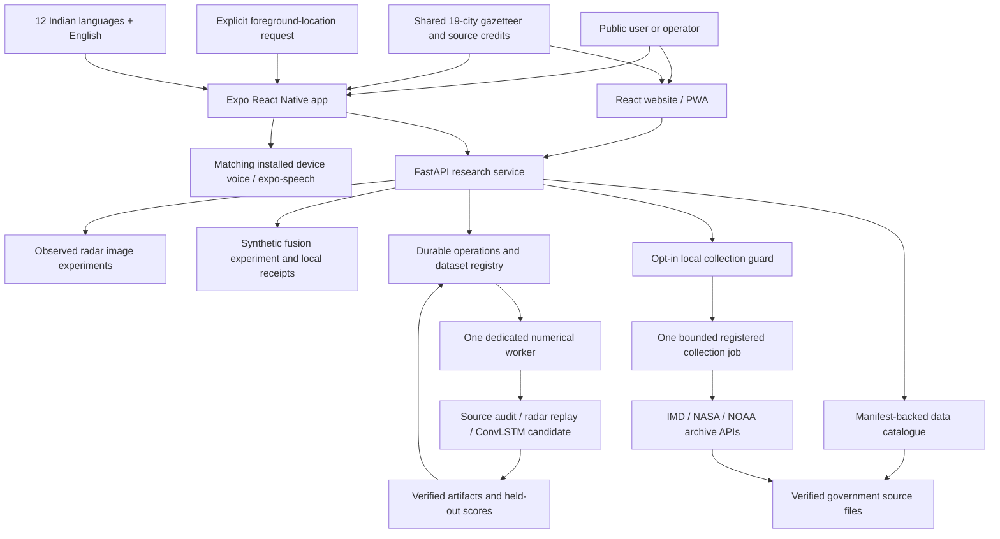
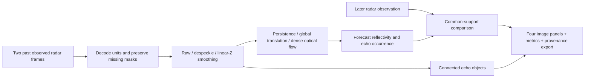
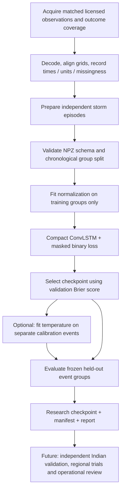

# Implemented website, image pipeline and mobile architecture

This describes the code delivered in this repository. The larger production proposal is in [the detailed architecture](../DETAILED_TECHNICAL_ARCHITECTURE.md). A connected research application is implemented; operational Indian warning services remain outside this release.

The latest build adds [durable research operations](OPERATIONS_GUIDE.md): an immutable dataset registry, SQLite job/attempt records, one OS-locked numerical worker, actual source/radar/training recipes, controlled daily admission and a shared status API. The website queues work; the React Native operator screen monitors it. Candidate results do not change the existing public forecast or dispatch policy.

The latest iteration adds [officer evidence gates and a standalone bounded revision queue](CONTINUOUS_FORECAST_DESIGN.md), a [native SMS report composer](MOBILE_GUIDE.md#citizen-observations-by-sms), and [pinned STLDM reference inference](STLDM_GUIDE.md). Saved simulation receipts contain separate probability/support checks and deterministic reasons, with public dispatch blocked. The queue is tested metadata infrastructure; no provider subscription drives it yet. STLDM executes through its isolated CLI and is not served by the app's forecast endpoint.

## How the parts connect

The website and native app use one Python service. The website adds the full image laboratory and collection controls. The native client emphasizes readable information, place exploration, spoken practice messages and an operator research view. A role selector changes the view; it grants no authority or permissions.

## What happens when someone searches for a place

1. Match the typed name against the bundled city names, state names and aliases. There is no external geocoding request or location permission.
2. Read the selected city's documented latitude and longitude.
3. Rotate the globe toward that geographic point and move the camera closer. The native presentation uses its own mobile renderer and the same coordinates.
4. Display the selected place and its coordinate source. Keep the weather-data scope visible: city selection does not produce a local forecast.
5. Pause automatic motion when requested and honor the system's reduced-motion setting. On the website, failed WebGL falls back to a static map with place search.

The web texture is a static NASA Blue Marble composite. The animated cloud layer is illustrative, not a satellite cloud observation. Details and hashes are in [image provenance](../public/earth/PROVENANCE.md) and [shared geography provenance](../shared/geography-provenance.json).

The native app separately offers an opt-in foreground device fix. Coordinates stay in memory, display their accuracy/time and focus the globe. Manual selection, cancellation, leaving the public screen and backgrounding clear them. No reverse geocoder or automatic regional forecast matching is connected; unsupported live coverage remains explicit. [Location contract](LOCATION_DELIVERY_NOTES.md).

## The image pipeline

| Technique | Implemented role | Why include it | Limit |
|---|---|---|---|
| Persistence | Keep the latest observed image unchanged | Essential low-cost reference | Cannot follow moving echoes |
| Global translation | Estimate one displacement from two previous frames | Simple and interpretable motion reference | One velocity cannot describe several moving systems |
| Horn–Schunck dense optical flow | Estimate a spatially varying backward motion field and extrapolate | Can represent local differences in motion | Assumptions about image change and smooth motion can fail during growth/decay |
| Connected components | Identify contiguous echoes over the experiment's threshold | Exposes the objects behind the rendered image | These are echo objects, not confirmed hazardous storms |
| Despeckling | Remove very small isolated thresholded objects | Makes the effect of cleaning inspectable | Small genuine echoes can also be removed |
| Masked linear-Z smoothing | Smooth valid physical reflectivity values before returning to dBZ | Avoids averaging logarithmic dBZ values directly | Smoothing can weaken peaks; always compare with raw input |

The implementation is in [image_processing.py](../nowcast/image_processing.py). Later observations enter the scoring path only. Tests change future frames and confirm that past preprocessing and forecasts remain unchanged. Missing inputs do not become clear-weather zeros.

The available French sequence supports +5, +10, +15 and +20 minute radar-echo experiments. It has no lightning labels, and its source timestamp timezone is unverified. The lab reports the sample's scores without claiming general model superiority.

## Collection and provenance

The source catalogue links provider APIs and access documentation, lists downloaded files and keeps unavailable Indian radar, INSAT and lightning archives visible as pending. Each download is looked up by a manifest ID; it must remain under `data/government` and pass its recorded byte-size and SHA-256 checks.

Collection is disabled unless `VAJRA_ENABLE_COLLECTIONS=1`. Enabled jobs still require a direct loopback request, an accepted host/origin and JSON. Only three registered scripts can run, with one active job, a time limit and a bounded in-memory history. These scripts retrieve or verify fixed historical samples. They are not continuous operational feeds.

The starter pack combines separate examples from different places and dates. That is useful for exercising parsers and studying schemas, but it does not create synchronized model training pairs. See [the actual inventory](../data/government/README.md).

## Training and model promotion

The trainable ConvLSTM is separate from both the observed-radar motion baselines and the existing synthetic logistic fusion model. Running training does not silently change the app's prediction engine. The checkpoint and corpus hashes remain explicit. The current release provides a research training CLI, not automatic model promotion or a live ConvLSTM inference service.

Follow [the training guide](TRAINING_GUIDE.md) for the exact arrays, preparation command and train/evaluate commands. The generated smoke exercise proves that the training program runs; it does not establish weather prediction skill.

`--calibrate` reserves four chronological partitions and fits a bounded regularized temperature only after checkpoint selection. The checkpoint stores calibration parameters, training-only climatology and split hashes. Evaluation produces raw/adjusted scores, reliability bins and whole-event bootstrap intervals when at least two test events exist. Permanently unavailable training measurements cannot affect normalization. The synthetic adjusted model still trails climatology; [exact results and methods](CALIBRATION_AND_VERIFICATION.md).

## Offline and online behavior

| Feature | Offline behavior |
|---|---|
| Bundled city search and globe | Local assets; available in an installed native app, or a previously cached website shell |
| Native language text and practice guidance | Bundled text remains readable |
| Speech | Depends on an installed compatible voice and device behavior; offline audio needs physical-device verification |
| Fresh API computations, inventory and collection | Requires the running backend and, for downloads, provider connectivity |
| PWA saved historical public preview | Only an explicitly saved sample is shown, with historical labels |
| Official present-time warnings | Not supplied by this prototype; users can open linked official sources |

For device setup, locale behavior and remaining native tests, see [the mobile guide](MOBILE_GUIDE.md). For measured evidence rather than planned capability, see [validation](../VALIDATION.md).
