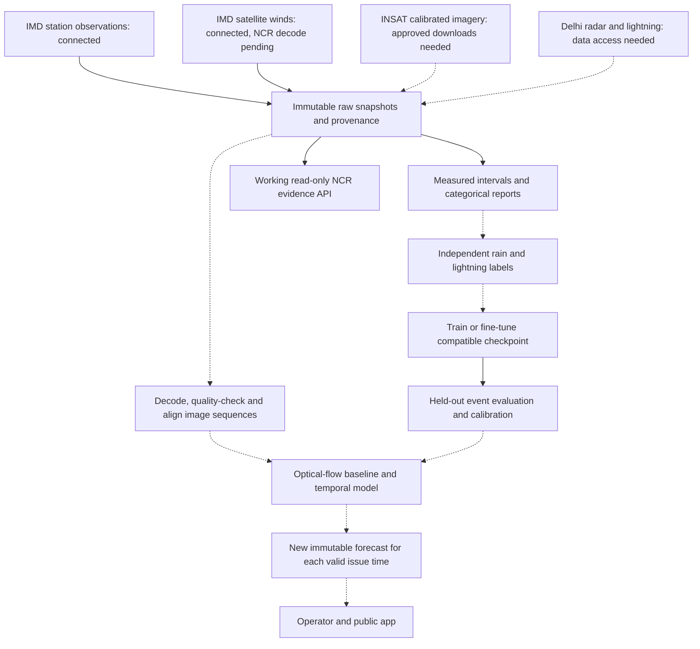

# NCR backend, data access and model architecture

Implemented 30 September 2026. This is a Delhi metro pilot rectangle, 76.5–78.0 degrees east and 28.0–29.3 degrees north, not the entire statutory NCR. See the [data inventory](../data/ncr/README.md) and [verified provider/Google research](../research/NCR_DATA_AND_GOOGLE_MODEL_RESEARCH.md).

## What runs now

- A paginated IMD station collector downloads actual observations, preserves raw bytes and source URLs, and writes verified JSON/CSV derivatives. Rain/drizzle descriptions and precipitation accumulation intervals remain separate.
- A public IMD satellite collector saves a bounded BUFR satellite-wind payload, notification and observation/publication/retrieval timestamps. It is not an INSAT image decoder or an established NCR wind grid.
- A public MOSDAC catalogue query locates scientific INSAT granules for the pilot. Downloading those granules requires approved provider credentials.
- The existing FastAPI server exposes read-only NCR source status and observations. Network collection stays in separate CLI processes.
- The existing compact ConvLSTM can initialize from compatible weights and run causal inference. A forecast uses the checkpoint's declared target and horizon. Compatible weights are required; unrelated architectures cannot be loaded by renaming files.

## Start and inspect

Run from the repository root. The existing data environment includes requests and an OS trust-store adapter. Certificate verification remains enabled.

```powershell
.venv-data/Scripts/python.exe scripts/collect_ncr_data.py --start 2026-09-01 --end 2026-09-30
.venv-data/Scripts/python.exe scripts/collect_ncr_data.py --latest
.venv-data/Scripts/python.exe scripts/collect_ncr_data.py --verify-only
.venv-data/Scripts/python.exe scripts/collect_satellite_observations.py
.venv-data/Scripts/python.exe scripts/collect_satellite_observations.py --verify-only
.venv-data/Scripts/python.exe scripts/query_mosdac.py --date 2026-09-30 --count 2
python -m uvicorn nowcast.service:app --host 127.0.0.1 --port 8000
```

`--latest` refreshes the latest three UTC calendar days. Explicit date-window collection reuses an existing complete compatible snapshot unless `--refresh` is set. A partial collection exits with code 2 and still saves its useful observations and failure/completeness evidence. `--verify-only` checks bytes and hashes without network access; its success does not certify archive completeness or model suitability.

| Local route | Result |
|---|---|
| `GET /api/ncr/status` | Provider access states, latest local collection, observation age, label counts and model blockers |
| `GET /api/ncr/observations?kind=observations&limit=100` | Measured/coded station variables, with units and provenance |
| `GET /api/ncr/observations?kind=precipitation&state=reported_zero` | Explicit station zeros for their original accumulation intervals |
| `GET /api/ncr/observations?kind=present_weather` | Categorical rain, drizzle, mixed thunderstorm precipitation, explicit no-precipitation and unknown reports |
| `GET /api/ncr/forecast` | Explicit unavailable response until a validated current NCR forecast is connected |

Lists support `offset` and `limit`, with a maximum of 500 records per call. `VAJRA_NCR_ROOT` can point the server at a different local surface collection directory. The API does not expose credentials, trigger provider downloads or silently substitute the synthetic demonstration.

## Source access and keys

| Provider | Working interface or required action |
|---|---|
| IMD WIS2 surface | Public HTTPS JSON API; no personal key needed. [Collections](https://wis2box.imd.gov.in/oapi/collections?f=json). |
| IMD WIS2 satellite-derived winds | Public HTTPS notification and linked BUFR downloads; no personal key needed. [Notifications](https://wis2box.imd.gov.in/oapi/collections/messages/items?f=json&limit=10&metadata_id=urn:wmo:md:in-imd:satellite&sortby=-pubtime). |
| ISRO INSAT scientific imagery | Public metadata search through the tested `query_mosdac.py`; approved MOSDAC account credentials for downloads. [Registration](https://mosdac.gov.in/signup/), [official SDK manual](https://www.mosdac.gov.in/downloadapi-manual), [official SDK](https://www.mosdac.gov.in/software/mdapi.zip). |
| IMD Delhi radar | Obtain authorized numeric scans/volumes and historical archive access. [Data portal](https://radarapi.imd.gov.in/dsp/frontend/login). A rendered radar map is not that API. |
| IITM lightning | Obtain raw events, time/position/type, network coverage/downtime and reuse terms. [Official metadata](https://incois.gov.in/essdp/ViewMetadata?fileid=05f2bab9-054f-45cf-b77d-1eaf089252ff). No current anonymous event API was verified. |

No provider credentials were created or guessed. Keep real credentials outside Git and out of the client app. The [MOSDAC example configuration](../config/mosdac.ncr.example.json) contains empty credential values. Run the provider SDK in a separate private local folder when approved access exists; do not commit its populated configuration. Public catalogue matching does not establish download permission, usable quality, or an NCR spatial crop.

For provider requests, specify Delhi/Palam coverage and the pilot rectangle, all scans during selected wet/dry windows, native scan cadence, UTC observation/publication times, calibration, geolocation, quality masks and missing/outage flags. Request matching lightning events and sub-hourly station/gauge truth for the same windows. Retain entire independent storm episodes and quiet periods; do not sample only visually impressive storms.

## Architecture and Google inspiration



Solid lines describe current collection or implemented software steps. Dashed lines require aligned data, decoding, integration or model acceptance. The inference CLI is implemented, but a live NCR model-to-app forecast connection is not.

WeatherNext 3 combines separate observational inputs through a mesh transformer, generates probabilistic scenarios and refreshes with recent observations. Its global forecast design motivates separate sensor handling, preserved observation age and uncertainty in our regional model. Its rainfall output is hourly at about 0.1 degrees; the finer station head is not a 5 km rain model. WN3 weights are not open source, so it cannot be our downloadable fine-tuning base. [Google specifications](https://developers.google.com/weathernext/guides/models), [Google open-source statement](https://developers.google.com/weathernext/guides/osmodel), [paper](https://arxiv.org/html/2609.03582v1).

TimesFM-3 predicts numerical time series using temporal and cross-variable attention with quantile outputs. It can be a research station-series comparator after enough usable history exists. It does not decode our image arrays. Its downloaded weights have non-production restrictions, unlike the repository code and some earlier versions. No TimesFM model has been installed or used in this change. [Official repository and weight terms](https://github.com/google-research/timesfm).

For this regional pilot, use the existing image decoders/baselines, the existing temporal training pipeline and licensed upstream reference work. The repository already has a pinned STLDM checkpoint runner for its normalized reference example. Transferring that radar model to Delhi requires validated unit/normalization/cadence/geometry conversion and Indian evaluation. It is not interchangeable with the compact ConvLSTM checkpoint format, and this change does not implement that cross-architecture transfer.

## Parameters, predictions and updates

The intended image branches use calibrated radar reflectivity and velocity, infrared/water-vapour brightness temperatures, cloud cooling/movement and quality masks. Station temperature, dew point, pressure and wind provide environmental context. Past lightning activity is an input; future independently measured events are labels. Only atmospheric forecasts released before issue time may be used as contextual model input.

A 30-minute prediction must declare whether it means rain at the end of 30 minutes, any rain during the interval, or an accumulated amount. Our binary-event trainer requires one explicitly defined target; it does not infer rainfall amount from a binary head. A separate lightning target cannot be trained with rain reports.

When a usable new scan arrives, the desired service selects only information available at the new issue time, reruns inference and stores a new forecast. Earlier forecasts stay unchanged for verification. This is forecast updating, not immediate weight retraining. Candidate weight updates occur separately after observed outcomes arrive and validation passes. The current collector and inference commands are one-shot programs; no continuous polling or automatic promotion service was started.

## Verification

Tests cover pagination, wrong regions/dates, missing and conflicting values, original accumulation intervals, categorical weather wording, immutable hashes, partial downloads, repeated collection, bounded API reads and no-network HTTP handlers. Model tests exercise actual weight updates, initializer compatibility, inherited event exposure, causality, calibration metadata and immutable outputs. These are software checks, not measurements of NCR forecast skill.

The next scientific milestone is an aligned set of Indian storm and dry episodes with usable radar/satellite inputs and independently observed targets, followed by event-separated evaluation against persistence and optical flow. Until then, the NCR forecast API deliberately reports unavailable.
