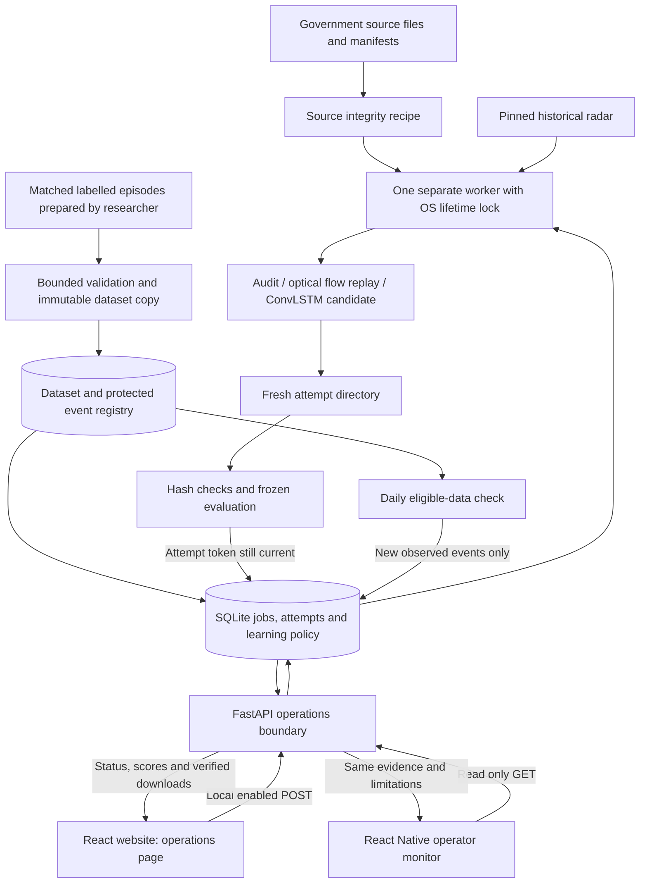

# Connected research operations

The website can now queue real research work and display its recorded results. A separate worker verifies government sample files, replays observed radar or trains and evaluates a compact ConvLSTM. The React Native operator screen reads the same records. Closing the page or restarting the API does not erase a job.

This is a research workstation workflow. It does not turn the current synthetic examples or historical French radar into a reliable Indian lightning service. No candidate is automatically promoted, and none of these endpoints sends public alerts.

## The flow in simple terms

1. **Know the inputs.** Check downloaded source bytes. For training, prepare matched event episodes with observation times, availability times, future labels and coverage.
2. **Freeze an experiment.** Copy accepted episodes into an immutable dataset version. Record the file hashes and separate training, validation, calibration and test events.
3. **Request the work once.** The API saves a job. The same dataset, recipe, code and configured package versions return the same job when submitted again.
4. **Run it outside the web server.** One dedicated worker executes one experiment at a time. Both clients can continue fetching status.
5. **Check the result.** Training fits the model, calibrates it using separate events, compares it with training climatology, then reloads the checkpoint and reproduces frozen evaluation.
6. **Review before promotion.** Completion means the computation finished. It does not mean the model is accurate enough to issue a warning.

## Implemented architecture



| Module | Responsibility |
|---|---|
| `nowcast/operation_store.py` | Atomic SQLite jobs, attempts, dataset identity, protected event roles and learning state |
| `nowcast/operation_recipes.py` | Admission budgets, frozen inputs, scientific recipe identity, execution and verified artifacts |
| `scripts/run_operations.py` | Worker ownership, restart reconciliation, CLI and daily scheduling |
| `nowcast/operations_api.py` | Small shared HTTP contract, local write checks and safe result projection |
| `src/operations.jsx` | Website experiment controls, actual stages, result comparison and recovery feedback |
| `mobile/src/components/operations-monitor.tsx` | Read-only native status, candidate comparison and explicit refresh |

SQLite is appropriate for this bounded single-workstation deployment: atomic metadata survives restarts without adding a broker. The worker uses an operating-system lock, not a heartbeat timeout, to prevent concurrent trainers. The heartbeat only says the process was recently reachable; it is not proof that numerical computation is making progress. See the [design comparison](OPERATIONS_BUILD_PLAN.md).

### Actual scientific recipes

| Recipe | Inputs and computation | What the result establishes |
|---|---|---|
| `starter_audit` | Current government manifest files and actual downloaded bytes; size and SHA-256 comparison | File integrity, with problems listed. It does not establish paired training events. |
| `radar_replay` | Pinned historical French radar; smoothing, dense optical flow, +10-minute forecast and persistence on common valid coverage | Performance on one observed radar case. It has no lightning labels. |
| `train_candidate` | Frozen episodes; compact ConvLSTM, one CPU epoch, history 3, batch 4, separate calibration events and exact frozen re-evaluation | A reproducible small development experiment. Better scores still require independent qualification. |

This first bounded recipe intentionally fixes training settings. Use the standalone [training program](TRAINING_GUIDE.md) for longer experiments. Changing the registered recipe/code produces a new identity. It is not a hidden continuation of an older experiment.

## Start the website, API and worker

Use the repository's existing application dependencies. Install the separate numerical environment if it is not present:

```powershell
python -m venv .venv-ml
.\.venv-ml\Scripts\python.exe -m pip install -r requirements-ml.txt
npm.cmd ci
npm.cmd run build
```

Terminal 1, with FastAPI installed from `requirements.txt`:

```powershell
$env:VAJRA_ENABLE_OPERATIONS = "1"
$env:VAJRA_ENABLE_COLLECTIONS = "1"
python -m uvicorn nowcast.service:app --host 127.0.0.1 --port 8000
```

Terminal 2:

```powershell
.\.venv-ml\Scripts\python.exe scripts/run_operations.py worker
```

Open **http://127.0.0.1:8000/#/operations**. Queue the source check or radar evaluation. Use **Prepare example episodes** to test the complete training flow on eight explicitly generated event groups. Select **Queue experiment**, inspect the scores, and download the checkpoint/report. Submitting it again opens the existing job.

Use `.venv-ml/bin/python` on macOS/Linux. The API reads package metadata from the repository's `.venv-ml`; the worker verifies it is running that configured numerical environment. Restart API and worker after changing Python code or dependencies. Stop a worker with Ctrl+C before starting another.

The default runtime directory is `data/operations/`. To use another location, set the same `VAJRA_OPERATIONS_ROOT` in both terminals, or use the CLI's `--root` before its subcommand. Back up the SQLite database and immutable dataset/attempt directories together while the worker/API are stopped. Runtime databases, copied datasets and weights are ignored by Git.

CLI equivalents:

```powershell
.\.venv-ml\Scripts\python.exe scripts/run_operations.py prepare-demo
.\.venv-ml\Scripts\python.exe scripts/run_operations.py enqueue --kind starter_audit
.\.venv-ml\Scripts\python.exe scripts/run_operations.py enqueue --kind radar_replay
.\.venv-ml\Scripts\python.exe scripts/run_operations.py status
# Execute at most one queued job, then exit:
.\.venv-ml\Scripts\python.exe scripts/run_operations.py worker --once
```

## Admit real training data

Follow the [episode schema and causal preparation rules](TRAINING_GUIDE.md) first. A raw satellite image, district warning or downloaded radar file alone is not a labelled lightning episode. Use authoritative event-level labels with known observation coverage. Missing lightning coverage must not become a negative label.

```powershell
.\.venv-ml\Scripts\python.exe scripts/run_operations.py register-dataset `
  --source data/training/episodes `
  --name "Pilot observed cohort v1" `
  --series "pilot-region-target-v1" `
  --labels-available-at "2026-09-29T12:00:00Z" `
  --coverage-evidence "Replace with the real provider coverage record and acquisition reference"
```

The timestamp and evidence above are illustrative; supply truthful acquisition records for your corpus. Registration checks that label availability is not in the future and is at or after every target window. Eligibility also requires observed-research scope and recorded availability metadata. The coverage evidence is an administrator declaration; the system does not independently authenticate a provider or certify that declaration.

The registry stores event roles and event-file identity within a series. A later version cannot move a protected event between roles or quietly change its bytes. Rebuilding a larger corpus may change the standalone trainer's deterministic split; admission will reject it if it moves existing events. Prepare a compatible version rather than bypassing protection. A new series is a scientific identity boundary, not a way to reuse inspected test events as untouched validation.

Current admission budgets: at least eight event groups, at most 32 episode files, 64 MiB compressed input, 64 MiB decoded arrays and 128 MiB materialized training windows. Arrays are bounded to 256 time steps, 16 channels and 128×128 spatial cells; object arrays and escaping links are rejected. These are workstation limits, not estimates of national deployment capacity. Model activations, library runtime and operating-system memory are additional; these budgets are not an RSS guarantee.

## What daily learning actually does

Enable **Daily checks** on the website after starting the worker. Once per UTC date, it considers the latest admitted eligible dataset in each series. It queues at most one candidate during that check if the chosen version contains independent events beyond previously completed candidates. Repeated checks deduplicate against the same dataset/recipe identity.

- Generated examples are excluded.
- No eligible observed data produces `waiting_for_labels`; unchanged successful event sets produce `waiting_for_new_events`.
- Failed or cancelled candidates require review and explicit retry; the scheduler does not silently revive them.
- Held candidates do not block independent series. If another eligible series is available it can proceed, with a note about held work; otherwise the check records `needs_review`.
- A full queue records an admission problem while the worker continues draining existing work.
- Pausing and re-enabling clears the previous check time; repeating enable while already enabled does not reset it.
- API restart preserves the policy. Checks happen while the worker is running; there is no external daily cron service.

This is controlled candidate generation, not online weight updates after every prediction. New observations can improve a future candidate, but more data does not guarantee better skill. Delayed labels, sensor changes, spatial bias and repeated benchmark inspection can all mislead. The current workflow does not automatically download/label Indian episodes, ingest citizen reports as truth, schedule national inference, perform drift-triggered retraining or promote a model.

Repeated development evaluation is intentionally labelled as such. Before operational qualification, reserve a fresh independent final cohort, compare seasons/regions/outages, assess reliability and confidence intervals, and review lead time, misses and false alarms. See [calibration and verification](CALIBRATION_AND_VERIFICATION.md).

## Retry, restart and cancellation behavior

| Situation | Behavior |
|---|---|
| Same registration or job request sent twice | Return the existing immutable dataset or logical job |
| Website/API restarts | SQLite records and queued work remain |
| Worker crashes while fitting | OS releases its lifetime lock; next owner marks running attempts interrupted/failed |
| Explicit retry | Expected attempt number prevents stale retries; fresh token and directory; at most three attempts |
| Two workers start | Second process fails to acquire the store lock |
| Job cancelled during a numerical call | Publication is fenced immediately; current call may finish before the worker can start another job |
| Artifact changed after completion | Download fails its recorded byte count/hash check |
| Dataset or recipe changed before/during execution | Integrity checks reject incompatible work; changed identity requires a new job |

Partial attempt folders remain as local diagnostic evidence and are not served as completed artifacts. There is no automatic garbage collector. The store caps 20 pending jobs, 1,000 historical jobs and 100 registered datasets. Keep long-running archive/retention and disk monitoring as an explicit deployment task.

## API and clients

| Endpoint | Purpose |
|---|---|
| `GET /api/operations/state` | Schema, write availability, recent worker contact, learning state, up to 30 recent jobs, registered datasets and research links |
| `POST /api/operations/datasets/demo` with `{}` | Create/reuse the eight-event synthetic workflow fixture |
| `POST /api/operations/jobs` | Submit one fixed recipe with an optional registered dataset ID |
| `GET /api/operations/jobs/{id}` | Inspect a known job beyond the recent list |
| `POST /api/operations/jobs/{id}/retry` | Retry using `{"expected_attempt": n}` |
| `POST /api/operations/jobs/{id}/cancel` with `{}` | Cancel without deleting evidence |
| `POST /api/operations/learning` | Set `{"enabled": true}` or `false` |
| `GET /api/operations/jobs/{id}/artifacts/{artifact_id}` | Download registered, verified completed bytes |

Writes require `VAJRA_ENABLE_OPERATIONS=1`, direct loopback, local Host, a trusted Origin and JSON. There is no arbitrary shell command, source path or URL accepted from the website. This is not operator authentication; do not expose it as a national administration service.

The website refreshes status while visible and preserves the previous snapshot after an error, disabling writes until reconnection. The native monitor uses explicit refresh, cancels requests on background/blur and labels an old snapshot. It sends no GPS to this API and has no mutation controls. Its new messages use the existing 12 Indian languages plus English; translations remain drafts requiring review.

Existing provider collection buttons retain their original in-memory job history and shared output semantics. The new durable source audit checks their downloaded files; it does not make collection durable. Existing public forecasts and officer decision receipts remain separate from these candidate results. STLDM stays a documented standalone reference experiment, not a selectable training recipe here.

## Verification and references

Tests cover transactional duplicate reuse, concurrent enqueue, dataset/event protection, stale attempt publication, cancelled attempt-zero retry, artifact tampering, real process lock contention and release after process termination, scheduler backpressure and observed/synthetic learning separation. The scientific integration runs actual ConvLSTM training, reloads the saved checkpoint and requires exact frozen evaluation agreement.

See [current verification results](../VALIDATION.md), [government data inventory](../data/government/README.md), [regional decision design](../REGIONAL_DECISIONS_AND_CONTINUOUS_FORECASTS.md) and [model/repository research](../research/MODEL_AND_REPOSITORY_DECISIONS.md). Technical reference: [Python SQLite transactions](https://docs.python.org/3/library/sqlite3.html), [FastAPI routers](https://fastapi.tiangolo.com/tutorial/bigger-applications/), [Expo SDK 57](https://docs.expo.dev/versions/v57.0.0/).
