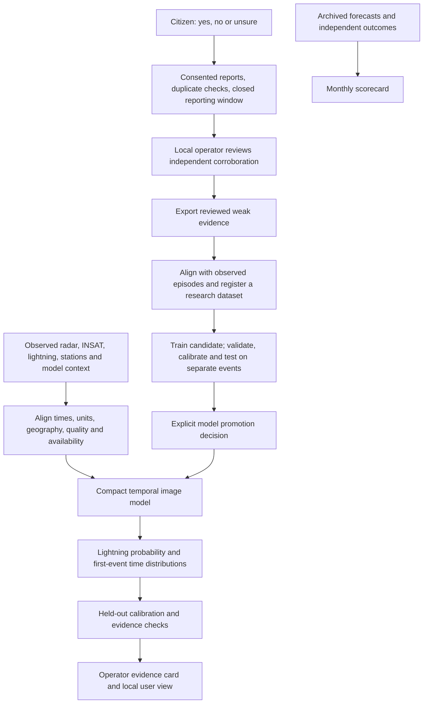

# Local prediction, citizen evidence and transparent verification

These additions make VAJRA more useful by connecting a forecast to its evidence and to later verification. The implementation now includes research lightning/onset model heads, seasonal methods, a website and native reporting form, an operator review ledger, public scorecard tools and a benchmark manifest validator. It does not yet have the matched Indian observations needed to establish reliable NCR lightning or block-scale rain forecasts.

## The simple flow



The graph describes the intended end-to-end connection. The citizen ledger/export, numerical training/inference and scorecard tools execute now. Raw Indian image/lightning acquisition, matched-episode preparation and operational model promotion remain data-dependent steps. Exported citizen votes do not automatically become model input or training jobs.

## What was added

| Feature | Implemented now | Evidence still needed |
|---|---|---|
| Lightning before a strike | Separate coverage-masked binary lightning head and first-lightning hazard head | Matched strike labels, network coverage and known quiet history; regional held-out skill |
| Rain onset | Discrete-time first-rain distribution, conditional interval and probability of no onset | Correctly aligned onset labels and timing calibration; rain cessation is a separate target |
| Monsoon-aware calibration | Phase-specific temperature scaling with disclosed pooled fallback | A versioned regional phase definition available at forecast issue and enough independent events |
| Local seasonal Z–R | Fit coefficients using quality-controlled training radar/gauge pairs; compare held-out MAE/RMSE against a declared baseline | Real matched NCR gauges/radar, sampling-support checks and evidence across seasons |
| Warm rain and dust | Descriptive quality flags and explicit unknown/missing-data handling | Labelled regional cases and trained/validated detection methods |
| Evidence card | Sensor timestamps/age, coverage notes, confidence and missing-forecast reasons | An admitted NCR forecast, actual tracked paths and a numeric radar loop; currently absent |
| Public verification | Immutable monthly metrics, reliability bins, event-bootstrap intervals and matched-cohort comparator rules | Archived forecasts and compatible independent observations; no IMD comparison is fabricated |
| Open benchmark | Hashes, causal timestamps, disjoint event partitions, privacy/redistribution gates, metadata/recipe output | A matched corpus and permission for each source; current source files are not that corpus |
| Citizen improvement loop | Durable website/native reports, consent, idempotent retries, review and weak-label export | Stronger public-service identity/abuse controls, field testing and validated use in training |

The small model shares a ConvLSTM image encoder between three task heads. It uses values, masks and observation-age channels. The current experiment starts random weights; it does not claim Google model weights or compatible pretrained transfer. The earlier scalar image model and STLDM reference experiment remain separate. Read [the numerical guide](REGIONAL_SCIENCE_GUIDE.md) for commands, the NPZ contract and inference without future labels.

## Citizen feedback: useful evidence, not a vote that makes weather true

The app asks **“Is it raining where you are now?”** with equally available yes, no and unsure answers. It does not say “our model says rain” before the response, which could influence the answer. Manual reporting also allows dry observations, rather than collecting only predicted rain cases. This remains self-selected participation, not a representative sampling survey.

1. Select one of four named NCR pilot cells and explicitly confirm you are there. These are bounding boxes for research, not official administrative blocks or proof of forecast resolution.
2. Choose an answer and optionally consent to research training. Precise GPS is not sent. The client saves a frozen request before submission, so a retry cannot silently create another vote or change the observation time.
3. The server accepts observations from the previous 15 minutes, stores only a hash of the installation identifier, and permits one answer per installation per quarter-hour across all cells. Reinstallation can evade this; an installation is not a verified independent person.
4. Agreement uses only consented yes/no reports. Five reports and 80% agreement create a candidate for review. These are configurable-in-code research admission heuristics, not a calibrated 80% rain probability. Unsure/nonconsenting reports do not authorize training.
5. Approval waits until 15 minutes after the reporting window ends. For a 16:15–16:30 UTC window, review approval begins at 16:45 UTC, when new late reports can no longer enter it. A local operator checks a relevant independent observation and records a public corroboration link and reason against the exact revision.
6. Export contains reviewed **weak rain-presence evidence**, its time/cell support and provenance. It contains no installation IDs, remains `ground_truth: false`, and cannot serve as a lightning or 30-minute rainfall-amount label.
7. A later preparation step must align admitted evidence with causal images. Evaluate whether using these weak labels actually improves independent instrument-test results before promoting a new model. More reports can also add bias or noise.

The public API withholds exact answer and consent counts. Private local review retains them. Local IP/host and origin checks protect this research workflow; switching the app to “operator” is not authentication. Deployment behind a proxy or onto the public internet needs real operator authentication, consent/retention controls and stronger abuse protection before opening this write service. The ledger is capped at 100,000 reports; it has no production retention/withdrawal service yet.

## Run the connected clients

```powershell
npm.cmd run build
$env:VAJRA_ENABLE_FEEDBACK = "1"
# Optional: isolate a local research store
$env:VAJRA_COMMUNITY_ROOT = "C:\private-data\vajra-community"
python -m uvicorn nowcast.service:app --host 127.0.0.1 --port 8000
```

Open `http://127.0.0.1:8000/#/community`. The website provides reporting, evidence, scorecards, benchmark status and local review. The native public screen provides the same report protocol; set its existing `EXPO_PUBLIC_API_URL` to a reachable backend. A phone cannot use the computer's loopback address and cannot act as the loopback-only reviewer. A saved failed request can be retried; this is not automatic background delivery, Bluetooth mesh or an SMS gateway.

Expo embeds `EXPO_PUBLIC_API_URL` at build time. After changing it, clear Metro's cached transform (`npx.cmd expo start --clear`, or `npx.cmd expo export --platform web --clear` for a web preview). An old export can still contain an empty API address even when the shell environment has changed. Rebuild and confirm the configured preview can load the listed pilot cells; an unconfigured client deliberately refuses submission.

Shared interface copy covers English and twelve Indian languages. It is draft localization and needs native-speaker review. Existing device speech and the explicit SMS composer remain separate from the new data submission.

| API | Purpose |
|---|---|
| `GET /api/community/state?cell_id=delhi-central&month=2026-09` | Pilot cells, neutral prompt, private-count-safe status and evidence |
| `POST /api/community/reports` | Record an unverified observation, gated by the feedback flag |
| `GET /api/community/review-queue` | Local-only exact counts, candidate revisions and closure time |
| `POST /api/community/review` | Local-only approve/reject; approval needs closed-window agreement and corroboration |
| `GET /api/community/export` | Local-only reviewed weak evidence; no automatic retraining |
| `GET /api/community/scorecard?month=2026-09` | Latest integrity-checked published revision, or unavailable |
| `GET /api/community/benchmark` | Manifest checks and release blockers, or metadata-only status |

The numerical research heads run separately through `scripts/train_regional_heads.py`. They are not silently attached to an untrained operational API. Scorecard and benchmark preparation commands are in [the public verification guide](PUBLIC_VERIFICATION_GUIDE.md).

## A stronger, supportable differentiation claim

Describe VAJRA as **a regional nowcasting research project combining explicit observation coverage, event timing, seasonal evaluation and a reviewed citizen-evidence loop**. Each forecast should eventually show its evidence age and uncertainty; every performance claim should be reproducible on frozen cases. This combination is a product/research objective, not proof of being first or most accurate.

Damini already provides advance alerts, so “Damini only tells where lightning is” is incorrect. IMD already does forecast verification, Delhi seasonal Z–R work exists, and Indian weather benchmarks exist. Onset displays and citizen reporting also have prior art. The meaningful experiment is whether this exact regional combination improves useful lead time and reliability on independent observations. See [the verified evidence and prior-art register](../research/REGIONAL_FEATURE_EVIDENCE.md), including the official Damini description, INCOIS metadata, Delhi study, IMD documents and redistribution rules.

No LLM or Jev is required. Numerical models estimate the outcomes; simple source, timestamp and coverage rules explain why an operator should or should not trust a result. A future explanation model would not replace calibration, sensor coverage or held-out verification.
