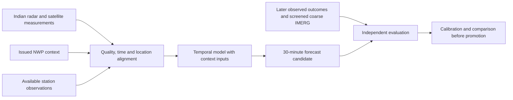

# Additional NCR data: collection and training

Implemented and checked on 30 September 2026. These sources add context and ways to check observations. An accuracy improvement still has to be measured on held-out storms.

## Real data collected

The pilot covers Delhi and nearby NCR locations, not the entire statutory NCR. A point request represents its provider's grid cell, not every neighbourhood.

| Source | Saved sample | Use and limitation |
| --- | --- | --- |
| [Open-Meteo](https://open-meteo.com/en/docs) | 48 Delhi forecast hours, 30 Sep through 1 Oct 2026 | CAPE, CIN, humidity, wind, rain, temperature, dew point, pressure and water vapour. These are GFS model outputs, not observations. |
| [IEM](https://mesonet.agron.iastate.edu/request/download.phtml?network=IN__ASOS) | 554 VIDP/VIDD airport reports, 23 through 29 Sep; 20 contain present rain/drizzle codes | Raw METAR and weather measurements. Indian numeric precipitation is unsupported; returned `p01i=0.00` is withheld from dry labels. |
| [Meteostat](https://dev.meteostat.net/data/timeseries/hourly) | 168 Delhi Palam station-hours for that week; full annual provider file retained | Each variable keeps its source. Model fill is not an observation. |
| [NASA POWER](https://power.larc.nasa.gov/docs/services/api/temporal/hourly/) | 168 requested hour slots, 144 with values, 24 missing | Broad historical environmental context. Missing hours remain null. |
| [RainViewer](https://www.rainviewer.com/api/weather-maps-api.html) | 13 past frame references, 13:50 to 15:50 UTC on 30 Sep | Attributed rendered map URLs. No future frames, numeric radar volumes or verified fresh NCR coverage. |
| [NASA IMERG](https://www.earthdata.nasa.gov/data/catalog/ges-disc-gpm-3imerghh-07) | 48 Early-run V07 catalogue entries covering 29 Sep | Exact scientific-file and OPeNDAP links. No authenticated rainfall arrays downloaded yet. |
| [NOAA GFS](https://registry.opendata.aws/noaa-gfs-bdp-pds/) | NCR numeric GRIB and 392 CSV rows: seven fields across 56 grid points | Issued atmospheric forecast context, with initialization and valid times. Not observed rain. |
| [ERA5](https://cds.climate.copernicus.eu/datasets/reanalysis-era5-single-levels) | Bounded NCR request template, no downloaded file | Historical reanalysis. Requires a CDS account/token and accepted dataset terms. |

These are verified starter samples, not a matched training corpus. IEM, Meteostat and IMD airport archives may repeat the same underlying observation. Open-Meteo with `gfs_global` and direct GFS are related forecasts, not independent votes. Provider licences, limits and primary references are in the [source review](../research/SUPPLEMENTAL_WEATHER_SOURCES.md).

## Collect and verify

Install the existing optional [data requirements](../requirements-data.txt). Collection runs separately from the web server. Each command performs a finite job.

```powershell
.venv-data/Scripts/python.exe scripts/collect_supplemental_data.py --source all --start 2026-09-23 --end 2026-09-30
.venv-data/Scripts/python.exe scripts/collect_supplemental_data.py --source all --verify-only

.venv-data/Scripts/python.exe scripts/collect_supplemental_data.py --source open_meteo
.venv-data/Scripts/python.exe scripts/collect_supplemental_data.py --source rainviewer

.venv-data/Scripts/python.exe scripts/collect_ncr_gfs.py --date 2026-09-30 --cycle 12 --lead 3
.venv-data/Scripts/python.exe scripts/collect_ncr_gfs.py --date 2026-09-30 --cycle 12 --lead 3 --verify-only
```

Dates are UTC; `--end` is exclusive. Historical windows are limited to 31 days per call. Meteostat windows must stay in one calendar year; its annual compressed file is filtered locally. Split larger archives into nonoverlapping windows. IMERG discovery returns at most 48 matching entries, not a complete paginated archive. To include today's completed intervals, use tomorrow's date as the exclusive end.

Open-Meteo and RainViewer always request their current products. The date flags do not turn those endpoints into archives. For historical operational tests use [Open-Meteo single runs](https://open-meteo.com/en/docs/single-runs-api) or original issued GFS archives. `generationtime_ms` is API computation duration, not model initialization.

GFS needs an existing `wgrib2`. This workspace has a checksum-verified NOAA installation under `tools/wgrib2`; the new collector does not install one. Its context crop spans 76.5 to 78.25 E and 28 to 29.5 N, with a small padding around the station pilot. It keeps the native 0.25-degree grid. Fields are 2 m temperature/RH, 10 m U/V wind, surface CAPE/CIN and total-column precipitable water.

The bundled GFS cycle initialized at 12:00 UTC, was valid at 15:00 UTC and was retrieved at 15:55:45 UTC on 30 Sep. Our system cannot claim it had this file at 15:00. Model initialization, archive modification and our retrieval are separate times.

## Backend, website and app

Run the existing FastAPI application. These read-only routes use saved evidence and never contact a provider:

```text
GET /api/ncr/supplemental
GET /api/ncr/supplemental/open_meteo?limit=48
GET /api/ncr/supplemental/iem?offset=0&limit=100
GET /api/ncr/supplemental/meteostat
GET /api/ncr/supplemental/power
GET /api/ncr/supplemental/rainviewer
GET /api/ncr/supplemental/imerg
GET /api/ncr/gfs?limit=100
GET /api/data/catalog
```

The existing website provider register at `/#/sources` lists these sources and API links. The React Native app can call the same routes. This change supplies RainViewer tile templates; it does not add a radar animation overlay to either app. There is no automatic polling, alert dispatch or new model loaded by these routes.

Each supplemental snapshot contains its raw response, normalized rows, manifest and manifest checksum under `data/ncr/supplemental/<source>/<content-id>/`. Publication is atomic. Identical requests and raw content reuse the first receipt; retries do not freshen the observation time. Incomplete staging folders are ignored. Metadata or payload corruption fails verification. Checksums detect changed files, not an attacker who can replace the whole repository.

API pages contain at most 500 rows. `VAJRA_SUPPLEMENTAL_ROOT` and `VAJRA_NCR_GFS_ROOT` select alternate local stores. Retrieval age is explicitly distinct from observation age. The newest saved GFS snapshot is selected by initialization, then forecast lead; the API exposes its exact valid time.

## IMERG scientific files and credentials

Register through [NASA Earthdata](https://urs.earthdata.nasa.gov/) and complete the provider's [application authorization](https://urs.earthdata.nasa.gov/documentation/for_users/how_to_preauth_app). Configure `EARTHDATA_USERNAME` and `EARTHDATA_PASSWORD`, or a supported `EARTHDATA_TOKEN`, locally. Never put them in Git, the frontend or chat.

```powershell
# Optional SDK, separate from web requirements.
.venv-data/Scripts/python.exe -m pip install earthaccess
.venv-data/Scripts/python.exe scripts/download_imerg.py --index 0
```

The downloader uses [earthaccess environment authentication](https://earthaccess.readthedocs.io/en/latest/api/) and one discovered NASA HTTPS file link. It bounds the sample to 64 MB, rejects redirects, checks the HDF5 container signature and records a checksum. A verified retry reuses the file. Failed downloads do not publish a snapshot. If NASA changes its service, rediscover the supported endpoint and update the adapter deliberately.

The credential-free failure and mocked download/retry paths were tested. No real authenticated download has been verified here because credentials are absent. Files go to the Git-ignored `data/ncr/imerg/`. The API catalogue remains discovery evidence, even if a file is separately downloaded; scientific admission is a later step.

A global file intersecting NCR still needs field decoding and subsetting. Check `Grid/precipitation` in V07, its mm/hour units, fill values, quality fields and interval bounds. For a usable full half-hour, multiply rate by 0.5 to obtain mm. The tested helper rejects invalid rates and non-boolean quality declarations. It does not replace a scientific HDF decoder.

Keep the native 0.1-degree footprint and product run. Early is typically delayed about four hours; Final by several months. Screened IMERG can supply coarse estimated labels and comparison data. Upsampling cannot create block-scale ground truth. See [NASA technical documentation](https://gpm.nasa.gov/resources/documents/imerg-v07-technical-documentation).

## ERA5 access recipe

The [request template](../config/era5.ncr.request.example.json) selects seven variables, four times on 1 July 2025 and a small NCR area. Follow the [official CDS setup](https://cds.climate.copernicus.eu/how-to-api), install `cdsapi` in the data environment, configure its personal token locally and accept the dataset terms. This recipe has not been run against an authenticated account:

```python
import json
from pathlib import Path
import cdsapi

spec = json.loads(Path("config/era5.ncr.request.example.json").read_text())
target = Path(spec["target"])
target.parent.mkdir(parents=True, exist_ok=True)
cdsapi.Client().retrieve(spec["dataset"], spec["request"], str(target))
```

Reanalysis belongs in labelled retrospective experiments. Information assimilated after an event cannot enter a claimed operational forecast issued before it arrived.

## Training integration and proof of improvement

This change implements collection and backend access. **The current ConvLSTM is not consuming these new tables.** Its checkpoint fixes channel order, units, normalization and target definition. Do not append inputs and assume old weights remain compatible. Follow the [model preparation guide](NCR_MODEL_GUIDE.md) to build aligned observed episodes first.



The combined image/context model in this diagram is planned. Collection implements its input side; matched data and experiments remain necessary.

1. Define outcome, interval and footprint. A station point, IMERG cell and radar pixel support different targets. Do not divide an hourly amount into invented half-hours or call a missing report dry.
2. Align radar/INSAT images with quality masks. For inputs, require availability at or before issue time. Downloading a historical archive today does not prove historical delivery time.
3. Add environmental features with explicit units and native spatial support. CAPE measures potential instability; CIN inhibits convection; humidity/PWAT describe moisture; wind helps transport and motion. None is an automatic rain threshold. Fit scaling on training events only.
4. Compare persistence, optical-flow, image-only temporal and image-plus-context models on identical test storms. Add GFS first, then station context. Assess whether related feeds actually contribute new information. Keep POWER/ERA5 retrospective experiments separate.
5. Split by storm/event and time. Hold out validation, calibration and test events. Measure Brier score, reliability, precision-recall, misses, false alarms and neighbourhood spatial skill. Bootstrap by event; report seasonal, geographic and outage performance.
6. Treat citizen reports as supporting evidence after time/location, duplicate and credibility checks. Ask some forecast-dry areas too: asking only where rain was predicted creates selection bias. Majority agreement is not guaranteed ground truth.
7. Retrain a candidate after delayed outcomes mature. Compare it with the current baseline and preserve earlier forecasts. Extra copies of one storm, shared airport reports and model-filled rain do not automatically improve learning.

The supplied training note helps explain the input-to-outcome flow. Its probabilities and label weights are illustrative, its sample arithmetic needs correction, and one gauge example falls outside the target interval. The [detailed review](../research/SUPPLEMENTAL_WEATHER_SOURCES.md#corrections-to-the-supplied-training-explanation) explains the corrections without changing the original attachment.
