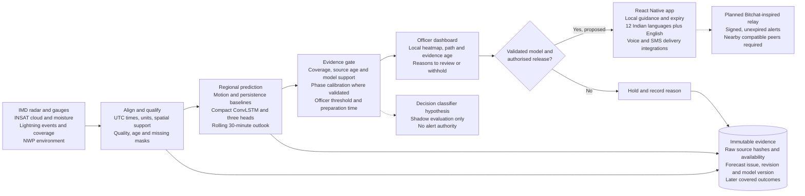
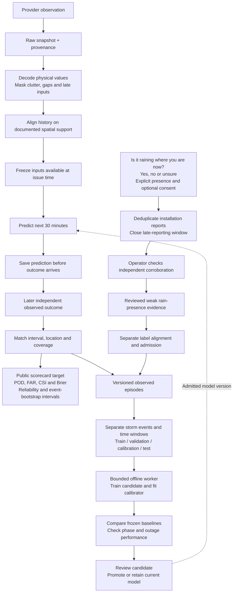

# VAJRA architecture and data flow for SIH26072

The core deliverable is a local weather prediction model. The website and React Native app let an operator inspect its evidence and help people understand approved guidance. The first scientific pilot targets NCR. The proposed forecast horizon is the next 30 minutes, revised as usable observations arrive.

This design separates the intended regional service from the implemented research components. Numeric Indian radar, matched INSAT sequences and lightning network coverage are still required for reliable NCR evaluation. A map cell is an output support choice, not proof of accuracy at that resolution.

The revised [SIH deck](VAJRA_SIH26072_v2.pptx) uses two loops. The forecast loop revises predictions from fresh evidence. The reviewed-learning loop trains candidates after outcomes mature and admits a new model only after independent evaluation. A forecast revision does not retrain the model.

## Forecast architecture

The service targets source checks every five minutes and forecast revisions every ten minutes, with a rolling 30-minute horizon. These are integration targets. A provider may publish less often, and polling an old record does not make the observation fresh. All users of a region can read the same current forecast revision instead of triggering inference per phone.

The software has executable optical-flow experiments and separate compact ConvLSTM research workflows. The regional model has a binary lightning head, a rain-onset head and a first-lightning-onset head. The timing heads use six five-minute bins. Phase calibration applies to the lightning probability where supported; the current onset hazards remain uncalibrated research outputs.

The HTTP workbench runs synthetic forecasts or a historical French radar replay. It does not yet serve the regional ConvLSTM as an operational NCR forecast. The diagram's unified live feed, context fusion, durable revision publication and public alert release are proposed integrations. The central archive is a logical boundary over currently separate file and SQLite stores. It does not imply a new deployed event service. No LLM or Jev is required.

The current policy evaluates explicit thresholds and evidence rules, then keeps public dispatch ineligible. A learned decision classifier remains an optional shadow experiment. It may later help rank ambiguous cases for review; it cannot bypass the evidence gate or officer authorisation.

Storm tracking across splits/merges is a later experiment. The existing connected-object image lab must not be presented as a validated NCR storm tracker. Global WeatherNext concepts motivate temporal forecasting and uncertainty evaluation, but the project does not load Google weights or claim Google's performance.

## Data flow and reviewed learning

New observations can revise a future forecast. A completed forecast record remains immutable so later evaluation cannot quietly replace a failed prediction. Citizen agreement can support a research label. It cannot establish an instrument measurement, rain amount or lightning truth. The prompt does not tell users the model's answer before they report.

The citizen ledger exports reviewed weak evidence for later episode alignment. It does not turn votes into automatic training labels. Separately, `learning_tick` can queue a research candidate once a day from newly admitted observed dataset versions with new independent events. The offline worker uses frozen files and split identities. Neither path automatically promotes the resulting checkpoint, and more data does not guarantee improvement.

## Implemented boundaries

| Boundary | Code reference | Current scope |
|---|---|---|
| Research API | [`nowcast/service.py`](../nowcast/service.py) | Synthetic forecasts, historical replay, immutable runs and receipts. |
| Observation contract | [`nowcast/observations.py`](../nowcast/observations.py) | Values, source state, acquisition and availability times. Missing data remains distinct from clear weather. |
| Temporal image model | [`nowcast/regional_heads.py`](../nowcast/regional_heads.py), [`train_regional_heads.py`](../scripts/train_regional_heads.py) | Compact ConvLSTM, three heads, causal inference and event-separated research training. |
| Forecast revision queue | [`nowcast/forecast_updates.py`](../nowcast/forecast_updates.py) | Bounded metadata tickets, expiry and stale-result rejection. Live provider scheduling and durable publication remain pending. |
| Decision policy | [`nowcast/decision_policy.py`](../nowcast/decision_policy.py) | Research thresholds, source-age checks and reasons. Public dispatch stays disabled. |
| Citizen evidence | [`nowcast/community_store.py`](../nowcast/community_store.py) | Consented reports, duplicate checks, review and weak-label export. Majority support is a review candidate. |
| Candidate learning | [`run_operations.py`](../scripts/run_operations.py), [`operation_recipes.py`](../nowcast/operation_recipes.py) | Bounded worker, daily dataset reconciliation, frozen corpus and candidate artifacts. No automatic production promotion. |
| Verification | [`nowcast/public_verification.py`](../nowcast/public_verification.py) | Immutable comparable cases, probability metrics and monthly scorecard preparation. No NCR comparative publication yet. |
| Mobile delivery | [`mobile`](../mobile), [mobile guide](../docs/MOBILE_GUIDE.md) | React Native screens, installed-device speech and a user-initiated SMS composer. Automatic public alerts and BLE relay remain pending. |

An alternative source can preserve context, but it cannot replace every sensor's information. A satellite-only model needs its own validated reduced-input regime. If required evidence is missing, the service must expose the gap and withhold unsupported output. An open stack reduces licensing dependence; compute cost and availability still need measurement.

The planned offline relay carries signed approved messages with issue time, expiry, location, revision and cancellation status. A connected gateway must introduce fresh alerts into the mesh. Nearby compatible devices and a working relay path are still necessary. This is Bitchat-inspired design, not implemented Bitchat interoperability. See the [official Bitchat repository](https://github.com/permissionlesstech/bitchat) and [protocol whitepaper](https://github.com/permissionlesstech/bitchat/blob/main/WHITEPAPER.md).

## Inputs and accuracy checks

| Source | Physical information | Role and access boundary |
|---|---|---|
| IMD numeric DWR | Reflectivity, velocity and polarimetric quality where supplied | Local echo evolution. Raw historical/live NCR access still needed. Rendered tiles cannot supply calibrated dBZ. |
| ISRO MOSDAC / INSAT | Infrared brightness temperatures, water vapour and cloud development | Cloud context. Match scientific image sequences and acquisition/availability times. Respect access and redistribution terms. |
| IITM / INCOIS lightning | Strike time/location/type plus network coverage | Direct lightning labels. The 2019 catalogue alone is not a downloaded matched training corpus. |
| IMD gauges and stations | Rain accumulation, present weather, humidity, wind and temperature | Outcome checks at documented point/time support. A point gauge does not certify rain over an entire block. |
| NASA IMERG | Half-hourly satellite rain estimates at about 0.1 degree support | Supplemental rain labels after quality/latency checks. They are estimates, not street-scale ground truth. |
| GFS / Open-Meteo / ERA5 | Environmental model fields such as CAPE, moisture and wind | Context, with forecast initialization and valid times retained. Reanalysis is retrospective. Model rain is not independent truth. |
| Citizen reports | Consented observed rain presence, time and selected cell | Reviewed weak evidence. No automatic majority-to-truth conversion. |

Quality and timing come before the neural network. Preserve observation time, arrival time, units, source, processing version, coverage and native support. Unknown or uncovered outcomes remain unknown. Prevent test-event overlap and future-data leakage, including retrospective monsoon phase labels.

The existing September 2026 IMD collection contains 631 station reports from four Delhi-area stations, represented by 11,479 variable records. It includes 25 rain descriptions, 11 drizzle descriptions and 195 reported-zero one-hour accumulations. The collection is partial because provider page counts disagree. These observations have different time supports and do not form 30-minute block labels. The [NCR inventory](../data/ncr/README.md) links the original pages, hashes and derivatives. The scientific radar, satellite and lightning sequences still need matching.

## How accuracy will be established

1. Define a measurable target and its geographic support. For lightning, include detection coverage. For onset, establish a covered event-free initial interval.
2. Freeze persistence and optical-flow baselines before test evaluation. Use the same eligible cases for every comparison.
3. Train on separate storms, select on validation events, calibrate on another partition, and test once on untouched events.
4. Evaluate active/break/onset phase only with a documented phase definition. Use pooled calibration when phase samples are sparse.
5. Fit seasonal Z–R coefficients only on matched training radar/gauge pairs. Compare held-out rainfall error with a declared standard relationship.
6. Report POD, false-alarm ratio, CSI, Brier score, reliability-bin counts and uncertainty. Evaluate timing with misses and no-onset outcomes retained.
7. Test missing sensors, stale feeds, warm-top rain and dust separately. If evidence is insufficient, show uncertainty and hold model-generated public alerts.
8. Compare against IMD only when hazard, issue deadline, geometry and target interval match. Never turn a district three-hour bulletin into an equivalent block 30-minute forecast.

The recorded 20-step synthetic smoke has lightning Brier 0.236092 against climatology 0.215820. Its Brier skill is negative. This confirms computation, not accuracy. A separate historical French radar example has measured optical-flow/translation comparisons, but it cannot establish NCR or lightning performance. The deck labels both demonstrations explicitly.

## Feasibility and public benefit

Use a regional pilot, existing observing networks, compact models and shared compute. Keep raw evidence, training jobs and public presentation separate. Cache source metadata, bound queues and reuse immutable inputs to control work. New observations trigger a new forecast revision, not a full model retraining cycle.

Operators would gain an inspectable evidence record and clear reasons for withholding a forecast. Farmers, schools and outdoor workers could gain preparation time through understandable local guidance if skill and delivery are validated. Measure useful lead time, false alerts, missed events, acknowledgement and user comprehension in a shadow pilot. No lives-saved total or percentage improvement is established.

This is a public-service feasibility case. The deck contains no revenue model, sales projection or pricing plan.

## Presentation content plan

The six reference layouts stay in order: title page, idea/problem and compact data flow, technical architecture and operator flow, feasibility and risk strategy, impact and measured evidence, references and evaluation. The revision keeps the original theme, SIH branding, team label, page size and color hierarchy. Weather-specific topology replaces the old architecture rather than retaining its camera-oriented flow. The reference contains no assigned team ID.

Slide 2 uses short key value propositions and a real NASA VIIRS image over Delhi NCR. The Dwarka sample cell, cloud path and rain-change overlay illustrate the intended display. They are not an observed track or a computed model result. [Asset provenance](assets/README.md) records the image date, exact request, bounds and checksum. [Revision 2 design](REVISION_2_DESIGN.md) maps each short label to its implementation status and claim limits.

Source and evaluation details are in [regional evidence](../research/REGIONAL_FEATURE_EVIDENCE.md), [numerical methods](../docs/REGIONAL_SCIENCE_GUIDE.md), [public verification](../docs/PUBLIC_VERIFICATION_GUIDE.md), [source setup](../docs/SUPPLEMENTAL_DATA_GUIDE.md) and [recorded validation](../VALIDATION.md). The deck includes source URLs in speaker notes and its reference slide.
