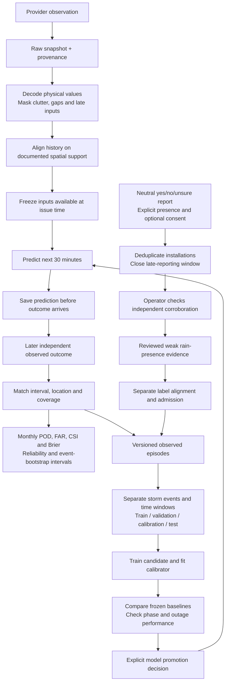

# VAJRA architecture and data flow for SIH26072

The core deliverable is a local weather prediction model. The website and React Native app let an operator inspect its evidence and help people understand approved guidance. The first scientific pilot targets NCR. The proposed forecast horizon is the next 30 minutes, updated when usable observations arrive.

This design separates the intended regional service from the implemented research components. Numeric Indian radar, matched INSAT sequences and lightning network coverage are still required for reliable NCR evaluation. A map cell is an output support choice, not proof of accuracy at that resolution.

## Architecture flow

```mermaid
flowchart LR
    Sensors[IMD radar and gauges\nINSAT satellite\nLightning detections and coverage\nNWP environment] --> Ingest[Source adapters\nUTC observation and arrival times\nImmutable raw files and hashes]
    Ingest --> QC[Quality control\nUnits and geographic support\nMissing and age masks]
    QC --> Motion[Optical-flow baseline\nEcho movement]
    QC --> Model[Compact ConvLSTM\nSpatial and temporal features]
    QC --> Environment[CAPE, humidity and wind\nPhase known at issue time]
    Motion --> Compare[Baseline comparison]
    Model --> Heads[Lightning event head\nRain and first-lightning onset heads]
    Environment --> Heads
    Heads --> Trust[Held-out calibration\nCoverage and age checks\nNo-event probability]
    Trust --> API[Versioned FastAPI output\nIssue, target window and evidence]
    API --> Officer[Officer website\nReview thresholds and evidence]
    API --> Public[React Native app\nLocal view, 12 Indian languages\nDevice speech and SMS composer]
    Officer --> Gate{Validation and\nauthorisation satisfied?}
    Gate -->|No| Hold[Research record\nNo public model warning]
    Gate -->|Yes, proposed service| Alert[Approved local guidance\nExpiry and update record]
    Alert --> Public
```

The software has executable optical-flow experiments and separate compact ConvLSTM research workflows. The regional model has a binary lightning head and two censored timing heads. It does not yet serve an operational NCR forecast. The diagram's unified live feed, model-context fusion and public alert publication are the proposed integration. No LLM or Jev is required.

Storm tracking across splits/merges is a later experiment. The existing connected-object image lab must not be presented as a validated NCR storm tracker. Global WeatherNext concepts motivate temporal forecasting and uncertainty evaluation, but the project does not load Google weights or claim Google's performance.

## Data flow and training loop

New observations can revise a future forecast. A completed forecast record remains immutable so later evaluation cannot quietly replace a failed prediction. Citizen agreement can support a research label. It cannot establish an instrument measurement, rain amount or lightning truth. The current ledger exports weak evidence for later preparation; it does not automatically retrain the model.

## Inputs and accuracy checks

| Source | Physical information | Role and access boundary |
|---|---|---|
| IMD numeric DWR | Reflectivity, velocity and polarimetric quality where supplied | Local echo evolution. Raw historical/live NCR access still needed. Rendered tiles cannot supply calibrated dBZ. |
| ISRO MOSDAC / INSAT | Infrared brightness temperatures, water vapour and cloud development | Cloud context. Match scientific image sequences and acquisition/availability times. Respect access and redistribution terms. |
| IITM / INCOIS lightning | Strike time/location/type plus network coverage | Direct lightning labels. The 2019 catalogue alone is not a downloaded matched training corpus. |
| IMD gauges and stations | Rain accumulation, present weather, humidity, wind and temperature | Outcome checks at documented point/time support. A point gauge does not certify rain over an entire block. |
| NASA IMERG | Half-hourly satellite rain estimates at about 0.1 degree support | Supplemental rain labels after quality/latency checks. They are estimates, not street-scale ground truth. |
| GFS / Open-Meteo / ERA5 | Environmental model fields such as CAPE, moisture and wind | Context, with forecast initialization and valid times retained. Reanalysis is retrospective. Model rain is not independent truth. |
| Citizen reports | Consented observed rain presence, time and selected cell | Reviewed weak evidence. No automatic majority-to-truth conversion. |

Quality and timing come before the neural network. Preserve observation time, arrival time, units, source, processing version, coverage and native support. Unknown or uncovered outcomes remain unknown. Prevent test-event overlap and future-data leakage, including retrospective monsoon phase labels.

The existing September 2026 IMD collection contains 631 station reports from four Delhi-area stations, represented by 11,479 variable records. It includes 25 rain descriptions, 11 drizzle descriptions and 195 reported-zero one-hour accumulations. The collection is partial because provider page counts disagree. These observations have different time supports and do not form 30-minute block labels. The [NCR inventory](../data/ncr/README.md) links the original pages, hashes and derivatives. The scientific radar, satellite and lightning sequences still need matching.

## How accuracy will be established

1. Define a measurable target and its geographic support. For lightning, include detection coverage. For onset, establish a covered event-free initial interval.
2. Freeze persistence and optical-flow baselines before test evaluation. Use the same eligible cases for every comparison.
3. Train on separate storms, select on validation events, calibrate on another partition, and test once on untouched events.
4. Evaluate active/break/onset phase only with a documented phase definition. Use pooled calibration when phase samples are sparse.
5. Fit seasonal Z–R coefficients only on matched training radar/gauge pairs. Compare held-out rainfall error with a declared standard relationship.
6. Report POD, false-alarm ratio, CSI, Brier score, reliability-bin counts and uncertainty. Evaluate timing with misses and no-onset outcomes retained.
7. Test missing sensors, stale feeds, warm-top rain and dust separately. If evidence is insufficient, show uncertainty and hold model-generated public alerts.
8. Compare against IMD only when hazard, issue deadline, geometry and target interval match. Never turn a district three-hour bulletin into an equivalent block 30-minute forecast.

The recorded 20-step synthetic smoke has lightning Brier 0.236092 against climatology 0.215820. Its Brier skill is negative. This confirms computation, not accuracy. A separate historical French radar example has measured optical-flow/translation comparisons, but it cannot establish NCR or lightning performance. The deck labels both demonstrations explicitly.

## Feasibility and public benefit

Use a regional pilot, existing observing networks, compact models and shared compute. Keep raw evidence, training jobs and public presentation separate. Cache source metadata, bound queues and reuse immutable inputs to control work. New observations trigger a new forecast revision, not a full model retraining cycle.

Operators would gain an inspectable evidence record and clear reasons for withholding a forecast. Farmers, schools and outdoor workers could gain preparation time through understandable local guidance if skill and delivery are validated. Measure useful lead time, false alerts, missed events, acknowledgement and user comprehension in a shadow pilot. No lives-saved total or percentage improvement is established.

This is a public-service feasibility case. The deck contains no revenue model, sales projection or pricing plan.

## Presentation content plan

The six reference layouts stay in order: title page, idea/problem and compact data flow, technical architecture and operator flow, feasibility and risk strategy, impact and measured evidence, references and evaluation. Keep the original theme, SIH branding, team label, page size, frame geometry and color hierarchy. Replace CCTV-specific media and labels with weather content inside the same frames. Preserve the supplied team name; the reference contains no assigned team ID.

Source and evaluation details are in [regional evidence](../research/REGIONAL_FEATURE_EVIDENCE.md), [numerical methods](../docs/REGIONAL_SCIENCE_GUIDE.md), [public verification](../docs/PUBLIC_VERIFICATION_GUIDE.md), [source setup](../docs/SUPPLEMENTAL_DATA_GUIDE.md) and [recorded validation](../VALIDATION.md). The deck includes source URLs in speaker notes and its reference slide.
