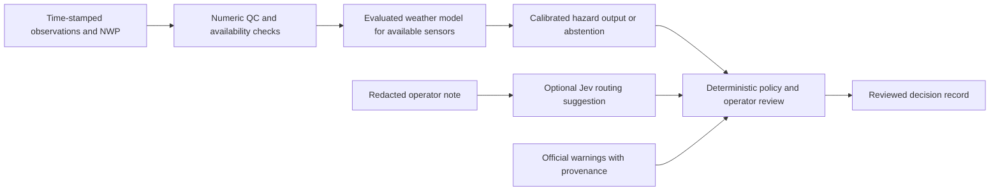

# Weather drivers, distant storms and observation gaps

Research and access date: **30 September 2026**. Scope: selecting defensible inputs for **0–60-minute thunderstorm/lightning guidance over an Indian pilot region**, including places with poor ground-sensor coverage. This is a research and design recommendation, not evidence that the current prototype ingests these feeds or predicts Indian lightning.

Start with storm evolution, recent lightning, moisture, instability, lifting and wind profiles. Add terrain, coast and time-of-day context. Treat sea-surface temperature as a slower environmental input and sea level as a separate coastal-hazard variable. A lunar effect on large-scale atmospheric rainfall has been measured, but that does not establish useful local lightning prediction. More variables earn their place through held-out improvement, dependable access and acceptable latency.

## 1. The physical system we need to represent

Warm, moist air can support deep convection when it becomes buoyant and a lifting mechanism overcomes inhibition. Vertical wind structure helps determine storm organization and transport. Lightning additionally depends on cloud electrification: collisions involving graupel, ice crystals and supercooled water, followed by charge separation, make mixed-phase storm structure relevant. Surface temperature or a large CAPE value alone is insufficient. [NWS environmental indices](https://www.weather.gov/lmk/indices), [NOAA NSSL lightning physics](https://www.nssl.noaa.gov/education/svrwx101/lightning/faq/).

WMO recommends combining radar, satellite, lightning, surface observations, upper-air profiles and NWP with forecaster interpretation. Their roles differ: tracking an existing echo, detecting developing convection and estimating the environment are related tasks, not interchangeable measurements. [WMO nowcasting guidance, 27 November 2019](https://public.wmo.int/media/magazine-article/nowcasting-guidelines-summary).

Indian regional and seasonal differences matter. Madhulatha and colleagues' **2024** study combines IMD soundings, ERA5 and TRMM-LIS, finding different thermodynamic and circulation relationships across Indian regions and seasons. Its climatological associations motivate region/season evaluation; they are not ready-made 30-minute probability thresholds. The accessible abstract and data statement do not establish an openly downloadable matched operational corpus. [Original paper, DOI 10.1002/joc.8471](https://rmets.onlinelibrary.wiley.com/doi/10.1002/joc.8471).

## 2. Predictor map

The lead ranges below describe **where to test a predictor**, not guaranteed skill or warning lead time. Spatial support means what the instrument/model represents; interpolation cannot create finer observed information. **Core** means a first experiment when access exists; **support** means useful conditional context; **later** means an ablation candidate; **separate** means a different hazard product.

### Rapid storm evidence

| Predictor and proposed priority | Physical role | Measurement and source route | Relevant time/spatial support | Main limitation |
|---|---|---|---|---|
| Recent flash/stroke locations, counts and trends. Core | Direct evidence of current electrical activity and its evolution | Authorized Indian lightning-event feed, with detection/QC metadata; provider event records, not dots extracted from a map | Rolling past intervals for 0–60 min; native location uncertainty and flash geometry | A stroke is not a flash. Total lightning differs from cloud-to-ground lightning. No detections under poor coverage cannot establish no lightning. [Detection study](https://journals.ametsoc.org/view/journals/atot/42/8/JTECH-D-24-0130.1.xml) |
| Radar reflectivity structure, echo growth, height and motion. Core where available | Precipitating storm structure and evolution; approximate location of strong hydrometeor cores | IMD numeric DWR volumes/composites and scan metadata, through approved access | Successive volume times, storm/beam sampling scale; test across 0–60 min | Echo is not lightning. Range, blockage, attenuation and calibration affect comparability. A rendered PNG is not a calibrated radar volume. [Radar sampling](https://www.weather.gov/lmk/radar_sample) |
| Reflectivity near temperature levels; mixed-phase echo volume. Core candidate | Relates storm structure to the environment in which electrification develops | Radar vertical structure plus a valid temperature profile/freezing level; do not use fixed altitude everywhere | Developing and mature cells, minutes to an hour | Temperature-level heights are themselves uncertain. No universal dBZ/isotherm rule is an India probability model. [Physical observations](https://journals.ametsoc.org/view/journals/mwre/137/12/2009mwr2860.1.xml) |
| ZDR, KDP, correlation coefficient and hydrometeor classifications. Later unless reliable dual-pol access exists | Additional evidence of particle populations and updraft-related columns | Calibrated polarimetric radar, appropriate wavelength-specific processing and temperature profiles | Cell/volume scale; prospective tests of initiation and intensification | No field is a guaranteed lightning detector. A US study found ZDR columns even without lightning; radar-derived classes are retrievals. [2026 primary study](https://repository.library.noaa.gov/view/noaa/75983) |
| Infrared brightness temperatures, cooling rate, cloud-top expansion and texture. Core | Growing cloud tops and cloud evolution can precede electrical activity | INSAT calibrated image sequences through MOSDAC; derive changes along tracked clouds | Actual scan cadence and channel footprint; test initiation/arrival during 0–60 min | Advected cold cloud can mimic local cooling. Thin cirrus, overlying anvils, parallax and missed scans matter. MOSDAC uses cloud-top cooling in its convective heavy-rain guidance, which is not a lightning label. [MOSDAC method](https://www.mosdac.gov.in/cloudburst/assets/documents/Description_Alert_heavy_rain.pdf) |
| Visible/SWIR cloud properties, phase-related signals and overshooting-top candidates. Support | Cloud development, glaciation and vigorous growth provide complementary evidence | INSAT VIS/SWIR and thermal channels; daylight flag, geometry and provider retrieval QC | Channel-native resolution; storm evolution within an hour | Solar channels have day/night differences. Cloud-top inference does not directly measure the full mixed-phase column. [Satellite lightning study](https://journals.ametsoc.org/view/journals/wefo/37/7/WAF-D-22-0019.1.xml) |
| Cloud motion vectors and radar-cell motion, with trajectory spread. Core | Advection and likely arrival of existing cloud/echo structures | INSAT atmospheric/cloud motion products or causal optical flow; radar object tracking | At least successive actual observations; storm and surrounding domain | Cloud-level wind is not the 10 m wind. Pattern growth changes apparent motion; storms can propagate through new-cell formation. [INSAT algorithm, cloud-motion chapter](https://mosdac.gov.in/docs/INSAT_3D_ATBD_MAY_2015.pdf) |
| Surface wind vectors/gusts, pressure rise, temperature drop and humidity changes. Core where measured | Help locate outflow/cold-pool boundaries and identify near-surface changes | Quality-controlled AWS/SYNOP stations; Doppler radial velocity and satellite boundary clues as complementary evidence | Point measurements and network-resolved boundaries; minutes to an hour | A single station cannot reconstruct a whole gust front. Radar measures radial motion; a 2-D wind field needs assumptions/additional information. [NWS outflow definition](https://forecast.weather.gov/glossary.php?word=outflow+boundary), [NWS radar](https://www.weather.gov/mlb/Doppler_Dual_Pol_Weather_Radar) |

### The environment around and ahead of the storm

| Predictor and proposed priority | Physical role | Measurement and source route | Relevant time/spatial support | Main limitation |
|---|---|---|---|---|
| Temperature, dew point/specific humidity and pressure near the surface. Core | Describe boundary-layer heat and moisture; changes help diagnose fronts and outflow | IMD surface observations; NWP equivalents clearly labelled as model estimates | Stations are points; model fields represent a grid. Current conditions and next-hour environment | Hot does not necessarily mean unstable, and relative humidity changes with temperature. Retain units, sensor height and elevation. [NWS ingredients](https://www.weather.gov/media/grr/brochures/advspg.pdf) |
| Temperature/moisture profiles, lapse rates and freezing-level height. Core | Establish vertical stability, dry layers and height of mixed-phase processes | Radiosondes where available; as-issued NWP pressure/model-level profiles; cloud-cleared sounder retrievals where valid | Column and mesoscale environment; hours of context for a next-hour forecast | Old soundings may miss rapid local changes. Satellite retrievals and NWP are not a balloon measured at every village. [WMO guidance](https://public.wmo.int/media/magazine-article/nowcasting-guidelines-summary) |
| CAPE, CIN, LCL/LFC and parcel definition. Core | CAPE describes available buoyant energy; CIN the barrier to lifting; cloud-base/free-convection levels describe the parcel environment | Derive consistently from temperature, humidity and pressure profiles, or decode documented model fields | Environmental context for 0–60 min and longer; model/sounding support | Surface-based, mixed-layer and most-unstable CAPE are different quantities. High CAPE can coexist with suppressed convection. No universal threshold imported from another region. [NWS indices](https://www.weather.gov/lmk/indices) |
| Low-/mid-level moisture, precipitable water and moisture advection. Core | Available moisture and transport shape convection and precipitation | Profiles, satellite water-vapour information and NWP humidity/winds | Storm inflow and regional environment; hours as well as next-hour context | Water-vapour imagery has broad vertical sensitivity and is not a direct surface-humidity map. Moisture alone does not locate lightning. [Indian analysis](https://rmets.onlinelibrary.wiley.com/doi/10.1002/joc.8471) |
| Wind speed/direction by height; vertical shear and storm-relative flow. Core | Steers systems, changes organization and separates updraft/downdraft regions | Soundings, profilers, radar-derived wind products, NWP u/v fields | Whole storm depth and surrounding environment, 0–60 min and longer | Surface wind cannot replace the profile. Shear effects depend on buoyancy and storm type; more shear is not always more lightning. [NWS storm environment](https://www.weather.gov/source/zhu/ZHU_Training_Page/thunderstorm_stuff/Thunderstorms/thunderstorms.htm) |
| Low-level convergence, frontal/wind-discontinuity boundaries, ascent and circulation. Core/support | Provides or strengthens lifting and modifies the environment for new cells | Station networks, radar fine lines/velocity, satellite cloud lines; NWP wind/divergence/vertical-motion context | Boundary to synoptic scales; present location and movement more useful than a coarse isolated index | Derivatives amplify noisy fields. Coarse NWP can displace or omit small convergence boundaries. [NWS lifting mechanisms](https://www.weather.gov/media/grr/brochures/advspg.pdf) |
| Cold pools and upstream outflow interactions. Core candidate | Parent storms generate spreading cooled air; boundary intersections can initiate or modify other storms | Multi-station changes, radar/satellite boundary tracking; convection-permitting NWP only if verified | Domain extending beyond the user location; minutes to hours | Outflow is not identical to the parent cloud trajectory. Under a strong cap, a boundary need not create a storm. [NWS primary case analysis](https://www.weather.gov/ohx/outflowboundary) |
| Sea/lake breezes and land–water thermal contrast. Regional support | Differential heating drives circulations and convergence | Coast/land mask, surface temperatures, winds, satellite cloud lines and suitably resolved NWP | Coastal/lake mesoscale, strongly time-of-day dependent; next-hour evolution | Synoptic winds and terrain can shift or obscure the boundary. Shore distance alone is not evidence that a sea breeze exists. [NWS sea-breeze explanation](https://www.weather.gov/chs/science) |
| Terrain elevation, slope, aspect and exposure to inflow. Regional support | Orographic lifting and terrain-modified circulation; also explains radar blockage | NASADEM/SRTM or an authorized national DEM, aggregated to the modelling grid, plus actual winds | Static local/regional context; relevant at all leads | Fine terrain data do not make coarse atmospheric fields high resolution. Separate terrain-related detection bias from genuine storm climatology. [NASA elevation product](https://catalog.data.gov/dataset/nasadem-merged-dem-global-1-arc-second-nc-v001), [NWS terrain/radar limits](https://www.weather.gov/mrx/radarrainfallestimates) |
| Solar time, season and solar heating. Low-cost support | Describes the diurnal environment and seasonal regimes | Derive local solar-time/season encodings from verified UTC and coordinates; NWP radiation/cloud cover where available | Daily and seasonal cycles; background conditioning for every forecast | Time-of-day association is not a current observation. Nighttime storms remain possible. Hold out seasons to expose shortcuts. [NWS heating mechanism](https://www.weather.gov/media/grr/brochures/advspg.pdf), [Indian seasonal study](https://rmets.onlinelibrary.wiley.com/doi/10.1002/joc.8471) |
| Soil moisture, land cover, sensible/latent heat flux and urban surfaces. Later | Can modify surface energy partition and boundary-layer conditions | Documented land-model/satellite products; land-cover maps; NWP land fields | Mainly environmental context over hours/days and landscape scales | Confounding and resolution matter. A land-cover correlation is not proof of incremental lightning skill or a causal urban effect. Test after core inputs. [2025 Indian observational study](https://www.sciencedirect.com/science/article/pii/S1364682625000446) |

Do not add every correlated index as an independent explanation. CAPE, lapse rates, moisture indices and related quantities can encode overlapping information. Derive them using consistent profiles and compare a compact physical-variable set with an expanded set on the same held-out events.

## 3. Distant storms need a surrounding-domain model

Three questions should remain distinct. **Will an existing storm arrive?** Use observed motion plus its uncertainty. **Can it trigger a new storm closer to us?** Examine outflow boundaries, convergence and the receiving environment. **Is the broader atmosphere becoming more favorable?** Use moisture transport, wind profiles and synoptic context. Outflow can survive its parent storm and interact with other boundaries; the NWS documented a case where such an interaction altered storm movement and intensity. [Outflow definition](https://forecast.weather.gov/glossary.php?word=outflow+boundary), [20 June 1998 case study](https://www.weather.gov/ohx/outflowboundary).

Recommended implementation: retain a surrounding input area larger than the forecast area. Size it from observed storm/boundary speeds, the requested lead and a validated margin for uncertainty and new development. A kinematic illustration, not a universal storm speed: 20 m/s over 60 minutes covers 72 km. Cropping inputs exactly at a district border can hide an approaching system. Do not treat distant storms as an arbitrary inverse-distance sum of danger; their relevance depends on transport, boundaries and environment.

Use separate motion estimates for cloud tops, precipitating cells and observed outflow when feasible. Track split/merge events and newly growing cells, rather than assuming every future storm is a translated old cell. Evaluate arrival timing and initiation separately. An impressive optical-flow animation establishes neither cloud electrification nor lightning skill.

## 4. Ocean temperature, sea level and the Moon

| Variable | What it physically informs | Source and scale | Recommendation for next-hour inland lightning |
|---|---|---|---|
| Sea-surface temperature and anomalies | Air–sea heat/moisture exchange and the maritime environment | NOAA OISST v2.1 is a daily 0.25-degree blended, interpolated analysis; INSAT and buoy products offer other measurements with their own support. [NASA mechanism](https://science.nasa.gov/earth/earth-observatory/global-maps/sea-surface-temperature-water-vapor/), [OISST metadata](https://www.ncei.noaa.gov/metadata/geoportal/rest/metadata/item/gov.noaa.ncdc%3AC01606/html) | Lower-priority contextual ablation. NWP already contains ocean boundary conditions, so incremental value must be measured. A warm sea does not locate the next lightning flash. |
| Ocean heat content, currents and large-scale SST patterns | Broader ocean–atmosphere/cyclone or seasonal context | INCOIS ocean products; their ocean depth, update interval and forecast/observation status must be retained. [INCOIS location products](https://iioe-2.incois.gov.in/oceanservices/LSF/index.html) | Defer unless a specific coastal/cyclone use case and evaluation justify them. They are not a substitute for rapid convective observations. |
| Sea level, astronomical tide, surge and waves | Coastal inundation, access and marine hazards | INCOIS tide gauges/ocean services; site-specific datum and timestamp. Storm surge and tide are distinct components; waves add further effects. [INCOIS observation portal](https://iioe-2.incois.gov.in/OON/index.jsp), [NOAA surge explanation](https://www.nhc.noaa.gov/surge/) | Separate hazard layer. It can change coastal impact/action advice without changing a lightning probability. |
| Lunar position and astronomical tide | Gravitational forcing of ocean tides; local tide depends on coastline/bathymetry and timing | Use official local tide predictions/observations for coastal decisions. Moon phase alone does not determine local high water. [NOAA local tide timing](https://oceanservice.noaa.gov/facts/moon-tide.html) | No core lunar-phase predictor. Use tides for coastal water-level risk, with local verification. |
| Lunar atmospheric tide | A small planetary-scale modulation of atmospheric pressure/humidity and mean rainfall | Kohyama and Wallace analysed 15 years of TRMM rainfall; their harmonic analysis across **10°S–10°N** found rainfall modulation of order **1 micrometre/hour**. [Original 2016 paper, DOI 10.1002/2015GL067342](https://agupubs.onlinelibrary.wiley.com/doi/10.1002/2015GL067342), [author-hosted paper](https://www.atmos.washington.edu/wallace/PDFs/2016%20-%20Rainfall%20variations%20induced%20by%20the%20lunar%20gravitational%20atmospheric%20tide%20and%20their%20implications%20for%20the%20relationship%20between%20tropical%20rainfall%20and%20humidity.pdf) | This study does not evaluate Indian local lightning forecasts. Exclude from the first model. Any later experiment needs a preregistered held-out ablation controlling for season and solar time. |

The lunar paper's rainfall sensitivity to humidity is not a claim that the Moon causes a large percentage change in each storm. A detectable aggregate signal can be irrelevant to an individual decision. Conversely, astronomical tide is directly relevant to coastal water levels; it should not be dismissed because it is a poor lightning predictor.

## 5. Sources and actual integration constraints

These are documented acquisition routes, not promises of entitlement, uninterrupted delivery or uniform station coverage. This task collected research, not new observations. Earlier downloaded samples and checks remain documented in [DATA_SOURCES.md](DATA_SOURCES.md) and [the government inventory](../data/government/README.md).

| Source | Obtainable/requested variables and interface | Operational gate |
|---|---|---|
| IMD DWR | Request numeric reflectivity/velocity volumes, geometry and quality metadata through [IMD radar service](https://mausam.imd.gov.in/responsive/radar.php?lang=en) and its data-supply workflow | Confirm each station's fields, dual-pol capability, archive, live latency and use terms. Public displays do not grant raw-volume access. |
| IMD surface observations | [WIS2 OGC collections](https://wis2box.imd.gov.in/oapi/collections); [IMD API reference](https://api.imd.gov.in/public/api_reference.html) for documented observations/products | Read station/time/units and actual returned fields. The project's prior WIS2 sample demonstrates bounded observations, not a dense all-India network or reliable real-time SLA. |
| INSAT/MOSDAC | Calibrated L1B imagery, temperature/moisture retrievals and cloud-motion products where catalogued; [download API manual](https://www.mosdac.gov.in/downloadapi-manual) | The API supports catalogue search without login but requires approved credentials for downloads through that client. Confirm actual product availability and permissions. |
| MOSDAC real-time eligibility | [Official FAQ](https://www.mosdac.gov.in/faq-page) distinguishes general and near-real-time users | General users are described as receiving L1 data with **three-day latency**, while L2 onward has different access. NRT L1 eligibility must be confirmed. Archived training access alone cannot support next-hour operation. |
| NOAA GFS | [NOMADS GRIB filtering](https://nomads.ncep.noaa.gov/info.php?page=opendap_grib_migration), [file/product inventory](https://www.nco.ncep.noaa.gov/pmb/products/gfs/nomads/); decode profile TMP/RH or specific humidity, HGT, UGRD/VGRD, pressure and documented CAPE/CIN fields | A 0.25-degree forecast grid and six-hour initialization cycle are environmental support, not village observations. Read the inventory for the exact field/level and product; preserve forecast reference, valid and receipt times. NOMADS is migrating older OPeNDAP uses toward GRIB access. |
| Radiosonde/NWP agency products | Indian study's data statement points to [IMD NWP](https://nwp.imd.gov.in/) and requested IMD soundings; [Wyoming sounding archive](https://weather.uwyo.edu/upperair/sounding.html) is a research route | Verify station inclusion, observation time, launch drift/representativeness, archive availability and permission. Never imply a profile was observed at every grid point. |
| NOAA OISST | [Provider product/download links](https://www.ncei.noaa.gov/products/optimum-interpolation-sst); daily NetCDF fields and accompanying error information | Interpolated analysis is not direct ocean measurement everywhere. Keep preliminary/final version and release timing; do not use a later revised field as an as-issued input. |
| INCOIS ocean observations | [In-situ portal](https://iioe-2.incois.gov.in/OON/index.jsp), [documented tide-gauge technical report](https://incois.gov.in/documents/Reports/TechnicalReports/TR_ESSO-INCOIS-ODM-TR-01%282024%29_20260107124227.pdf) | A portal/report does not establish an unrestricted numeric API for every buoy/gauge. Check station datum, calibration, gap processing and access conditions before ingestion. |
| NASA POWER / reanalysis | [POWER meteorological methodology](https://power.larc.nasa.gov/docs/methodology/meteorology/) explains model-derived gridded historical estimates | Useful for background research and exercises. A point query does not create a local station record or a real-time storm sensor. Retain time standard and source product; do not repurpose historical daily data as five-minute nowcasting truth. |

INSAT-3DS documentation specifies nominal sub-satellite footprints of **1 km for VIS/SWIR, 4 km for MIR/TIR and 8 km for water vapour**, and a normal-mode frame time of **25 minutes**. These are instrument specifications, not a guarantee of a particular product's cadence or delivery time to VAJRA. Read actual scan times, navigation and quality flags. [MOSDAC payload specification](https://mosdac.gov.in/insat-3s-payloads), [scientific product-format document](https://www.mosdac.gov.in/docs/INSAT-3DS_Operational_Products_V1.pdf).

GOES ABI/GLM and its published LightningCast results demonstrate a satellite-based next-hour lightning method. GOES coverage, channel properties and GLM labels are not Indian INSAT observations or an entitlement to an Indian lightning feed. Reusing the architecture requires channel adaptation, matching Indian targets and new validation. [Original LightningCast paper, 2022](https://journals.ametsoc.org/view/journals/wefo/37/7/WAF-D-22-0019.1.xml).

## 6. NWP and data assimilation when observations are sparse

NWP evolves an atmospheric state using physical equations and parameterizations. Data assimilation estimates an initial state by combining available observations with a short forecast and their uncertainties. This is why a model can provide a spatially complete estimate even where no station exists. The complete grid remains an estimate, not an observation at each point. ECMWF explicitly discusses uncertainty in both observations and the background model. [ECMWF data assimilation](https://www.ecmwf.int/en/research/data-assimilation).

For VAJRA, consuming a documented operational analysis/forecast is the practical first step. Stacking satellite, radar and GFS channels in a neural network is data fusion; it does not become a tested numerical assimilation system merely by using that name. Building a regional assimilation cycle would additionally require observation operators, error modelling, QC, cycling, boundary conditions and dedicated verification.

Use only the model run and forecast hours actually available by the forecast issue time. A newer run, an analysis with later observations or a retrospectively revised reanalysis can leak future information. Interpolation between two future valid times of an already released forecast is different from interpolation between two observations when the second was not yet received. Preserve these distinctions in the data contract.

A radar-free path can combine geostationary cloud evolution, available lightning detections, surface observations and model environmental fields. Satellite-only research makes that route plausible, but it does not make all locations equally observable. Satellite cloud-top views can conceal lower-cloud processes; global NWP may miss local initiation; mountain radar gaps can remain even inside a drawn coverage circle. [LightningCast research](https://repository.library.noaa.gov/view/noaa/52868), [radar sampling limits](https://www.weather.gov/lmk/radar_sample).

## 7. Forecast mode, uncertainty and trust must be separate

Recommended output fields are `hazard_definition`, `issue_time`, `valid_interval`, `hazard_probability`, `source_mode`, `source_ages`, `coverage`, `validation_support`, `uncertainty_summary` and `decision_status`. A numerical probability is shown only for a supported forecast mode with an appropriate calibration/evaluation record.

| Available evidence | Recommended behavior, to be validated before operational use |
|---|---|
| Fresh radar, satellite, lightning and environmental inputs | Use the evaluated multimodal mode and disclose known local limitations. |
| Radar absent but other inputs usable | Use a separately evaluated reduced-sensor mode, with its own performance record. Do not present reconstructed radar as an observation. |
| Satellite gaps/daylight-channel absence | Use a model trained and tested for those masks/day/night conditions; otherwise withhold unsupported outputs. |
| Only coarse NWP is usable | Provide environmental context at its supported scale. Do not manufacture a local next-hour probability. |
| Critical inputs stale, coverage unknown or conditions outside validation support | Show insufficient current evidence and route for review. Preserve separately sourced official warnings with their own issue/expiry information. Missing observations must not create an all-clear. |

Do **not** multiply hazard probability by a quality or trust score. For example, `0.8 × 0.2 = 0.16` would turn poor evidence into a lower displayed hazard even though no meteorological evidence justified that decrease. A calibrated probability already conditions on the evidence used by its model. Quality should affect the available model, uncertainty, disclosure or abstention decision; any statistical fusion needs a defined model and validation.

Also distinguish provider/data quality, empirical probability reliability, applicability to this location and human trust in a service. They are different constructs. A trusted agency can have a temporarily unavailable station; a confidently predicted event can still be poorly calibrated. Do not compress these into one unvalidated percentage.

The current temperature-calibration experiment cannot establish uncertainty for missing modalities or a new Indian domain. Its event bootstrap estimates limited sampling variation with a fixed model/calibrator, not every source of epistemic or observation uncertainty. See [the implemented calibration contract](../docs/CALIBRATION_AND_VERIFICATION.md).

## 8. Evaluation for places with few sensors

The absence of a label is not a negative label. A sparse region may have both worse inputs and worse verification coverage; a seemingly low false-alarm rate can merely reflect selective reporting. Lightning detection performance varies with geography, viewing geometry and time of day even in well-studied systems. A **2025** GLM study used cross-network comparisons because ground references were themselves imperfect; its Western Hemisphere results cannot supply an Indian detection-efficiency constant. [Primary detection-performance paper](https://journals.ametsoc.org/view/journals/atot/42/8/JTECH-D-24-0130.1.xml).

Recommended evaluation sequence:

1. **Define the target and its support.** Specify flash versus stroke, total versus cloud-to-ground lightning, provider, spatial neighbourhood, forecast interval and target-coverage requirement. Rain gauges validate rain, not lightning; an official warning is a forecast, not independent lightning truth.
2. **Retain realistic negatives.** Include covered quiet periods and relevant seasonal frequencies. A storm-enriched training sample requires calibration/evaluation under the intended deployment distribution, not just similarly enriched test patches.
3. **Split independent events before any fitting.** Keep related windows, neighbouring tiles and storm split/merge descendants together. Purge overlapping label windows, fit preprocessing on causal training inputs, select on validation, calibrate separately and keep the final test untouched.
4. **Hold out real places and periods.** Evaluate unseen radars, sparse regions, seasons, terrain regimes, coast/interior, day/night and sensor configurations. Compare matched products and definitions; show support counts and areas where no defensible verification was possible.
5. **Test structured sensor loss.** Remove complete radar sites, azimuth sectors, scan sequences or source channels; inject delays, outages and measured QC failures. Test naturally occurring outages too. Random missing pixels alone do not reproduce a blocked mountain sector or a failed communication link.
6. **Keep verification evidence when dropping predictors.** At well-observed sites, hide selected inputs while retaining independent reference labels. This tests reduced-input performance without pretending the test region has no truth. Then test transfer to genuinely sparse regions with additional reference campaigns where feasible.
7. **Collect targeted independent reference evidence.** With agencies, consider temporary calibrated surface instruments and appropriate lightning detection/mapping support. Record detection coverage and ensure verification observations are not fed into the tested prediction path. Human reports can help investigate events but are incomplete and need timestamps, locations and corroboration.
8. **Measure abstention as well as errors.** Report forecast coverage, abstention frequency and error rates among issued forecasts by regime. A system that withholds nearly everything must not claim high accuracy without showing its low useful coverage.
9. **Use hazard- and decision-specific scores.** Report Brier/log loss/reliability, AP and fixed-threshold POD/FAR/CSI, with event-level uncertainty and baseline comparisons. Separately evaluate first-event lead time, location error and late warnings. Grouped confidence intervals do not cure biased or missing truth.

Feature ablations should use the same covered cohort and issue times: persistence/recent-lightning baseline; satellite plus environment; add radar; add boundary/motion features; then test optional SST/land inputs. Retain a predictor only if improvement survives held-out regimes and is worthwhile after missingness, latency, bandwidth and operational cost. Attributions or feature-importance plots are descriptive model diagnostics, not proof of atmospheric causation.

### Records that make the evaluation auditable

| Record | Minimum useful content |
|---|---|
| Source observation | Provider/product/version; observation interval; receipt time; units; coordinate system; spatial/vertical support; scan geometry; QC; source hash and access terms |
| Missingness and maintenance | Missing versus measured-zero mask; outages; calibration changes; station moves; radar blockage/beam height; sensor/channel availability; known detection changes |
| NWP field | Model/version; initialization; forecast lead and valid time; release/receipt time; grid; level; ensemble member; field units and accumulation interval |
| Lightning target | Original event IDs; flash/stroke grouping and deduplication; event time/location uncertainty; network coverage; detection/QC record; exact spatial/time aggregation |
| Forecast | Issue/valid times; source mode; data cutoff; model and calibrator hashes; probability; suppressed/abstained state and reason; official-warning provenance kept separately |
| Verification | Held-out event/site/season assignment; independent reference identity; matched forecast/label support; excluded periods and reasons; reproducible metric configuration |
| User decision | With consent and minimum necessary personal data: receipt, understanding, acknowledgement and action timestamps as separate outcomes; no inference of lives saved from app usage |

This is more valuable than accumulating additional unaligned columns. Without these records, neither a sophisticated model nor a new confidence score can establish local reliability.

## 9. Jev's bounded decision role

Jev can be assessed as an optional semantic router after meteorology and numeric policy have already run. For example, an operator note can be classified into `SENSOR_SUPPORT`, `FORECAST_REVIEW` or `UNRESOLVED`. It must not infer a missing radar observation, compute lightning probability, choose meteorological thresholds, clear an official warning or issue an all-clear.

TypeSafe's **Jev 1.13** limitations explicitly place arithmetic and date comparisons in code, and warn about adversarial input and inconsistent logical formulations. Its confidence is about the model's answer distribution, not measured accuracy of an Indian weather forecast. [Vendor limitations, reviewed 17 September 2026](https://docs.typesafe.ai/model-jaggedness/jev-1.13), [confidence documentation](https://docs.typesafe.ai/confidence).

Validate routing against human labels, including negation, local-language notes and hostile instructions. Keep source checks, deadlines, access control and mandatory review in code. Missing credentials, offline operation or an uncertain answer should leave the ordinary review queue usable. The existing [Jev assessment](JEV_ASSESSMENT.md) documents the hosted-service/access boundary; this note adds no integration or meteorological competence claim.

## 10. What to build and verify first

The first matched Indian research dataset should contain available radar and/or INSAT sequences, independent lightning labels with coverage evidence, as-issued environmental profiles, and explicit missing/receipt-time records. Train the radar-free satellite/environment path alongside the full-input path if real operational coverage requires both. Add storm motion and boundary context only from observed or clearly labelled model-derived inputs.

Give judges a replay in which a radar feed disappears: the source-mode change, forecast availability, uncertainty disclosure and preserved official warning should all be inspectable. Show reduced-sensor results on independent events, including failures. That is a concrete, testable distinction. An added Moon feature or a lower hazard score under poor data would not be.

Source checks in this note distinguish official physical guidance, original research, instrument specifications and proposed engineering policy. Direct source links were inspected on the research date; none grants new accounts or data rights. The lunar quantitative statement was checked against both the original journal text and author-hosted paper. MOSDAC access constraints were checked against its FAQ and API manual. No performance number from a foreign sensor system is claimed for India.
