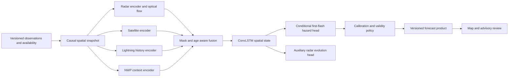

# Candidate B: spatial forecast snapshots with trained lightning hazards

Status: independent architecture candidate; proposed future research architecture, not implemented behavior. Design phases: grounding complete (greenfield), sketch complete, synthesis pending, implementation deferred to the synthesis decision, scrap/revise if data or runtime evidence contradicts this shape. Scientific evidence is in [MODEL_RESEARCH.md](../MODEL_RESEARCH.md).

## Problem

A forecaster needs a localized lightning probability and an auditable explanation while radar, satellite, lightning and NWP arrive at different times. The main difficulty is preserving a valid relationship between historical observations, real lightning labels and operational issue time. A spatial model must capture motion and growth without disguising missing sensors as calm weather. This candidate prioritizes a true spatial training/inference system over an application-led demonstration.

## Usage (caller's view)

These sketches are the proposed public contract. A caller requests one issue-time forecast or evaluates one model against an immutable manifest; it does not coordinate loaders, gridders, encoders and calibrators.

```python
from nowcast import ForecastService, Issue, PilotRegion, ModelVersion

service = ForecastService.from_config("pilot.toml")
issue = Issue(region=PilotRegion("pilot-01"), at="2026-04-15T10:30:00Z")
result = service.forecast(issue, model=ModelVersion("lightning-spatial-v1"))
match result:
    case AvailableForecast(product=product):
        district_map.display(product.lightning, product.source_health)
    case UnavailableForecast(reason=reason):
        district_map.display_unavailable(reason)
```

```python
# Historical replay selects only objects actually available at the issue time.
replayed = service.forecast(historical_issue, model=frozen_model)
audit_store.keep(replayed.manifest_id)
```

```python
from nowcast.training import Experiment, ExperimentSpec

run = Experiment(ExperimentSpec.from_file("experiments/india-pilot.toml"))
report = run.execute(dataset_manifest="catalogues/pilot-v1.json")
# report contains baseline/model scores, coverage, split identifiers and artifacts
```

## Shape

Data structures precede services. Boundary parsers create domain objects; framework tensors, HTTP requests and vendor payloads remain private. Each `ForecastService.forecast` call owns its inference state, so concurrent runs never mutate a shared “current storm” object.

```python
from dataclasses import dataclass
from datetime import datetime
from enum import Enum
from typing import Literal, Protocol

class Modality(Enum):
    RADAR = "radar"
    SATELLITE = "satellite"
    LIGHTNING = "lightning"
    NWP = "nwp"

@dataclass(frozen=True)
class SourceStamp:
    source_id: str
    observed_from: datetime
    observed_until: datetime
    received_at: datetime
    content_sha256: str

@dataclass(frozen=True)
class GridSpec:
    crs: str
    cell_metres: int
    width: int
    height: int
    origin_x_metres: float
    origin_y_metres: float

@dataclass(frozen=True)
class LightningTarget:
    sensor_product: str
    event_kind: Literal["total_flash", "cloud_to_ground_flash"]
    radius_metres: int
    horizons_minutes: tuple[int, ...]

@dataclass(frozen=True)
class SnapshotManifest:
    issue: Issue
    grid: GridSpec
    sources: tuple[SourceStamp, ...]
    # Includes preprocessing version, missingness and data-availability assumptions.
    preprocessing_version: str
    availability_mode: Literal["recorded", "simulated_latency", "idealized"]

@dataclass(frozen=True)
class ProbabilityGrid:
    target: LightningTarget
    grid: GridSpec
    # Private owned arrays: probabilities, validity and horizons.
    artifact_id: str

@dataclass(frozen=True)
class ForecastProduct:
    lightning: ProbabilityGrid
    source_health: tuple[SourceHealth, ...]
    issued_at: datetime
    expires_at: datetime
    model: ModelVersion
    calibration: CalibrationStatus

@dataclass(frozen=True)
class AvailableForecast:
    manifest_id: str
    product: ForecastProduct

@dataclass(frozen=True)
class UnavailableForecast:
    manifest_id: str
    reason: str

ForecastResult = AvailableForecast | UnavailableForecast

class ForecastService:
    @classmethod
    def from_config(cls, path: str) -> "ForecastService":
        raise NotImplementedError

    def forecast(self, issue: Issue, model: ModelVersion) -> ForecastResult:
        """Same frozen issue/manifest/model yields the same product or reason."""
        raise NotImplementedError

class Experiment:
    def __init__(self, spec: ExperimentSpec):
        raise NotImplementedError

    def execute(self, dataset_manifest: str) -> EvaluationReport:
        """Train/calibrate using frozen splits, then report untouched test scores."""
        raise NotImplementedError
```

`Issue`, `PilotRegion`, `ModelVersion`, `SourceHealth`, `CalibrationStatus`, `ExperimentSpec` and `EvaluationReport` are small named domain types; configuration parsers validate their actual fields. The sketch intentionally exposes the forecast target and availability assumptions because these affect what the consumer may conclude. Numeric array shapes, calibration algorithms and provider schemas remain hidden, per boundary-discipline and minimize-reader-load.

| Module | Knowledge it owns |
|---|---|
| `observations.py` | Provider parsing, units, quality, coordinate transforms, causal source selection, immutable snapshot manifests |
| `forecast.py` | Spatial tensor construction, baseline/model execution, calibrated lightning product and quality policy |
| `training.py` | Label construction, event-grouped splits, fitting/calibration, evaluation and model artifact provenance |
| `decisions.py` | Location/asset exposure queries, versioned alert thresholds, expiry and deduplication; no network dispatch by default |
| `app.py` | HTTP/UI mapping to domain calls; no forecasting policy |

Modules own coherent knowledge rather than merely sequential load/validate/save steps. Storage starts with immutable files and a local catalogue; parallel workers write distinct run directories and the read boundary selects a completed manifest. Production object storage and a job queue become useful only when ingestion volume requires them. Forecast ids derive from the immutable manifest/model/policy content so retries are idempotent, per make-operations-idempotent.



The initial six-frame, 2 km regional model uses small modality encoders and a downsampled ConvLSTM. Optical flow supplies a baseline and motion features; an auxiliary residual learns radar growth/decay. Lightning has a separate observation-trained target. A conditional first-event hazard head supports coherent cumulative 15/30/60 minute probabilities. If direct labels are unavailable, this design returns no trained lightning claim. See the full target and censoring definition in the model research.

The public interface hides all snapshot, preprocessing, model and calibration coordination behind one forecast call. Consumers see the forecast definition, quality and provenance, because hiding those would make misuse easier. This is a deep interface with a short call chain.

## Synthesis decision

To be completed by the root synthesis. Candidate B is the proposed base only if representative historical observations, lightning labels and compute are available. Otherwise retain its target/provenance contracts and build the narrower end-to-end prototype while recording the spatial model as future work.

## Tradeoffs accepted

- We accept less model novelty in exchange for strong causal data alignment, baselines and reproducibility.
- We accept a small pilot domain and moderate grid spacing in exchange for a testable training cycle.
- We accept source-specific validity handling and abstention in exchange for probabilities with an honest operating domain.
- We accept a distinct lightning target in exchange for losing the shortcut of calling a precipitation model a thunderstorm predictor.
- We accept more training/data preparation than a tabular model in exchange for capturing spatial structures and neighbourhood motion.

## Alternatives considered

- **Single concatenated end-to-end transformer:** hides model stages well but exposes a demanding fixed tensor contract to data callers and risks learning sensor availability artifacts. Reconsider after the small spatial baseline establishes a data and skill floor.
- **Storm-object feature model:** hides feature-based probability estimation behind a simple interface and trains cheaply, but requires reliable upstream detection/tracking and discards useful cloud structure before first radar echo. A strong hackathon/transparent baseline; not a full replacement for a spatial future model.
- **Microservices for every pipeline stage:** produces many shallow interfaces and cross-service timestamp policies. Rejected until operational scale demonstrates a need.

## Open questions and risks

Which matched Indian lightning/radar archive will support the first test? What operational latency and minimum useful lead time will IMD set? Which radar/satellite outages occur during hazardous weather? Can a partner provide coverage metadata, rather than only events? These are future operational dependencies; the current prototype can proceed with explicit assumptions.

## Next implementation step

Build one causal replay fixture with known sensor delays and real event labels, run climatology/recent-lightning/advection baselines, and freeze the forecast/label contract before spatial training.

## Red-flag review

- Shallow interfaces: passed; consumers make one forecast or experiment call.
- Information leakage: passed at sketch level; provider/transport types stay in observation and app boundaries, target semantics are deliberately public.
- Temporal decomposition: passed; modules own observation, prediction, evidence and decision knowledge rather than load/clean/save phases.
- Pass-through layers: none proposed.
- Remaining implementation risk: the source-health policy and label-validity policy must remain centrally defined; duplicated mask logic would violate this sketch and require revision.
