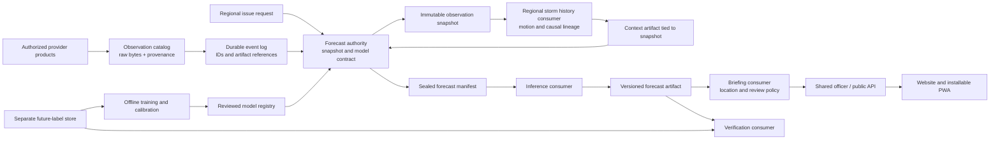

# Candidate B: immutable forecast records with independent stream consumers

**Status: proposed architecture, 30 September 2026.** This is an alternative for a future regional VAJRA system. The APIs, consumers, Indian observation feeds and neural models below are not implemented. It preserves the existing simulator and MétéoNet replay endpoints as separate products. Grounding: [detailed-grounding.md](detailed-grounding.md). Research: [paper reference library](../PAPER_REFERENCE_LIBRARY.md).

Design phases: grounding complete; candidate sketch complete; synthesis belongs to the parent architecture review; implementation and any redesign follow the selected architecture. No deployment or model changes are part of this candidate.

## Usage: what each caller should do

These three sketches are the public contract, not runnable code. Source adapters, message envelopes, storage formats and framework request objects stay inside the corresponding module.

```python
# 1. An authorized source collector records one provider product.
from vajra.observations import observations, SourceProduct

receipt = observations.capture(
    SourceProduct(source="pilot-radar", provider_product_id="provider-issued-id")
)
# The module retrieves bytes, checks the source contract, commits immutable
# provenance and publishes its own event. A retry of the same revision
# returns the same receipt; revised provider bytes remain a distinct artifact.
```

```python
# 2. A regional scheduler requests one forecast; the officer/PWA reads it.
from vajra.forecasts import forecasts, ForecastRequest, Live
from vajra.briefings import briefings, Location

pending = forecasts.request(ForecastRequest(
    region="pilot-region-v1",
    issue_at="2026-10-01T10:00:00Z",          # illustrative future issue
    target="lightning-occurrence-30m-8km-v1",
    deployment="regional-candidate-v1",
    mode=Live(),
))
view = forecasts.view(pending.forecast_id)    # pending | available | withheld
brief = briefings.at(Location(lat=..., lon=...), forecast=pending.forecast_id)
# Officer review records the exact forecast, policy and reviewer identity.
# A public read serves official warnings and clearly labelled guidance under
# the configured authorization policy; it does not create another forecast.
```

```python
# 3. A scientist runs a causal replay without granting dispatch capability.
from vajra.replay import replays, ReplayPlan, RecordedServiceAvailability

run = replays.request(ReplayPlan(
    region="pilot-region-v1", period=(start, end),
    target="lightning-occurrence-30m-8km-v1",
    deployment="regional-candidate-v1",
    availability=RecordedServiceAvailability(),
    namespace="holdout-2026-v1",
))
# The report identifies every issue manifest, exclusion, label mask and model.
# Archive-only data with unknown historical arrival cannot satisfy this mode.
```

The public caller chooses the region, target, issue and deployment. It does not coordinate tracking, raster alignment, retries, calibration or per-source fallback. Each is owned behind a domain interface. Existing `POST /api/runs` continues to identify its simulation or observed-echo product; the proposed `/api/v2/forecasts` never silently routes collected observations through simulator-trained weights.

## Shape: a durable event log, with bounded domain owners

The distinctive structure is independent consumers around immutable artifacts. A source arrival can update the regional scene, source-health view and future training catalog without making one consumer wait for the others. A forecast nevertheless depends on **one frozen input snapshot and one sealed forecast manifest**. Eventual consistency is acceptable for indexes; it is unacceptable for mixing forecast inputs from different issues.



Arrows show information dependencies, not a remote call for every box. The log carries small references; grids stay in object storage. Raw provenance, sealed snapshots and forecast records remain durable after event-log retention expires. Event IDs enable notification replay; they do not replace scientific provenance.

Internally, `ObservationCommitted` is consumed independently by source-health projections, issue selection and the research catalog. `SnapshotSealed` requests a context tied to one immutable input closure. `ContextReady` lets the forecast owner seal a compatible manifest; `ForecastManifestSealed` schedules inference. `ForecastCompleted` is consumed independently by briefing and verification owners. `LabelsFinalized` lets verification complete later without blocking delivery. Each event carries a schema version, owner/event identity, run namespace, causation identity and artifact reference. Consumers quarantine unsupported schemas; adding a field never changes the meaning of an existing event version.

### Module ownership

| Owner | Knowledge it owns and hides | Sole writable records | Main access pattern |
|---|---|---|---|
| `observations` | Provider access, units, georeferencing, checksums, parsing, corrections, observation and availability evidence | Source products, receipts, normalized observations and source-health history | Query by source, valid interval, footprint and eligibility cutoff; resolve an artifact by digest |
| `forecasts` | Issue identity, causal input selection, deployment compatibility, deadlines, quality routing and immutable manifests | Forecast requests, snapshots, selected model/calibrator contract, completion/withheld records | Lookup exact forecast ID; latest eligible issue by region/target/mode; join context by snapshot ID |
| `storm_history` | Region-wide radar object detection, optical flow, association, track epochs and observed split/merge lineage | Track revisions, motion/context artifacts and lineage edges | Query a track as known at a cutoff; resolve context for one snapshot; spatially find crossing objects |
| `model_registry` | Training lineage, feature signature, target compatibility, calibration validity and promotion policy | Immutable candidate versions plus explicit deployment revisions | Resolve one deployment revision to a compatible model/calibrator/fallback set |
| `targets` | Lightning event meaning, network coverage, duplicates, finalized label windows and censoring | Future event/coverage records, target versions and label manifests | Lookup one issue's future interval and 8 km neighbourhood coverage |
| `verification` | Held-out splits, score definitions, comparison cohorts and uncertainty reporting | Evaluation manifests and reports | Join forecast ID to a finalized target manifest; aggregate by storm/region/season |
| `briefings` | Location lookup, warning authority, officer decisions, message expiry and delivery receipts | Guidance records, review decisions and authorized delivery outbox | Fetch exact forecast/location or authoritative active warning; record a versioned review |

These boundaries follow knowledge ownership, per the architect's boundary-discipline and model-the-domain principles. They are not separate `load`, `validate`, `transform` and `save` services. Consumer implementations can share a process initially, but cannot write another owner's tables. One Postgres instance with schema ownership is sufficient for this candidate's pilot; physical database separation is optional later.

### Proposed domain types and signatures

Illustrative Python notation; constructors validate UTC timestamps, positive durations, CRS, units and discriminated variants. Omitted ID aliases are opaque, not interchangeable strings. Store and broker types are private.

```python
@dataclass(frozen=True)
class SourceProduct:
    source: SourceId
    provider_product_id: ProviderProductId

@dataclass(frozen=True)
class RawReceipt:
    id: RawReceiptId
    raw_digest: SHA256
    source_product: SourceProduct
    received_at: UTCInstant
    retrieval_record: RetrievalRecordId  # URL/product, receipt evidence; no secrets
    access_terms: AccessTermsVersion

@dataclass(frozen=True)
class Provenance:
    raw_receipt: RawReceiptId
    observation_interval: TimeInterval
    provider_revision: str
    normalized_committed_at: UTCInstant
    provider_availability: ProvenTime | UnknownTime
    units: UnitSchema
    spatial_reference: SpatialReference
    parser_version: ParserVersion

@dataclass(frozen=True)
class NwpCycle:
    source: SourceId
    initialized_at: UTCInstant
    forecast_valid_times: tuple[UTCInstant, ...]
    provenance: Provenance
    field_schema: NwpFieldSchemaVersion

@dataclass(frozen=True)
class GridSpec:
    central_shape: Literal[(128, 128)]
    resolution_m: Literal[2000]
    halo_cells: Literal[32]             # candidate configuration, not a theorem
    projection: RegionalCRS
    origin: MetricPoint

@dataclass(frozen=True)
class ObservationSnapshot:
    id: SnapshotId
    issue_at: UTCInstant
    knowledge_cutoff: UTCInstant
    mode: Live | ServiceReplay | ProviderReconstruction | ResearchReplay
    grid: GridSpec
    six_slots: Six[UTCInstant]
    inputs: tuple[EligibleObservation, ...]
    nwp: EligibleNwpCycle | MissingNwp
    availability_policy: AvailabilityPolicyVersion
    feature_recipe: FeatureRecipeVersion
    source_catalog_revision: CatalogRevision

@dataclass(frozen=True)
class ContextArtifact:
    id: ContextId
    snapshot_id: SnapshotId
    motion: FieldArtifact
    tracks: TrackViewId | TrackingUnavailable
    validity: FieldArtifact
    recipe_version: ContextRecipeVersion

@dataclass(frozen=True)
class ForecastManifest:
    id: ForecastId
    content_digest: SHA256
    snapshot_id: SnapshotId
    context_id: ContextId
    target: TargetVersion
    model: ModelVersion
    calibrator: CalibratorVersion
    quality_profile: QualityProfileVersion
    deployment_revision: DeploymentRevision
    runtime_recipe: RuntimeRecipeVersion
    supersedes: ForecastId | None

ForecastView = PendingForecast | AvailableForecast | WithheldForecast
# AvailableForecast always has generated_at, valid_until, mode, quality status,
# calibrated probability artifact, per-cell validity and the manifest digest.

class Observations:
    def capture(self, product: SourceProduct) -> ObservationReceipt:
        raise NotImplementedError

class Forecasts:
    def request(self, request: ForecastRequest) -> PendingForecast:
        raise NotImplementedError
    def view(self, forecast_id: ForecastId) -> ForecastView:
        raise NotImplementedError

class StormHistory:
    def context(self, snapshot: ObservationSnapshot) -> ContextArtifact:
        raise NotImplementedError

class Replays:
    def request(self, plan: ReplayPlan) -> ReplayRun:
        raise NotImplementedError

class Briefings:
    def at(self, location: Location, forecast: ForecastId) -> LocationBrief:
        raise NotImplementedError
```

`EligibleObservation` can only be constructed by the catalog's cutoff selector. A model cannot accept a raw provider response or an arbitrary list of “latest” arrays. `CalibratedForecast` is constructed only when the registry matches model, target, feature schema and supported quality profile. An unsupported combination returns `WithheldForecast`; it does not attach a reassuring confidence label.

The raw receipt exists even if parsing fails. Normalization creates a new provenance record referring to it, rather than appending mutable fields to the original receipt. The source adapter includes advertised revision/ETag evidence in its capture identity; where a provider can silently replace a file, it revalidates retrieval and deduplicates by digest rather than trusting the provider product name alone.

Two sealed records serve different purposes. `ObservationSnapshot` freezes knowledge at issue time. Derived motion and tracking may be computed afterward from that frozen closure. `ForecastManifest` then binds their exact artifacts and the chosen predictor. Its content cannot change after inference starts. A deadline may select a separately validated no-tracking deployment; it cannot remove a required tensor behind a model's back.

## Data contract and causal alignment

### Proposed tile and six-frame context

The central forecast tile is **128 × 128 cells at 2 km**, covering 256 × 256 km in the selected regional metric grid. This candidate proposes a **32-cell halo on each side**, so input processing uses **192 × 192 cells**, spanning 384 × 384 km. The geometric cell-count multiplier is **2.25**, not a measured runtime multiplier. The target applies to 2 km-spaced centres and an 8 km neighbourhood; it does not mean 2 km location accuracy for lightning.

Six nominal inputs are `T−50, T−40, T−30, T−20, T−10, T` minutes. They span 50 minutes. For each sensor and slot, select the most recent eligible observation whose valid time does not exceed that slot, within that source's configured age limit. Do not interpolate using a later image. Reused scans retain their true age and repeat/validity indicators. Unequal real cadences remain visible instead of being presented as six fresh scans.

An interval product uses its last contributing observation time for cutoff eligibility. A radar volume or composite cannot be treated as fully known at its scan-start timestamp if it contains later measurements.

The halo is an engineering proposal for boundary context and incoming storms. A sizing experiment should compare `halo_distance ≥ motion_bound × (30 minutes + observation_age) + 8 km + model_context_margin`. For illustration only, an assumed 25 m/s design speed and five-minute age consume 52.5 km of transport and 8 km of neighbourhood radius, leaving 3.5 km within a 64 km halo. This is not an observed speed limit or a guarantee. Longer age, faster motion or a large receptive field can require a larger halo or an edge-invalid mask. Full 50-minute storm ancestry may leave this tile; regional tracking must carry wider history rather than inventing local ancestry.

Per-channel data include declared physical units, missing and quality masks, observation age, coverage and source identity. Radar reflectivity is not averaged as if dBZ were linear power; any fusion recipe declares its measurement space and radar-quality assumptions. Satellite brightness temperature is retained in kelvin and cloud-top cooling uses only eligible historical images. Past lightning counts never include an event after `T`. Static terrain and source-geometry features have separately versioned provenance. Feature normalization statistics come from the training partition alone.

### Five times that must not be conflated

| Time | Meaning | Role |
|---|---|---|
| Observation/valid time | When the measured state occurred, or when an NWP forecast is valid | Determines the physical slot or forecast lead |
| NWP initialization time | Which numerical forecast cycle produced the fields | Must not be later than issue; distinct from its future valid times |
| Provider availability | When this product revision was released, if supported by evidence | Can support provider reconstruction, with its evidence recorded |
| Local receipt and normalization commit | When this service obtained and could select the product | Determines recorded service availability |
| Issue / generation / delivery | The forecast's target origin, completion and client receipt | Separates predictive lead from time remaining when someone receives it |

For live and recorded-service replay, the catalog admits only observed products with valid time at or before the corresponding input slot and `received_at ≤ T`, `normalized_committed_at ≤ T`. Pin the catalog revision visible at the cutoff. A product arriving at `T+20 seconds` does not enter the forecast labelled as known at `T`, even if its scan time is `T−10 minutes`. Later computation may finish after `T`; `generated_at` and remaining lead must reflect that delay. The original target still ends at `T+30 minutes`.

Archive files downloaded today do not prove they were available historically. **Service replay** requires recorded historical local readiness. **Provider reconstruction** may use independently documented historical provider release times, but does not measure our service latency. **Research replay** with a declared assumed latency is a separate sensitivity experiment. Unknown availability remains unknown; none of these modes is silently promoted to live evidence.

NWP selection chooses a coherent cycle initialized no later than `T` whose exact product revision was available under the mode's cutoff policy. Valid times beyond `T` are legitimate forecast covariates when that cycle was already available. A later initialization, future analysis or retrospectively revised field is not. Pin cycle, member, levels, accumulation intervals, units and interpolation recipe; avoid mixing the newest field from several incompatible cycles. Missing NWP routes through a validated missing-NWP profile or produces an explicit unavailable result.

## The first target, and the separate initiation experiment

The initial future product is cumulative occurrence:

`Y(x,T) = 1` if at least one qualifying observed lightning event lies within **8 km** of cell centre `x` during **(T, T+30 minutes]**.

The `TargetVersion` fixes distance method, event type, sensor/network, location-quality filter, duplicate-event rules and interval boundaries. Total lightning and cloud-to-ground lightning receive different target identities. A satellite/radar threshold is never relabelled as a measured flash.

The broader severe-weather workbench may show radar context and official warnings, but this first lightning probability does not estimate hail, damaging wind or flooding. Each added hazard needs its own observations, target and validation before receiving a probability label.

The target service returns both event evidence and observability:

```python
EventEvidence = ObservedPositive | NoEventObserved
Observability = CompleteWindowCoverage | PartialCoverage | UnknownCoverage

@dataclass(frozen=True)
class LightningLabel:
    target: TargetVersion
    issue_at: UTCInstant
    event_evidence: EventEvidence
    observability: Observability
    coverage_manifest: CoverageManifestId
    finalized_at: UTCInstant
```

Zero observed flashes becomes a negative training label only when the required spatial neighbourhood and full future window satisfy a documented coverage rule. A trusted positive can still be recorded during partial coverage, but the initial ordinary binary-loss and comparable score cohort use complete-coverage windows for **both** classes; admitting every partial-coverage positive but dropping partial-coverage negatives would bias event frequency. A later censoring/weighting experiment requires its own declared assumptions. Coverage is based on network/product quality evidence, not merely a nonempty file. Even “complete” operational coverage does not prove perfect physical flash detection.

Label files finalize only after the future window and an explicitly configured reporting/finalization lag. Corrections create new label versions and evaluation reports. Restricted label-store credentials, separate storage prefixes and explicit sample manifests prevent inference from reading future flashes or finalized targets. Training creates an input snapshot first, then joins its separate label manifest. Event-grouped date/region splits precede normalizer fitting, tuning and calibration; neighbouring tiles and overlapping windows from one storm cannot be independently shuffled across partitions.

This 30-minute occurrence task includes already active storms. **First-lightning initiation is a later, separately versioned experiment** requiring a chosen quiet-history duration, observed coverage throughout that history, and a definition of first detected event. A survival head may model time to that event with censored follow-up, but is not interchangeable with the current simulator's independent 15-minute interval heads. Discrete survival methods supply a mathematical option, not weather validation. [Gensheimer and Narasimhan, 2019](https://peerj.com/articles/6257.pdf).

## Storm history without future leakage

Use a regional tracking owner rather than separate identities per display tile. It can reuse DATing-style detection, optical-flow association and overlap matching, with locally evaluated thresholds. The regional history stores an algorithm/run namespace, object geometry, observed intensity features, timestamps, source artifacts and uncertainty flags. Dense background features remain present because a newly developing storm may have no detected radar object. [Feldmann et al., 2021](https://wcd.copernicus.org/articles/2/1225/2021/).

One writer owns each region and tracking epoch. A split creates child track IDs with parent edges; a merge creates a successor with multiple parents. Edges become visible only when their evidence has arrived and the matching scan has been processed. IDs mean algorithmic associations, not proven physical storm identity. Boundary crossings retain the regional identity; a display tile does not restart the storm's age.

Every `TrackView` records `as_of`, tracker version, input closure and lineage revision. A late scan or corrected segmentation can create a revised history, but old forecast references retain the earlier view. Replay either advances the same tracker over causal prefixes or recomputes each prefix; it never computes a complete storm trajectory once and gives earlier forecasts its future edges. In particular, DATing fields such as `will_merge` or next-frame split identifiers cannot be used before the confirming frame is eligible. [Official DATing API](https://pysteps.readthedocs.io/en/stable/generated/pysteps.tracking.tdating.dating.html).

## Predictor, registry and quality routing

The first trained candidate is a compact temporal convolutional model: modality encoders plus six-step ConvLSTM-style context, with a dense lightning-occurrence head. It receives masks, ages and quality fields. Motion and growth provide an auxiliary radar/precipitation task or explicit baseline; learning radar growth does not itself establish lightning skill. Track summaries are an ablation, not a prerequisite for detecting new convection.

Compare lightning against climatology and suitable satellite-only/radar-plus-satellite models; compare precipitation against persistence, optical-flow transport and LINDA where compatible data support its rain-rate formulation. Existing multimodal lightning work and the radar-LightningCast first-flash/absent-radar experiments already cover substantial parts of this idea. [Leinonen et al., 2023](https://agupubs.onlinelibrary.wiley.com/doi/10.1029/2022GL101626), [Cintineo et al., 2026](https://repository.library.noaa.gov/view/noaa/75509), [Pulkkinen et al., 2021](https://doi.org/10.1175/JTECH-D-21-0013.1).

Each registry entry pins weights hash, code/runtime recipe, target version, grid/channel signature, normalization statistics, training/split manifests, supported source combinations and validation report. A calibrator additionally pins its parent model, calibration cohort and applicable region/season/quality profiles. Promotion creates a deployment revision; it never mutates a version named in a historical forecast. Rollback changes the next issue's deployment pointer, preserving earlier outputs.

Quality routing has three outcomes: a validated full-input model; a separately evaluated missing-source profile; or **forecast unavailable** with reasons and continued display of any current official warnings. Stale observations are not converted to zero hazard. No rule such as multiplying risk by source freshness is justified without training and validation. Probabilistic quality is tested using proper scores, reliability and event-level uncertainty; a good aggregate Brier score does not establish safety at every site. [Gneiting and Raftery, 2007](https://sites.stat.washington.edu/people/raftery/Research/PDF/Gneiting2007jasa.pdf).

The model bundle is promoted only after causal replay, leakage checks, same-cohort baselines and realistic missing/delayed-source tests. An input outage can therefore reduce data quality while the remaining model still predicts high lightning risk. Display those two facts separately.

## Recovery, idempotency and forecast versioning

Use an at-least-once event contract. Broker transactions alone do not establish exactly-once writes to Postgres, object storage or a future external delivery provider. [Apache Kafka delivery semantics](https://kafka.apache.org/41/design/design/#message-delivery-semantics).

1. An owner writes immutable artifact bytes to a content-addressed object key, verifies them, then commits its catalog row, handled-event key and outbox record in one local database transaction. An abandoned unreferenced object is recoverable storage garbage, not a published result.
2. An outbox relay sends committed events. A crash after send but before acknowledgement can resend the event. Each consumer's unique `(consumer, event_id)` inbox key and domain uniqueness constraint make reprocessing harmless.
3. Long inference does not hold a database transaction open. A leased task includes a fencing token; only its current owner may commit the completion. Deduplicate request keys before expensive work. A crash can still cause recomputation, but cannot create two authoritative completions for one manifest.
4. Commit the result and completion event together. A projection consumer can catch up without recomputing the model. Poison events enter an inspected quarantine; they are not silently acknowledged as healthy observations.

Event ordering is guaranteed only where the selected broker and partition contract provide it. Partition regional forecast/track state by `(region, run_namespace)`, and source receipts by source/product ownership. Cross-source event order does not determine eligibility; the sealed snapshot does. High-volume raster payloads do not enter broker messages.

The request key includes region, issue, target, mode, deployment revision and namespace. Its stable `ForecastId` exists while work is pending. Once sealed, the separate manifest digest includes exact snapshot, derived context, model, calibration, feature/runtime recipes and quality profile; it is bound once to that forecast ID. `generated_at`, numeric precision/runtime and any stochastic seeds are retained; content identity does not promise bitwise GPU reproducibility across environments.

A source correction or model rerun creates a distinct forecast linked by `supersedes`. A late-input update needs a new actual knowledge cutoff and issue/target interval; it cannot masquerade as the forecast available at the earlier time. A retrospective rerun at the original cutoff remains labelled replay. The “latest” read pointer advances only to an explicitly eligible completed product, not whichever event arrives last. Advisory approval remains attached to the exact version reviewed.

### Dominant reads and failure outcomes

| Situation | Required outcome |
|---|---|
| Duplicate capture or repeated forecast request | Resolve existing receipt/request before expensive repeated work |
| Radar arrives after issue | Retain for later issues; preserve the sealed earlier snapshot |
| Tracking is behind | Use a validated no-tracking deployment at its deadline, or withhold; never claim zero storm age |
| GPU consumer restarts | Resume uncommitted work using the same manifest; old lease cannot publish |
| Broker temporarily unavailable | Committed owner state/outbox remains durable; UI shows last product's real age; new work waits |
| Label network outage | Mark coverage incomplete; do not create a negative label |
| Projection lags a completed forecast | Exact forecast-ID lookup can resolve the authoritative record; “latest” carries its projection timestamp |
| Source files are revised | New immutable artifact and provenance revision; never overwrite prior bytes |
| Regional forecast expires | Mark unavailable/expired; retain historical provenance and separately show valid official warnings |

## Deployment and shared website/app

An initial deployment of this candidate would use object storage, Postgres with owner schemas, a durable partitioned broker, CPU consumers and an independently scheduled inference consumer. A GPU is conditional on model benchmarks, not mandatory for every baseline. Local development may run single instances; this is not a high-availability claim. Region and namespace quotas stop a research backfill from occupying the live inference queue. A managed broker can reduce operational work only after its cost, access controls and retention requirements are assessed.

The API serves both the officer website and installable PWA. Forecast rasters, quality masks and review records are shared backend artifacts. A location response includes forecast ID, issue and generation times, valid-until, target definition, quality status and provenance link. The initial lookup reports the nearest valid grid centre and its offset from the requested site; it does not claim an exact-site probability or take the maximum of neighbouring probabilities as a calibrated value. Official-warning consumption has a separate typed origin from experimental VAJRA guidance. A receipt means the stated delivery stage was observed; it does not prove the person acted or a life was saved.

Offline mode caches the app shell and explicitly saved, time-stamped briefs. It shows an expiry state and last-sync time; it cannot infer current weather, silently refresh a warning, or queue an officer approval as if it happened online. A native app is unnecessary for this candidate until a documented device capability requires it. No public alert dispatch or authority integration is assumed from the existing local receipt endpoint.

Measure source latency, normalization delay, manifest wait, inference duration, publication latency, queue lag, missing-source frequency and user-visible forecast age separately. Define pilot service objectives after source agreements and measured workloads. The broker introduces no guaranteed speedup, and the 2.25× halo area ratio is the only computational multiplier asserted here.

## Rationale and synthesis notes

**Problem.** Asynchronous weather products, late corrections and several independent users of the same observations make a single mutable “latest grid” scientifically unsafe. This design lets consumers scale and recover independently while a sealed manifest provides the scientific transaction boundary. It respects the current distinction between synthetic lightning examples and observed radar replay.

**Interface depth.** `capture`, `request`, `view` and `at` each hide substantial provider, causality, model-selection or policy knowledge. Broker APIs do not leak into UI or model code. The public interface grows with domain capabilities, not processing stages. Immutable snapshots and one writable owner per invariant follow boundary-discipline and separate-before-serializing-shared-state.

**Synthesis decision.** Pending the parent's comparison with the transaction-worker candidate. This is a complete alternative, not a recommendation to introduce a broker into the current prototype immediately. Its strongest transferable elements are the sealed snapshot/forecast distinction, immutable availability evidence, per-owner idempotency and explicit replay modes.

**Tradeoffs accepted.**

- We accept broker, schema-evolution and consumer-lag operations in exchange for independently recoverable ingestion, tracking, inference and evaluation.
- We accept eventually consistent convenience indexes in exchange for isolated writers; exact forecast reads retain authoritative immutable references.
- We accept occasional recomputation after a crash in exchange for a simpler at-least-once design with one authoritative completion.
- We accept withholding unsupported input combinations in exchange for preserving the meaning of a calibrated probability.
- We accept a fixed halo and measured boundary exclusions for the pilot in exchange for avoiding untested adaptive tiling and cross-tile model state.

**Alternatives considered.** A modular transactional worker hides orchestration behind an equally small interface and has lower pilot operating cost; it becomes less attractive when several independently paced consumers must backfill without competing for the same worker pool. A request-time HTTP chain of separate services exposes timeouts and partial completion across many boundaries without the recovery value of retained events. A mutable feature store containing only current values offers simple reads but loses the exact knowledge state needed for replay; this is incompatible with the core causal requirement.

**Risks to resolve through source acquisition and pilot experiments.** Can the provider supply historical release evidence and credible lightning coverage metadata? Does the proposed region have enough matched storms for independent training and calibration? Does the halo cover observed motion and model context without unacceptable boundary exclusions? Does the team have the operational capacity for a broker, or is the worker candidate the appropriate first deployment? These are decision inputs, not requests to block this design task.

**Self-score for arena, 1–5:** causality 5; realistic data access 4; recovery 5; ownership clarity 4; pilot cost/operability 2. These are design judgments, not measured system results. The principal cost is operating more moving parts before a regional data corpus exists.

**Red-flag screen.** No generic load/transform/save services; no public transport types; no shared mutable “latest” tensor; no future labels in inference storage; no pass-through controller required for each domain module. The remaining architectural risk is that owner/event proliferation could exceed the pilot's needs. Keep the seven knowledge boundaries logical and deploy fewer processes until independent scaling is demonstrated.

**Next implementation step.** Implement the immutable observation snapshot and adversarial replay fixtures first: duplicate arrivals, revised products, late radar, unavailable NWP cycle, incomplete lightning coverage, expired forecast and track split known only after the issue cutoff.
